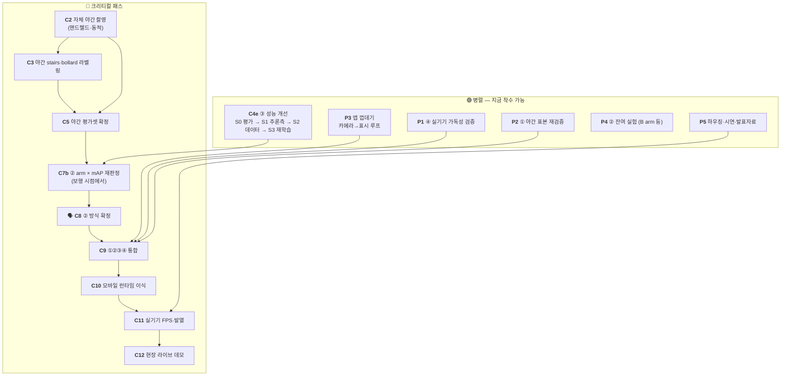

# 밤마실 — 전체 작업 TODO

> 최초 작성 **2026-07-31** · 갱신 **2026-08-25** (8/24 ④ **색 3종 확정** · ③ **ONNX 3클래스 계약 공지** 반영 · `C4e` **S0~S3 전부 완료** — 남은 것은 `C5` 판정)
> 이 문서는 **무엇을 언제 할 수 있는가(순서·병렬성)** 만 다룬다. *왜 그렇게 하는가*는 원 문서에 있다.
> 현재 상태 한 장은 [STATUS.md](STATUS.md) · 완료 이력 원문은 [archive/](archive/).

| 표기 | 뜻 | | 환경 | 뜻 |
|---|---|---|---|---|
| 🔴 | **크리티컬 패스** — 늦어지면 전체가 늦는다 | | 💻 | CPU만으로 가능 |
| 🟢 | **병렬 가능** — 지금 착수해도 된다 | | 🖥️ | 학습 PC 필요 (RTX 4060 Ti + 전체 데이터) |
| ⏸ | **대기** — 무엇을 기다리는지 명시 | | ☁️ | Colab (GPU 없는 PC 에서도 가능) |
| 🗣️ | **팀 회의 필요** | | 📱 | 실기기 · 🎥 촬영 현장 |

---

## 0. 지금 상황

**남은 것은 2주 남짓이다** (8/22 기준). ①②③④ 네 단계는 전부 후보가 서 있고 데스크톱
end-to-end 도 돈다. 막혀 있는 것은 **두 개뿐**이고 둘 다 코드가 아니다 — 그리고
**8/5 이후 둘 다 한 칸도 안 움직였다.**

1. 🔴 **`C2` 자체 야간 촬영** — `C3`→`C5`→`C7재판정`→`C8`→`C9` 가 직렬로 매달려 있다.
   선행 조건(안건 3·4)은 8/3 에, **마지막 전제였던 안건 7 은 8/22 에** 풀렸다
   (클래스 3종 최종 확정 → 코스에 장애물 구간이 추가될 일이 없다).
   **이제 문서상 `C2` 를 막는 것이 하나도 없다.**
2. 🔴 **`P3` 앱 껍데기 — 구현 0건.** `C9` 통합 시점에 없으면 통합할 곳이 없다.

★ **③ 는 그동안 외부에서 진행됐다** — `C4c` 를 이어받은 **`C4d` 6런 비교**가 8/7 에
`received/` 로 들어왔고(→ [STATUS ★인수분](STATUS.md)), 8/13 에 **실야간 소재로 눈으로
확인**까지 했다. 그러나 **held-out 야간 평가를 못 돌려 채택은 못 했다** — 결국 `C2` 다.
`bollard` 를 막던 "샘플에 172박스뿐"은 8/5 전량(300GB) 확보로 해소됐다.

> ⚠️ **직관과 반대인 순서 2건** — 놓치기 쉽다.
>
> 1. **② 방식 결정이 ③ 학습보다 *뒤*에 온다.** 파이프라인은 `②→③` 순이지만 ② 판정의
>    주 지표가 **③ 탐지 mAP** 라, 채점기(③)가 먼저 있어야 한다.
> 2. **자체 야간 촬영이 ② 방식 결정의 *선행*이다.** 보유 데이터에 야간·강광원이 없어
>    평가 수단 자체가 없다. 평가 수단이 없으면 방식을 고를 수 없다.

---

## 1. 의존 관계



- 🔴 은 화살표 방향으로만 진행된다. **출발점은 `C2` 하나**다 — 나머지 크리티컬 항목은
  전부 그 뒤에 붙는다. (`C1`·`C4`·`C4b`·`C6`·`C7 1차` 는 완료 → 8장)
- 🟢 은 아무 때나 시작해도 되지만 **`C9` 통합 시점까지는 끝나 있어야 한다.**
- **`C4e` 는 크리티컬 패스가 아니다.** ③ 는 이미 쓸 수 있는 가중치(`c4b_loli0`)가 있고
  ONNX 도 나가 있다. `C4e` 는 거기서 성능을 더 올리는 개선이라 병렬로 돈다.
  (`C4c` 는 외부에서 `C4d` 로 실행됐고, 그 6런의 **채택 판정이 `C4e` S0** 이다.)

---

## 2. 🔴 크리티컬 패스

| # | 작업 | 선행 | 환경 | 담당 | 근거 |
|---|------|------|------|------|------|
| **C2** | **자체 야간 촬영** — 핸드헬드·동적. ⚠️ 코스에 셋이 반드시 들어가야 한다 — **볼라드 장면** · **멀리서 계단에 접근하는 구간** · 🆕 **계단이 없는 야간 노면**(점자블록·자전거도로·자갈). 셋째는 8/13 실측 때문에 추가됐다: 실야간 노면에서 `stairs` 오탐이 되살아나는데 StairNet 에 음성 표본이 없어 **이것 없이는 못 고친다** | **없음 — 8/22 안건 7 종결로 전제 소멸** | 🎥 | 팀원3 | [data.md 2-2](data.md) · [detection.md 8-4](detection.md) |
| **C3** | 자체 야간 `stairs`·`bollard` BBox 라벨링. 🆕 **`data/test_real_data/` 7장도 같이 친다** — `_04` 는 프로젝트 유일의 야간 볼라드 사진이고, 나머지는 오탐 판정에 쓸 음성 표본이다 | C2 | 💻 | 팀원3 | [labeling_stairs.md](labeling_stairs.md) |
| **C5** | **야간 평가셋 확정** — 자체 촬영분을 주 평가셋으로 승격 | C2·C3 | 💻 | 팀원3·팀장 | [STATUS 3장 함정 1](STATUS.md) |
| **C7b** | ② arm × ③ mAP **재판정** — 1차(8/2)는 NightOwls **대시캠**이라 보행 시점과 다르다 | C5 | 🖥️ | 팀장 | [detection.md 7장](detection.md) |
| **C8** | 🗣️ **회의 — ② 방식 확정** (FPS 예산 · 게이트 측정 환경 · 표시/탐지 분리 추인) | C7b | — | 전원 | [archive/lowlight_method_decision](archive/lowlight_method_decision_2026-07.md) |
| **C9** | **①②③④ 파이프라인 통합** — 데스크톱 사전 검증은 끝났다(`pipeline_demo.py`) | C8 + P1·P2·P3 | 💻🖥️ | 팀장 | README 2장 |
| **C10** | ONNX → 모바일 런타임 이식 (QNN/NNAPI/Core ML). ③ 는 **이미 ONNX 로 나가 있다** | C9 | 🖥️📱 | 팀장·팀원2 | [hardware_inference.md 1장](hardware_inference.md) |
| **C11** | 실기기 측정 — 지속 FPS · 10분 발열 · end-to-end 지연. **② 속도 게이트의 최종 판정자** | C10 + P5 | 📱 | 팀원2 | [hardware_inference.md 5장](hardware_inference.md) |
| **C11b** | **실기기 960 프레임 시간 측정** — 기획서 2.4 KPI 의 "측정 예정" 칸을 채운다. `C11`(지속 FPS·발열)과 **별개 항목**: 재는 대상이 960 해상도 1건이고 납품처가 기획서다. ⚠️ 기존 640 값(p50 32.7 · p95 38.1 · 표시 5.75 · 11분, Galaxy A34)은 **더미 모델 골격 = "무처리" 기준**이다 — 실모델·②·④를 얹은 값이 아니므로 **"15FPS(66ms) 대비 여유 확보"의 근거가 되지 못한다.** 960 을 재기 전에 **640 처리 포함값을 먼저** 재야 비교가 성립한다. 계측 원본이 이 저장소에 없으니 같이 올릴 것 | C10 (앱 골격은 있음) | 📱 | 팀원2 | [STATUS ★인수분 R5](STATUS.md) |
| **C12** | 현장 라이브 데모 + 모의 야간 코스 정량 비교 | C11 | 📱🎥 | 전원 | README 5장 |

> **`C2` 가 왜 최우선인가** — 촬영은 날씨·시간대·섭외 리드타임이 있고 실패하면 재촬영에
> 며칠이 든다. 게다가 뒤에 4단계가 직렬로 매달려 있다. 다른 무엇보다 먼저 나가야 한다.

---

## 3. 🟢 병렬 트랙

### ~~C4c. ③ 3클래스 재학습~~ — ✅ **대체 완료** (외부 `C4d` 8/7 → 자체 `C4e` S3 8/23)

착수 전 4단계(정찰·held-out 분리·서브샘플·블록 단위 val)와 Colab 패키징 절차는 **소임을
다했다** — 외부 인수분이 11K 축소셋으로 먼저 돌렸고(→ [STATUS ★인수분](STATUS.md)),
우리 자체 런은 `aihub_subset_to_yolo.py` 로 배선해 8/23 에 끝났다(→ `C4e` S3).
절차 원문은 [data.md 3-1-4](data.md) 에 그대로 있다.

★ **다만 게이트는 살아 있다** — 이후 모든 ③ 판정이 이 3축을 쓴다. **자를 바꾸면 8/23
판정들과 대조가 끊긴다.**

| 축 | 자 | 기준 |
|---|---|---|
| person 회귀 | rec 34 held-out (`eval_nightowls.py`) | recall **0.609** 유지 |
| stairs 회귀 | rec 34 · rec 38 (`eval_stairs_night.py`) | 야간 오탐 **0.2%** 유지 |
| bollard 신규 | 야간 평가셋 (`C5`) | 기준선 없음 — **박스 크기 구간별 recall 을 같이 뽑을 것** |

> ⚠️ **볼라드는 640 입력에서 절반이 탐지 하한 아래다**(폭 중앙 7.8px · 8px 미만 50.3% ·
> `<4px` 는 960 에서도 recall 0.49 상한). 낮은 recall 은 예상된 것이고, 크기 구간별로
> 쪼개지 않으면 "데이터 부족"과 "해상도 한계"가 구분되지 않는다.

⏸ **잔여** — 노면 마스킹(`Surface_1~5`) 미수령(`W5`). `stairs` 는 여전히 StairNet 뿐이라
**원거리 계단 측정**이 그 다운로드에 달려 있다 (→ [detection.md 8-3](detection.md)).

### 🆕 C4e. ③ 성능 개선 — **비용 오름차순 4단계** (팀장 · 8/22 수립)

클래스가 3종으로 고정(🗣️안건 7 종결)됐으므로 이제 **성능만 올리면 된다.**
⚠️ **배포 해상도 640 은 고정 전제**다 — 실기기 속도가 아직 미측정이고 ②가 이미 ~20ms 를
쓴다. 960 은 픽셀 2.25배라 근거 없이 올리면 FPS 게이트가 깨진다. **남은 레버는
데이터 · 학습 레시피 · 추론측 셋뿐**이고 `S0`~`S3` 이 그 순서로 훑는다.

| 단계 | 무엇 | GPU 학습 | 선행 |
|---|---|---|---|
| **S0** | ✅ **완료 (8/23)** — 640 축 4런 판정. **3런 통과 · `26n_640` 기각 · 주간 순위 뒤집힘** (→ [detection.md 9장](detection.md)) | 0 | — |
| **S0b** | ✅ **완료 (8/23)** — 보행 시점 실야간에서 **라벨 없이 오탐 측정**. 세 축의 1위가 전부 다름 (→ [detection.md 9-6~9-8](detection.md)) | 0 | — |
| **S1** | ✅ **완료 (8/23)** — E2·E1 둘 다 실행. **단일 conf 0.25 확정**(일괄 하향 **기각**) · **클래스별 `bollard` 0.15 채택안** · `W6`·`P1` **값 없음** | 0 | — |
| **S2** | ✅ **완료 (8/23)** — 배경 음성 1,163장 투입. **`stairs` 실야간 오탐 conf 0.10 에서 22 → 9박스(2.4배 감소)** · 배선은 신설 `aihub_subset_to_yolo.py` | 0 | — (`W5`·`C3` 는 잔여 항목) |
| **S3** | ✅ **완료 (8/23)** — **첫 자체 3클래스 런 `c4e_s3_11n`** · 100ep · **게이트 3종 전부 통과**(recall 0.635 · `stairs` 오탐 0.0% · 실야간 5박스) · **야간 볼라드 붕괴 사라짐** (→ [detection.md 11-3c](detection.md)) | 1회 ✅ | — |
| **S4** | `C5` 자체 야간 평가셋에서 **최종 판정** — 🆕 후보가 3개가 됐다(`c4b_loli0` 현 배포 · `c4d_11n_640` 인수분 · **`c4e_s3_11n` 자체**). ✅ **하네스는 8/25 에 준비됐다**(↓ S4 절) | 0 | `C2`→`C3`→`C5` |

> **아래 S0~S3 은 전부 ✅ 완료다.** 이 문서는 *무엇을 언제 할 수 있는가* 만 다루므로
> **결정된 값과 재실행 명령만** 남긴다 — 표·근거·읽어낸 것의 원문은
> [detection.md 9·11장](detection.md) 이 정본이다.

#### S0·S0b. 무학습 판정 — ✅ 완료 (8/23)

인수분 640축 4런을 held-out 에 태웠다. **3런 통과 · `c4d_26n_640` 기각**(NMS-free 라
앱 계약도 바꾼다) · ★★ **주간 순위가 야간에서 뒤집혔다**(함정 1 의 세 번째 증거).
S0b 는 보행 시점 실야간 음성에서 **라벨 없이** 오탐을 셌고 **세 축의 1위가 전부 달랐다**
(recall `noneg` · 오탐 `11s` · 야간 볼라드 `11n`) → 단일 후보를 여기서 정하지 않는다.

```powershell
uv run python scripts/compare_detect.py `
    --runs c4b_loli0,c4d_11n_640,c4e_s3_11n --skip-fp38
uv run python scripts/eval_real_night.py --runs c4b_loli0,c4d_11n_640,c4e_s3_11n
```

⚠️ `--skip-fp38` 는 rec38 재생성이 **~4GB 복사**이기 때문이다 (→ [STATUS 3장 함정 14](STATUS.md)).
⚠️ 960 런 2개는 **평가 대상이 아니다** — 배포 640 고정 전제이고 imgsz 불일치 평가는 무의미하다.

#### S1. 추론측 — ✅ 완료 (8/23) · **운영값이 여기서 확정됐다**

| 결정 | 값 | 근거 |
|---|---|---|
| 운영 conf | **단일 0.25 확정** — 일괄 하향은 **기각** | 야간 음성에서 0.25→0.10 이 `stairs` 오탐 2~3.7배 · 발화 6/15→14/15 |
| 클래스별 conf | `bollard` 0.15 는 **`11s` 를 쓸 때만** — `11n` 은 이미 0.25 에서 다 잡고 `noneg` 는 역효과 | 9-9-1 |
| ③ 프레임 스킵 | **`--detect-every` 2 가 상한** (k=2→3 에서 IoU 0.93→0.88 · miss 0.21→0.30) | 9-9-2 |
| `W6` 트래킹 보간 · `P1` 박스 평활 | **둘 다 불필요** — 값이 없다 | 9-9-2 |

🔴 **시간축은 conf 하향의 흡수 수단이 되지 못한다** — 오탐 평균 지속을 13.6 → **24.7**
프레임으로 **늘린다.** ★ 깜빡임의 주범은 스킵이 아니라 **탐지기 자체**(오라클도 1,000
프레임에 105~127회)이고, 그것은 보간이 아니라 **데이터·학습(S2·S3)** 에서 풀 문제다.

#### S2. 데이터 — 음성 표본 보강 ✅ 완료 (8/23) · **잔여 2건**

AIHub `negative_night` **1,163장** 투입 → `stairs` 실야간 오탐 conf 0.10 에서 **22 → 9박스**.
막고 있던 것은 데이터가 아니라 **배선 한 칸**이었고 `aihub_subset_to_yolo.py` 로 해소했다
(같은 실행에서 세션 누수 결함 발견 → [STATUS 3장 함정 17](STATUS.md)).

- ⚠️ 배경 비율은 **10% 유지** — `noneg` 런이 보였듯 **배경의 효과는 mAP 가 아니라 FP 에** 난다
- 🟡 **잔여 1** `W5` 노면 마스킹 `Surface_1~5` 다운로드(국내 PC) → 투입 전 `label_stats.py` 로
  StairNet 과 종횡비·면적 대조해 **학습 투입 / 평가 전용** 판정
- 🟡 **잔여 2** `C3` 에서 `data/test_real_data/` 7장 라벨링 — 최초의 야간 음성 표본 +
  유일한 야간 볼라드 GT(`_04`)
- ★ ghost FP(기둥·가로등·표지판 지주) **57~63%** 는 좁은 정의 확정으로 **영영 오탐**이라,
  `pole`·`tree_trunk` 프레임을 **배경으로** 더 넣는 것이 정공법이다

#### S3. 재학습 — ✅ 완료 (8/23) · `c4e_s3_11n`

`detect_v3`(16,291장 · NightOwls 실야간 + AIHub bollard + StairNet + 배경 음성) ·
640 · 배경 10% · **100ep / patience 20**. **게이트 3종 전부 통과.**
c4d 는 50ep/patience 10 이었으므로 **학습량 축이 여기서 처음 확인됐다.**

- ⚠️ **seed 1개로 순위를 정하지 말 것** — 후보 간 차이가 mAP +0.02 대라 seed 분산과
  구분되지 않는다. 최종 후보는 **seed 3개**로 재확인한다
- 🔴 남은 게이트는 **실야간 노면 `stairs` FP**(`C3` 라벨 후에만 가능)

#### 🆕 S4. 최종 판정 — ✅ **잴 자는 준비됐다** (하네스 8/25 신설)

후보 3개(`c4b_loli0` 현 배포 · `c4d_11n_640` 인수분 · `c4e_s3_11n` 자체)를 `C5` 자체 야간
평가셋에서 가르는 것이 마지막 단계다. 기존 하네스 3종은 **전부 다른 것을 재서**
(`compare_detect` NightOwls 전용 · `eval_real_night` **라벨 없음** · `eval_stairs_night`
단일 클래스) `C5` 를 못 쟀고, 그 빈칸을 **`scripts/eval_own_night.py`** 가 메운다.

**재는 것 — 5축** (원문은 스크립트 docstring)

| 축 | 무엇 | 비고 |
|---|---|---|
| A | 클래스별 **mAP50 · mAP50-95** + 종합 | 임계값 무관 · `model.val()` |
| B | **운영점** recall·precision·F1·FP·미탐 | 클래스별 **+ 종합(micro)** |
| C | **음성 프레임 오탐** 박스 수 · 발화 프레임 | 8/23 게이트와 **같은 자** |
| D | **GT 폭 구간별 recall** `<4/4~8/8~16/≥16px` | **+ 전체 열·종합 행** |
| E | **볼라드 박스별 confidence** | 장면 `maxconf` 로는 붕괴가 안 보인다 |

- `ignore` 박스는 **감점 제외**다 — 찾아도 FP 아니고 못 찾아도 FN 아니다
  (규칙은 [labeling_stairs.md 4장](labeling_stairs.md)). val 라벨에서도 빼서 mAP 를 지킨다
- 클래스별 conf(`bollard` 0.15)는 `eval_real_night.py` 함수를 **그대로 재사용**한다 —
  자를 새로 만들지 않았다
- **2클래스 `c4b_loli0` 은 `bollard` 행이 `-`** 로 나온다(0 이면 "오탐 0" 오독)

```powershell
uv run python scripts/eval_own_night.py --src data/own_night `
    --runs c4b_loli0,c4d_11n_640,c4e_s3_11n
```

🔴 **남은 것은 소재뿐이다** — `C2` 촬영 → `C3` 라벨. 라벨이 들어오는 순간 위 한 줄로 판정된다.
⚠️ **`C5` 확정 전에 `label_stats.py` 를 한 번 돌릴 것** — 높이 32px 미만 비율이 0 에 가까우면
라벨이 아니라 **촬영**이 문제다(거리 계단 미확보 → 재촬영) (→ [labeling_stairs.md 7장](labeling_stairs.md)).

★ **만들면서 기존 하네스에도 해당하는 함정 2개를 잡았다** (→ [STATUS 3장 함정 18·19](STATUS.md))
— ① 방향이 섞인 이미지를 한 `predict` 에 넘기면 **모든 예측이 바뀐다**(볼라드 0.669→0.501)
② 평가셋을 하드링크로 깔면 `model.val()` 이 **원본을 재인코딩해 덮어쓴다**(3.37→7.27MB).

#### 하지 않는 것 (재개 조건을 같이 적는다)

| 항목 | 이유 | 재개 조건 |
|---|---|---|
| 960 · 1280 · 타일링 | 640 고정 전제와 충돌. `<4px`(GT 22%)는 960 에서도 recall 0.49 상한이라 해상도로 못 간다 | `C11b` 에서 **640 처리 포함값**을 재고 예산에 여유가 확인될 때 |
| YOLO26n(NMS-free) 채택 | 앱 인터페이스 계약 변경 · 앱 구현 0건 | `P3` 골격 완료 후 |
| 클래스 추가 | 🗣️안건 7 종결 (8/22) | 마감 이후 |
| **주간→야간** 합성 증강(`W2`) | ✅ **이미 A/B 로 쟀고 값이 없다** — 합성 21,657박스를 넣든 빼든 실야간 동점(`c4b_loli6000` 0.691/0.625 vs `c4b_loli0` 0.684/0.609)인데 **학습 비용은 2배**. 포화 광원 0.00% · 노이즈 방향 역전 · 라벨 오염 (→ [detection.md 6-7](detection.md)) | **없음 — 재개하지 않는다.** 대신 아래 좁은 변형만 |
| `--pole-as-bollard` | 8/22 좁은 정의 확정 | 제품 정의가 바뀔 때 |

### P3. 앱 (팀원2) — **완전 독립 · 🔴 실질적으로 크리티컬**

처리부를 항등함수로 두고 카메라→표시 루프를 먼저 완성해 두면 `C9` 통합이 "함수
갈아끼우기"로 끝난다. **모델을 기다릴 이유가 전혀 없다.**

| 작업 | 선행 |
|------|------|
| 앱 구조 설계 · 카메라 입력 → 표시 루프 (처리부 항등함수) | 없음 |
| 사전 녹화 입력 데모 모드 — **현장 실패 대비 보험** | 위 |
| UI — 온/오프, 강조 강도, 해상도 전환 | 위 |
| 스테레오 렌더(좌우 분할 + 배럴 왜곡) — 초기엔 단일 화면으로 검증 | 위 |

### P1·P2·P4·P5 — 잔여

| # | 작업 | 선행 | 환경 | 근거 |
|---|------|------|------|------|
| **P1** | ④ **저시력 가독성 실사용 검증** — 🆕 **색은 8/24 에 확정**(`person` 시안 · `stairs` 노랑 · `bollard` 라임 `#9CFF2E`)이라 판정 대상이 좁아졌다: **라임↔노랑이 적록색약에서 갈리는가**(녹색맹 최소 ΔE **9.9**). 안 갈리면 되돌아갈 자리는 `violet`(#C77DFF)·`magenta`(#FF3CDC)이고 **둘 다 밝기 대비가 3:1 아래**다. 두께·야외 시인성은 여전히 가설 | P3 실기기 | 📱 | `scripts/emphasize.py` · [노트북](../notebooks/emphasis_palette_review.ipynb) |
| **P1** | 박스 시간축 평활(hold·IIR) — ③ 프레임 스킵 시 깜빡임 방지 | — | 🖥️ | [hardware_inference 5장](hardware_inference.md) |
| **P2** | ① 야간 표본(ExDark·StairNet)으로 `D1A1+bf` 재검증 — **현재 글레어 표본 n=1** | — | 🖥️ | [lowlight 6-5-4](lowlight_classical.md) |
| **P2** | 🗣️ ①을 ②에 통합할 것인가 — 채택 시 통합이 기본 구도 | 위 재검증 | — | [lowlight 6-5-4](lowlight_classical.md) |
| **P4** | **B arm(Zero-DCE/SCI) 구현·실측** — 미착수 | — | 🖥️ | [lowlight 1장](lowlight_classical.md) |
| **P4** | `+bf` 기본값 승격 검토 — 신 지표에서 **반례 2건** | — | 💻 | [lowlight 6-4-3](lowlight_classical.md) |
| **P4** | LoLI-Street 라벨 육안 검수 (pseudo-label 신뢰도) | — | 🖥️ | [data.md 2-1](data.md) |
| **P5** | 골판지 VR 하우징 · 시연 영상 · **발표자료** | — | 🎥💻 | 아래 |

> **발표 소재는 이미 4건 확보돼 있다** — ① 계단 고전 CV 기각(재현율 0.232·오경보 100%),
> ② 평가 데이터가 야간이 아님을 발견, ③ 목적 축 지표 3개가 육안과 어긋나 재설계,
> ④ 표시/탐지 경로 분리(전처리가 탐지를 해친다는 실측). **"가설 → 정량 측정 → 기각 →
> 재설계" 서사**가 검증 없는 아키텍처 자랑보다 설득력이 높다.

---

## 4. ⏸ 대기

| # | 작업 | 무엇을 기다리는가 |
|---|------|------------------|
| **W2** | ~~주간 → 야간 저조도 합성 증강~~ → **야간 → *더 어두운* 야간 증강**으로 **범위 축소** (8/25 판정) | 🔴 **주간→야간은 기각** (→ [detection.md 6-7](detection.md) · 3장 *하지 않는 것*). 남은 것은 `C2` 실야간분을 `scripts/darken.py` 로 밝기 축 증강하는 것뿐 — **광원이 원본에 실재**해 합성의 치명 결함 2개가 없다. ⚠️ **학습 증강으로만** 쓰고 **평가셋에는 넣지 말 것**(함정 2). 기다리는 것: `C2` 촬영분이 부족할 때만 |
| **W3** | C안 dense 복원망 33k 본학습 | **속도 게이트 통과 시에만.** 현재 게이트 돌파 실마리가 없어 사실상 동결 |
| **W4** | NightOwls 로 ② arm 비교 재실행 | ✅ 선행 해제(8/1). **착수 가능** — ExDark 는 실내가 많아 보행 도메인과 다르다 |
| **W5** | AIHub **노면 마스킹**(`Surface_1~5`) 다운로드 | 없음 — 국내 PC 에서 지금 받을 수 있다. `stairs` 원거리 측정이 여기 달려 있다 |
| **W6** | 탐지 프레임 스킵 + 트래킹 보간 | ③ 모델 (✅ 있음) → **착수 가능** |
| **W7** | ② 속도 게이트 돌파 | 남은 카드 3개 — 내부 해상도 하향 · 셰이더 이식 · `C11` 실기기 재판정 |

---

## 5. 🗣️ 회의 안건

| # | 안건 | 시점 |
|---|------|------|
| **1** | **FPS 예산 배분 + 게이트 측정 환경 기준.** ★ 표시/탐지 분리로 계산이 달라졌다 — ②의 지연이 ③에 더해지지 않으므로 두 경로를 병렬로 돌리면 예산이 는다. 20ms 는 실측이 아니라 **설계 배분값**이다 | C7b 직후 |
| **2** | **①을 ②에 통합할 것인가** — `D1A1+bf` 채택 시 통합이 기본 구도 | 야간 표본 재검증 후 |
| **3** | paired 촬영 **규모·공수 배분** (팀원3 경합). ✅ 존폐·개인정보는 8/3 종결 | C2 이후 |
| **5** | 채도 보정 적용 여부 (적용 시 arm 수 2배) | C7b 이전 |
| **6** | opencv-contrib 교체 여부 — 팀 4인 `uv.lock` 전원 갱신 | BIMEF 를 arm 에 올릴 때만 |
| **7** | ✅ **종결 (8/22) — 클래스는 `0 person` · `1 stairs` · `2 bollard` 3종으로 최종 확정.** ① 나머지 26종 **미채택 확정**(`pole` 648px vs `bollard` 75px 로 형태가 갈려 버려도 안전) ② `2 bollard` 는 **좁은 정의 확정** — `pole`·`tree_trunk` 를 흡수하지 않는다. `aihub_to_yolo.py --pole-as-bollard` 는 **확장 대비로 남기되 켜지 않는다** ③ 노면 20종은 **향후 확장 후보로 보류**(전부 세그 클래스라 bbox 파이프라인과 태스크가 안 맞는다). ★ **추후 클래스 확장 가능성은 열려 있다 — 다만 마감(9월 초) 이후 갈래다** | ✅ 8/22 종결 |

> ✅ **재촬영 위험은 8/22 로 해소됐다.** 클래스가 3종으로 고정돼 촬영 코스에 장애물
> 구간이 추가로 필요해질 일이 없다 — **`C2` 를 막는 전제가 하나도 남지 않았다.**
> ⚠️ **코스에 이미 확정된 요구는 셋** — **볼라드 장면**(야간 볼라드는 `C2` 로만 판정된다) ·
> **멀리서 계단에 접근하는 구간**(원거리 계단의 야간 답은 `C2` 뿐) · 🆕 **계단이 없는
> 야간 노면**(점자블록·자전거도로·자갈 — 실야간 `stairs` 오탐의 음성 표본, 8/13 실측).

---

## 6. 남은 일정 (8/25 기준)

🔴 **크리티컬 패스가 4주째 한 칸도 안 움직였다.** `C2` 미출발 · `P3` 0건 그대로다.
마지막 전제(안건 7)는 8/22 에 풀렸다 — **남은 것은 실행뿐이고, `C9` 통합이 9월로 넘어가는 것은
이제 기정사실이다.** 마감(9월 초)까지 **1주 남짓**이다.

| 시기 | 🔴 크리티컬 | 🟢 병렬 |
|------|------------|---------|
| ~~8월 1~3주~~ | ~~안건 7 → `C2` 출발~~ **미이행** | `C4c` → 외부 `C4d` 로 대체 ✅ · 8/13 실야간 육안 확인 ✅ |
| ~~8월 4주~~ | ✅ 안건 7 종결(8/22) → 🔴 **`C2` 촬영 출발** **미이행** | ✅ `C4e` **S0~S3 전부**(8/23) · ✅ ④ 색 확정 + ONNX 3클래스 공지(8/24) · ✅ Junction 재연결 · 🔴 **`P3` 앱 껍데기 미착수** · `W5` 미이행 |
| **8월 5주 (지금)** | 🔴 **`C2` 촬영 — 더 못 미룬다** → `C3` 라벨링 → `C5` 평가셋 → **`C7b` 재판정** → 🗣️**`C8`** | 🔴 **`P3` 앱 껍데기** · `W5` 노면 받기(4주에서 이월) · `P5` 하우징·시연 촬영 |
| **9월 1주** | **`C9` 통합** → `C10` 이식 → **`C11` 실기기 측정** | ~~`C4e` S3 재학습~~ ✅ 8/23 완료 → **`C4e` S4 = `C5` 최종 판정**(후보 3개) · 발표자료 |
| **9월 초 마감** | **`C12` 현장 데모** | 사전 녹화 데모 모드(보험) 완비 |

### ⚠️ 일정 리스크

1. 🔴 **`C2` 는 이미 4주 늦었다** (8월 1주 목표 → **8/25 현재 미이행**). 뒤에 4단계가 직렬로
   매달려 있어, **`C9` 통합이 9월로 넘어가는 것은 이제 기정사실이다.**
   8/22 로 마지막 전제가 풀렸으므로 **남은 것은 실행뿐이고, 마감까지 1주 남짓이다.**
2. **앱이 구현 0건이다.** `C9` 시점에 껍데기가 없으면 통합할 곳이 없다 — **8월 4주에
   병목이 될 것이라 적었고, 5주에 들어선 지금 실제로 병목이다.** 이 문서에서 **가장
   오래 방치된 항목**이다.
3. **`C7b` 는 이미 넘겼다**(`C2` 미출발 → `C5` 없음). `C8` 을 기다리면 통합 시간이 없다 —
   **보험을 발동할 국면이다: 현 후보(`c4e_s3_11n`)를 기준선으로 `C9` 통합을 먼저 시작**한다.
4. **② 속도 게이트가 실기기(`C11`)에서 떨어지면** 9월 1주에 내부 해상도 하향으로
   대응해야 한다 — 되돌릴 시간이 없으므로 `C11` 을 앞당길 수 있으면 앞당긴다.

---

## 7. 지금 당장 착수 가능한 것 (선행조건 0)

| 작업 | 담당 | 환경 |
|------|------|------|
| ~~🔧 `data/` Junction 재연결~~ ✅ **8/23 완료** | — | — |
| ~~🔴 `C4e` S0·S0b~~ ✅ **8/23 완료** · **S1 실험 설계도 8/23 완료**(→ [detection.md 9-9](detection.md)) | 팀장 | 🖥️ |
| ~~🔴 `C4e` S1 — E2 클래스별 conf~~ ✅ **8/23 완료** — 대가 거의 0 · **이득은 `11s` 에서만** · `bollard` 0.15 채택안 (→ [detection.md 9-9-1](detection.md)) | 팀장 | 🖥️ |
| ~~**`C4e` S1 — E1 박스 시간축**~~ ✅ **8/23 완료** — `W6`·`P1` **둘 다 값 없음** · **일괄 conf 하향 기각** · 깜빡임의 주범은 탐지기 자체 (→ [detection.md 9-9-2](detection.md)) | 팀장 | 🖥️ |
| ~~**`C4e` S2+S3 재학습**~~ ✅ **8/23 완료** — 첫 자체 3클래스 런 `c4e_s3_11n` · **게이트 3종 전부 통과** · 야간 볼라드 붕괴 사라짐 (→ [detection.md 11-3c](detection.md)) | 팀장 | 🖥️ |
| ~~🆕 **앱팀 계약 변경 공지**~~ ✅ **8/24 완료** — ONNX 출력 **2→3** 공지 · `RUN_METRICS` 등록 · ④ `bollard` **라임 `#9CFF2E` 확정** (→ [share 7-0](share_yolo_c4b_20260803.md) · [STATUS 3장 함정 16](STATUS.md)) | 팀장 | 💻 |
| ~~🆕 🔴 **`C5` 판정 하네스 신설**~~ ✅ **8/25 완료** — `scripts/eval_own_night.py` · 5축 · `ignore` 감점 제외 · CPU 스모크 완주. **남은 것은 소재뿐**(`C2`→`C3`) (→ 3장 `C4e` S4) | 팀장 | 💻 |
| **`W4`** NightOwls 로 ② arm 비교 재실행 · **`P2`** 야간 표본 `D1A1+bf` 재검증 — Junction 복구로 **선행조건 0** | 팀장 | 🖥️ |
| 🔴 **`C2` 야간 촬영지 섭외·장비 준비** — 회의 직후 출발 | 팀원3 | 🎥 |
| 🔴 **`P3` 앱 껍데기** — 카메라→표시 루프 (처리부 항등함수) | 팀원2 | 📱 |
| **`C4c` ①정찰** `aihub_pack_for_colab.py --src <해제루트> --dry-run` | 팀원1 | 🖥️국내 |
| **`W5`** 노면 마스킹 `Surface_1~5` 다운로드 (`stairs` 원거리 측정용) | 팀원1 | 🖥️국내 |
| **`P4`** B arm(Zero-DCE/SCI) 구현 · LoLI 라벨 육안 검수 | 팀원1 | 🖥️ |
| **`W4`** NightOwls 로 ② arm 비교 재실행 | 팀장 | 🖥️ |
| **`P2`** 야간 표본으로 `D1A1+bf` 재검증 (글레어 표본 n=1 해소) | 팀장 | 🖥️ |
| **`P5`** 하우징 제작 · 발표자료 초안 | 팀원3 | 🎥💻 |

---

## 8. 완료 (요약 — 원문은 각 근거 문서)

| 항목 | 완료 | 근거 |
|------|------|------|
| 개발 환경(uv·CUDA) · 데이터 4종 확보 + 무결성 검증 | 7/26 | README |
| 계단 고전 CV **정량 검증 후 기각** → YOLO 통합 전환 | 7/26 | [archive/stair_classical_rejection](archive/stair_classical_rejection_2026-07-26.md) |
| ② 고전 arm 11개 구현 · 속도 프로브 · 비교 하네스 | 7/29 | [lowlight 1~2장](lowlight_classical.md) |
| ★ 보유 데이터에 **야간·강광원이 없음**을 발견 | 7/29 | [data.md 0장](data.md) |
| ★ 목적 축 지표 3개 **절대 기준으로 재설계** | 7/31 | [lowlight 6-4](lowlight_classical.md) |
| `P1` ④ 선택적 강조 렌더 · `P2` 조합 arm `D1A1+bf` | 7/31 | `scripts/emphasize.py` · [lowlight 6-5](lowlight_classical.md) |
| `C1` StairNet 선분 → BBox (train 2,670 / val 424) | 8/1 | [detection.md 2-1](detection.md) |
| `C6` ② 해상도 × arm 스윕 — 720p 통과는 `A1`·`A2` 뿐 | 8/1 | [lowlight 6-6](lowlight_classical.md) |
| NightOwls 확보·해제 (13,602장 / 13.78 GiB) | 8/1 | [data.md 5-2](data.md) |
| ② **고전 CV 확정** — A/B/C 중 A | 8/1 | [archive/lowlight_method_decision](archive/lowlight_method_decision_2026-07.md) |
| `C4` ③ baseline → **실야간 붕괴 발견**(person recall 0.226) | 8/2 | [detection.md 3~4장](detection.md) |
| `C4b` ③ 재학습 — held-out recall **0.195→0.609** · `stairs` 오탐 **7.7→0.2%** | 8/2 | [detection.md 6장](detection.md) |
| `C7` ② arm × mAP 1차 → ★ **표시/탐지 경로 분리 확정** | 8/2 | [detection.md 7장](detection.md) |
| `W1` A3 시간축 — `+ts` 플리커 상쇄 ✅ / `+td` 는 `bf` 대체 실패 ❌ | 8/2 | [lowlight 8장](lowlight_classical.md) |
| 파이프라인 데모 (②→③→④ end-to-end) | 8/2 | `scripts/pipeline_demo.py` |
| 🗣️ 안건 3·4 처리 — `C2` 선행 조건 해소 · `stairs` 라벨 정의 확정 | 8/3 | [labeling_stairs.md](labeling_stairs.md) |
| **클래스 3종 확정 + AIHub 배선** · ③ **ONNX 배포 패키지** | 8/3 | [data.md 3-1-1](data.md) · [share](share_yolo_c4b_20260803.md) |
| ★ AIHub **노면 마스킹 `stairs`** 발견 — "계단 없음" 정정 | 8/4 | [data.md 3-1-2](data.md) |
| AIHub 취득 경로 확정 — **국내 패키징 + Colab 학습** (해외 차단 대응) | 8/4 | [data.md 3-1-3](data.md) |
| **AIHub bbox 전량 300GB 다운로드** · ★ **정찰**(블록 수·저조도 판별) | 8/5 | [data.md 3-1-4](data.md) |
| ★ `stairs` **야간/주간 분리 실측** — 야간 76장 mAP50 0.993, **저조도 아닌 도메인이 문제** | 8/3 | [detection.md 8장](detection.md) |
| **문서 최적화** — `TODO` 전면 재작성 · 종결 논의 2건 `archive/` 이관 · `STATUS` 한 장 복귀 | 8/5 | — |
| ★ **외부 인수분 `received/` 도착** — `C4d` 3클래스 6런 비교 · `is_night` 무효 판명 | 8/7 | [STATUS ★인수분](STATUS.md) |
| ★ **기획서 v20 수치 검증** — 수정 필요 5건 + 귀속 오류 1건 | 8/8 | [review_proposal_v20](review_proposal_v20_20260808.md) |
| ★ **`C5` 판정 하네스 `eval_own_night.py` 신설** — 5축(mAP · 운영점+종합 · 음성 오탐 · 폭 구간별 recall+전체 · 볼라드 박스별 conf) · `ignore` 감점 제외. ★ **기존 하네스 함정 2건 동시 발견**(방향 혼합 배치 · 하드링크 원본 덮어쓰기) | 8/25 | [STATUS 3장 함정 18·19](STATUS.md) |
| **문서 최적화 2차** — `STATUS` 한 장 복귀(52.5→35KB) · 인수분 원문 `archive/` 이관 · `TODO` 중복 제거 · **`W2` 합성 증강 기각 판정** | 8/25 | [archive/received_c4d](archive/received_c4d_2026-08-07.md) · [detection.md 6-7](detection.md) |
| ★ **문서 정합 정리** — 폐기된 직렬 파이프라인 표기 4곳 통일 · 재학습이 데이터가 아닌 **배선**으로 막혀 있음을 확인 · 3클래스 전환 함정 3개 기록 | 8/23 | [STATUS 3장 함정 16](STATUS.md) |
| ★ **④ 색 3종 확정 + ③ ONNX 3클래스 패키지·앱팀 계약 공지** — `bollard` 라임 `#9CFF2E` · 출력 `[1,6,8400]`→`[1,7,8400]` · `RUN_METRICS` 등록 | 8/24 | [share 7-0](share_yolo_c4b_20260803.md) · [노트북](../notebooks/emphasis_palette_review.ipynb) |
| ★★★ **`C4e` S2+S3 — 첫 자체 3클래스 런 `c4e_s3_11n`** — 게이트 3종 전부 통과 · `stairs` 실야간 오탐 **22→9박스** · 야간 볼라드 confidence 붕괴 소멸 | 8/23 | [detection.md 11-3c](detection.md) |
| ★★ **`C4e` S1 — E2 클래스별 conf · E1 박스 시간축** — **단일 conf 0.25 확정**(일괄 하향 기각) · `bollard` 0.15 채택안 · `W6`·`P1` 값 없음 | 8/23 | [detection.md 9-9](detection.md) |
| ★★ **`C4e` S0b — 보행 시점 실야간 오탐 측정**(라벨 불요) · **conf 0.10 야간 보류 결정** | 8/23 | [detection.md 9-6~9-8](detection.md) |
| ★★ **`C4e` S0 — `c4d` held-out 야간 판정** (3런 통과 · **주간 순위 뒤집힘**) | 8/23 | [detection.md 9장](detection.md) |
| `data/` Junction 5종 재연결 (7개 스크립트 복구) | 8/23 | [data.md 5-2](data.md) |
| 🗣️ **안건 7 종결 — 클래스 3종 최종 확정**(`2 bollard` 좁은 정의) · `C2` 전제 소멸 | 8/22 | 5장 안건 7 · [detection.md 8-2](detection.md) |
| **데이터 위치 재편** — 전 데이터셋 실체를 `D:\datasets\` 로 이관 (`data/` 는 Junction) | 8/22 | [data.md 5-2](data.md) · [STATUS 3장 함정 15](STATUS.md) |
| **`outputs/datasets/` 정리 — C: 18.3GB 회수** | 8/22 | [STATUS 3장 함정 14](STATUS.md) |
| ★ **c4d 육안 검수 노트북** — 라벨 검수 + 640 추론 + **실야간 첫 소견** | 8/13 | [notebook](../notebooks/aihub_subset_review.ipynb) · [detection.md 8-4](detection.md) |

---

## 부록. 문서 지도

**정본은 [STATUS 5장](STATUS.md)** 이다 — 문서·노트북 목록과 크기가 거기 한 곳에만 있다
(여기 있던 표는 8/25 에 중복이라 제거).
이 문서에서 가장 자주 따라가는 것만 적어 둔다:

- 현재 상태 한 장 → [STATUS.md](STATUS.md)
- ③ 판정 원문(`C4e` 전체) → [detection.md 9·11장](detection.md)
- 앱팀 인수인계(3클래스 계약) → [share 7-0](share_yolo_c4b_20260803.md)
- `stairs` 라벨 규칙(`C3` 작업자용) → [labeling_stairs.md](labeling_stairs.md)
- 종결된 실험·결정 원문 → [archive/](archive/)
