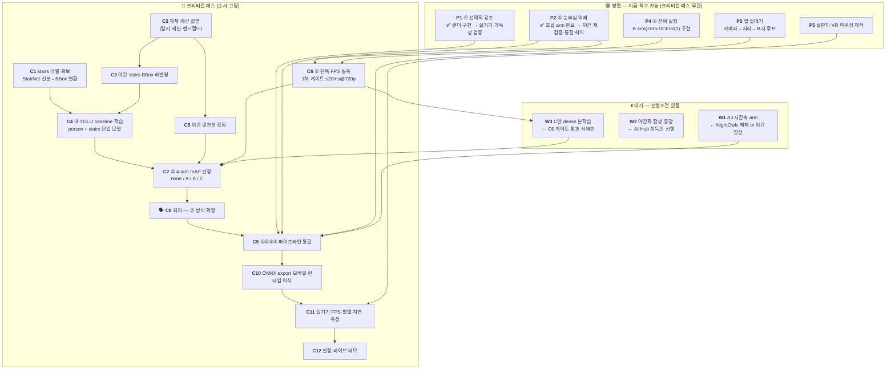

# 밤마실 — 전체 작업 TODO

> 최초 작성: **2026-07-31**
> 범위: 프로젝트 전 단계(①②③④ + 앱 + 시연). 각 항목의 근거는 원 문서에 링크한다.
> 이 문서는 **무엇을 언제 할 수 있는가(순서·병렬성)** 만 다룬다. *왜 그렇게 하는가*는 원 문서에 있다.

## 이 문서를 읽는 법

| 표기 | 뜻 |
|------|-----|
| 🔴 | **크리티컬 패스** — 늦어지면 프로젝트 전체가 늦는다. 순서를 바꿀 수 없다 |
| 🟢 | **병렬 가능** — 크리티컬 패스와 무관하게 지금 착수해도 된다 |
| ⏸ | **대기** — 선행조건이 안 끝나서 착수 불가. 무엇을 기다리는지 명시 |
| 🗣️ | **팀 회의 필요** — 개인이 결정할 수 없는 항목 |
| ✅ | 완료 |

| 실행 환경 | 뜻 |
|-----------|-----|
| 💻 | CPU만으로 가능 (데이터 불요 또는 LOL·자체 촬영본만) |
| 🖥️ | **학습 PC 필요** (RTX 4060 Ti + 전체 데이터셋) |
| 📱 | 실기기 필요 |
| 🎥 | 촬영 현장 |

---

## 0. 지금 상황 한 줄 요약

> 🔄 **갱신 2026-08-03** — `C4`·`C4b`·`W1` 완료 반영 · `stairs` 야간/주간 분리 실측 반영

**7월(아키텍처·베이스라인·데이터)이 끝났다. 남은 것은 8월 한 달 + 9월 초다.**
데이터·환경·② arm 탐색·지표는 갖춰졌고, ①은 조합 arm `D1A1+bf` 로 후보 확보(7/31),
④는 렌더 스테이지 구현 완료(7/31)다.
**③ 탐지는 `C4b` 로 실야간 성능을 확보했다**(8/2, held-out recall 0.195→0.609 ·
`stairs` 오탐 7.7%→0.2%, 채택 `c4b_loli0` 기준). 그러나 **앱은 여전히 구현 0**이고,
크리티컬 패스에서 막혀 있는 것은 이제 **`C2` 자체 야간 촬영**이다 —
`C3`→`C5`→`C7`→`C8`→`C9` 가 전부 여기에 매달려 있고, `stairs` 는 계단 사진에선 야간에도
잘 찾지만(StairNet 야간 mAP50 0.993, 8/2 실측) **보행 중 멀리 있는 계단은 측정할 데이터
자체가 없다** (→ [detection.md 8장](detection.md)).

> ⚠️ **가장 중요한 순서 뒤집기 2건** — 직관과 반대라 놓치기 쉽다.
>
> 1. **② 방식 결정이 ③ 학습보다 *뒤*에 온다.** 파이프라인은 `②→③` 순이지만,
>    ② arm 판정의 주 지표가 **③ 탐지 mAP** 라서 채점기(③ baseline)가 먼저 있어야 한다
>    ([data.md 2-3-3](data.md))
> 2. **자체 야간 촬영이 ② 방식 결정의 *선행*이다.** 보유 데이터에 야간·강광원이 없어
>    평가 수단 자체가 없다. 평가 수단이 없으면 방식을 고를 수 없다
>    ([data.md 2-4 개정](data.md))

---

## 1. 의존 관계 — 무엇이 무엇을 막는가

**읽는 법**

- 🔴 상자는 **화살표 방향으로만** 진행된다. 단 `C1`·`C2`·`C6` 은 서로 독립이라
  **셋 다 동시에 출발할 수 있다** — 합류점은 `C7` 이다.
- 🟢 상자는 아무 때나 시작해도 되지만 **`C9` 통합 시점까지는 끝나 있어야 한다.**
- ⏸ 상자는 화살표로 표시된 선행조건이 풀리기 전에는 착수 자체가 무의미하다.
- 다이어그램에는 **크리티컬 패스에 직접 닿는 대기 항목(`W1`~`W3`)만** 그렸다.
  대기 항목 전체(`W1`~`W7`)는 **4장** 표에 있다.

> **`C6`(FPS 게이트)이 `C7`(mAP)보다 앞선 이유** — 게이트를 못 넘은 arm 은 화질과 무관하게
> 탈락이므로, 먼저 걸러야 mAP 실험 비용이 줄어든다. 특히 **C안(dense 복원망)은 게이트를
> 통과했을 때만 33k 본학습에 들어간다**(`W3`). 측정 없이 학습에 시간·VRAM 을 투입하면
> 되돌리기 어렵다 ([data.md 2-3-4](data.md)). 속도 측정은 학습이 불필요하므로
> **C안 미학습 상태에서도 `C6` 는 지금 돌릴 수 있다.**

---

## 2. 🔴 크리티컬 패스 — 순차 진행

각 항목이 다음 항목의 **입력을 만들기 때문에** 순서를 바꿀 수 없다.
단 **출발점은 3개**다 — `C1`(라벨 변환) · `C2`(촬영) · `C6`(FPS 실측)은 서로 독립이라
**동시에 시작해야 한다.** 셋의 결과가 `C7`(4-arm 판정)에서 합류하고, 그 뒤로는 완전 직렬이다.

| # | 작업 | 선행조건 | 환경 | 담당 | 근거 |
|---|------|----------|------|------|------|
| **C1** | ✅ ~~**StairNet 선분 라벨 → BBox 변환 스크립트**~~ — **완료 (8/1)** `scripts/stairnet_to_bbox.py`. train 2,670 / val 424장, **계단 전체 1박스**(잠정 정의 — 회의 안건 4) | 완료 | 🖥️ | 팀원1 | [data.md 4-3](data.md) |
| **C2** | **자체 야간 촬영 (탐지 세션 — 핸드헬드·동적)** | 없음 — **존폐 결정 불요, 즉시 착수** | 🎥 | 팀원3 | [data.md 2-4 개정](data.md) |
| **C3** | **자체 야간 `stairs` BBox 라벨링** | C2 (+🗣️회의 4번으로 라벨 정의 선확정) | 💻 | 팀원3 | [data.md 4-3](data.md) |
| **C4** | ✅ ~~**③ YOLO 통합 baseline 학습**~~ — **완료 (8/2)** YOLO11n 100ep. 개발 val person 0.794 / stairs 0.990. **그러나 NightOwls 실제 야간 라벨에서 person mAP50 0.205 · recall 0.226 으로 붕괴** — 학습 데이터 교체가 선행돼야 한다 (→ [data.md 2-1-2](data.md)) | 완료 | 🖥️ | 팀원1 | [data.md 6장](data.md) |
| **C4b** | ✅ ~~**재학습 — NightOwls 를 학습에 투입**~~ — **완료 (8/2). 두 결함 모두 해결.** held-out(rec 34)에서 person mAP50 **0.127→0.684** · recall **0.195→0.609**, `stairs` 야간 오탐 **7.7%→0.2%** (채택 `c4b_loli0` 기준 · 최고 런 `loli6000` 은 0.691/0.625/0.0% 로 동점). ★ **LoLI 를 빼도 성능 동점**이라 "LoLI 가 오염원"이라는 진단은 절반 수정됐다 (→ [detection.md 6-7](detection.md)) | 완료 | 🖥️ | 팀원1 | [detection.md 6장](detection.md) |
| **C5** | **야간 평가셋 확정** — 자체 촬영분을 주 평가셋으로 승격 | C2, C3 | 💻 | 팀원3·팀장 | [data.md 2-3-3 ⚠️⚠️](data.md) |
| **C6** | ✅ ~~**② 단독 FPS 실측 → 1차 게이트 판정**~~ — **완료 (8/1)**, 해상도 × 목적 축까지 확장 (`scripts/resolution_sweep.py`). 잔여는 밴드 정밀화 or `C11` 이관 | 완료 | 🖥️ | 팀장 | [lowlight_classical.md 6-6](lowlight_classical.md) |
| **C7** | ✅ ~~**② 4-arm mAP 판정**~~ — **1차 완료 (8/2), NightOwls rec 34 held-out 기준.** 탐지 앞단은 **무처리가 1위**이고 ②를 붙이면 `stairs` 오탐이 **0.1%→5.7%** 로 복귀 → 🗣️ **표시/탐지 경로 분리 확정** (→ [detection.md 7장](detection.md)). **잔여: `C5` 자체 촬영분에서 재판정** (대시캠 ≠ 보행 시점) | C5 대기 | 🖥️ | 팀장 | [data.md 2-3-3](data.md) |
| **C8** | 🗣️ **회의 — ② 처리 방식 확정** (FPS 예산·판정 기준·표시/탐지 분리) | C7 | — | 전원 | [data.md 2-3-4](data.md) |
| **C9** | **①②③④ 파이프라인 통합** | C8 + P1·P2·P3 | 💻🖥️ | 팀장 | README 2장 |
| **C10** | **ONNX export · 모바일 런타임 이식** (QNN/NNAPI/Core ML) | C9 | 🖥️📱 | 팀장·팀원2 | [hardware_inference.md 1장](hardware_inference.md) |
| **C11** | **실기기 측정** — 지속 FPS·10분 발열·end-to-end 지연 | C10 + P5 | 📱 | 팀원2 | [hardware_inference.md 5장](hardware_inference.md) |
| **C12** | **현장 라이브 데모 + 모의 야간 코스 정량 비교** | C11 | 📱🎥 | 전원 | README 5장 |

### C6의 측정 기준을 먼저 정해야 한다 ⚠️

현재 문서에 있는 속도 수치는 **학습 PC CPU·NumPy 프로브**이지 목표 실행 환경이 아니다
([lowlight_classical.md 2장 주의](lowlight_classical.md)). 그런데 폰 런타임 경로는 `C10`
에서야 준비된다 — **게이트를 무엇으로 재느냐가 미정인 채로 남아 있다.**

> **대응**: `C6` 은 학습 PC 기준으로 먼저 재서 **상대 순위와 명백한 탈락자**를 거르고,
> 절대 판정은 `C11`(실기기)에서 재확인한다. 🗣️ **회의 1번의 "FPS 예산 배분 승인"에
> "게이트를 어느 환경 기준으로 볼 것인가"를 안건으로 추가할 것.**
> 20ms 라는 값 자체가 66.7ms/frame 을 단계별로 나눈 **설계 배분값이지 실측 근거가 아니다**
> ([data.md 2-3-3](data.md)).

### C2가 왜 최우선인가

> 촬영은 **날씨·시간대·장소 섭외에 걸리는 리드타임이 있고, 실패하면 재촬영에 며칠이 든다.**
> 게다가 C3(라벨링) → C5(평가셋) → C6(판정)까지 **4단계가 전부 여기에 매달려 있다.**
> 다른 어떤 작업보다 먼저 나가야 한다. [data.md 2-4](data.md)가 "존폐 결정을 기다릴 이유가
> 없다"고 재정의한 이유가 이것이다.

---

## 3. 🟢 병렬 트랙 — 크리티컬 패스와 무관하게 진행

**`C9` 통합 시점까지만 끝나면 된다.** 크리티컬 패스가 막혀 있는 동안 여기를 돌린다.

### P1. ④ 선택적 강조 — 구현 완료 (7/31), 실사용 검증 잔여

`scripts/emphasize.py` — 이중 스트로크(검정 밑선+대비색) 비채움 렌더 + ③→④ `Detection`
인터페이스. 렌더 비용 <1ms(박스당). 설계 근거(빨강 배제·점멸 금지 등)는 모듈 docstring.

| 작업 | 선행 | 환경 |
|------|------|------|
| ✅ ~~경계선 대비색 렌더 스테이지 구현~~ — 완료 (7/31, `scripts/emphasize.py`) | — | 💻 |
| ✅ ~~③ 출력(BBox) → ④ 입력 인터페이스 확정~~ — `Detection` + `from_ultralytics()` | — | 💻 |
| **저시력 가독성 실사용 검증** — 색·두께·야외 야간 시인성. 코드 기본값은 가설이다 | 실기기(P3) | 📱 |
| 박스 시간축 평활(hold·IIR) — ③ 프레임 스킵 시 박스 깜빡임 방지. **③ 트래킹 쪽 과제** | C4 | 🖥️ |

### P2. ① 눈부심 억제 — 조합 arm 으로 후보 확보 (7/31)

**대상 사용자(광과민 야맹증)에 직결되는 차별점이다.** 조합 arm `D1A1+bf` 가 3축(글레어·
대비·색노이즈)을 동시 만족하며 **표시 경로 잠정 1위로 승격**됐다 — 채택 시 ①이 ②에
흡수되므로, ① 독립 구현 여부는 회의 결과에 달려 있다.

| 작업 | 선행 | 환경 | 근거 |
|------|------|------|------|
| ✅ ~~조합 arm `D1→A1→bf` 실험~~ — **완료 (7/31). 가설 지지, 잠정 1위 교체** | — | 💻 | [6-5](lowlight_classical.md) |
| ✅ ~~**잔여 — 휘도 노이즈 대응**: bf 재조정 또는 A3 시간축 대체~~ — **A3 대체는 기각 (8/2)**. `bf` 를 유지하고 `+ts` 를 얹는 `D1A1+bf+ts` 가 새 후보 | 완료 | 💻 | [8-4](lowlight_classical.md) |
| **야간 표본(ExDark·StairNet)으로 `D1A1+bf` 재검증** — 현재 글레어 표본 n=1 | 학습 PC | 🖥️ | [6-5-4](lowlight_classical.md) |
| 🗣️ **①을 ②에 통합할 것인가** — `D1A1+bf` 채택 시 통합이 **기본 구도** | 위 재검증 | — | [6-5-4](lowlight_classical.md) |
| ① 독립 스테이지 구현 (통합 기각 시에만) | 위 회의 | 💻 | [4장](lowlight_classical.md) |
| 내부 처리 해상도 확정 (640×360 / 480p / 720p) — 조합 채택·보류군 재평가의 전제 | C6 | 💻 | [6-5-3](lowlight_classical.md) |

### P3. 앱 (팀원2) — **완전 독립**

모델이 확정되기 전에도 **껍데기는 전부 만들 수 있다.** 처리부를 항등함수(`none` arm)로
두고 카메라→표시 루프를 먼저 완성해 두면, C8 통합이 "함수 갈아끼우기"로 끝난다.

| 작업 | 선행 | 환경 |
|------|------|------|
| 앱 구조 설계 · 카메라 입력 → 표시 루프 (처리부는 항등함수) | 없음 | 📱 |
| 사전 녹화 입력 데모 모드 (현장 실패 대비 — **보험**) | 위 | 📱 |
| UI — 온/오프, 강조 강도, 해상도 전환 | 위 | 📱 |
| 스테레오 렌더(좌우 분할 + 배럴 왜곡) — 초기엔 단일 화면으로 검증 | 위 | 📱 |

### P4. ② 잔여 실험 (팀장)

| 작업 | 선행 | 환경 | 근거 |
|------|------|------|------|
| **B arm 구현·실측** (Zero-DCE / SCI 계열 초경량 커브추정) — **미착수** | 없음 | 🖥️ | [data.md 2-3-2](data.md) |
| 🗣️ 채도 보정 적용 여부 결정 (적용 시 arm 수 2배) | 없음 | — | [6-1의 4](lowlight_classical.md) |
| `+bf` 기본값 승격 검토 — 신 지표에서 **반례 2건** 확인됨 | 없음 | 💻 | [6-4-3의 5·6](lowlight_classical.md) |
| ✅ ~~노트북 `lowlight_lol_review.ipynb` 7절·10-4 **신 지표로 재실행**~~ — 완료 (8/1). **글레어 코어가 처리 해상도에 크게 의존**한다는 새 관측 포함 | 없음 | 💻 | [7장](lowlight_classical.md) |
| 🗣️ opencv-contrib 교체 여부 (BIMEF를 arm에 올릴 때만) | 없음 | — | [5장](lowlight_classical.md) |
| LoLI-Street 라벨 육안 검수 (pseudo-label 신뢰도) | 없음 | 🖥️ | [data.md 2-1](data.md) |

### P5. 폼팩터·시연 (팀원3·팀원2)

| 작업 | 선행 | 환경 |
|------|------|------|
| 골판지 VR 하우징 제작 — 카메라 개구부·통풍 구조 | 없음 | 🎥 |
| 시연 영상 촬영·편집 | C2 촬영분 활용 가능 | 🎥 |
| 발표자료 — **"가설 → 정량 측정 → 기각 → 재설계" 서사** | 없음 | 💻 |

> **발표 소재는 이미 3건 확보돼 있다** — ① 계단 고전 CV 기각(재현율 0.232·오경보 100%),
> ② 평가 데이터가 야간이 아님을 발견, ③ 목적 축 지표 3개가 육안과 어긋나 재설계.
> 검증 없는 아키텍처 자랑보다 설득력이 높다 ([data.md 4-4](data.md)).

---

## 4. ⏸ 대기 — 선행조건이 풀려야 착수

| # | 작업 | **무엇을 기다리는가** | 근거 |
|---|------|----------------------|------|
| **W1** | ✅ ~~**A3 시간축 arm**~~ — **완료 (8/2). 절반 성공.** `+ts`(톤커브 평활)가 플리커를 **1.19배→1.00배로 상쇄**했다. 그러나 `+td`(시간축 노이즈 억제)는 **`bf` 를 대체하지 못한다** — 노이즈 세 축 전부에서 지고 10ms 더 비싸다. 새 후보는 교체가 아니라 합인 **`D1A1+bf+ts`** | 완료 | [8장](lowlight_classical.md) |
| **W2** | 주간 → 야간 저조도 **합성 증강 파이프라인** | 없음(착수 가능)이나, **AI Hub 취득의 선행조건**이라 AI Hub를 쓸 때만 의미 | [data.md 5-1](data.md) |
| **W3** | **C안 dense 복원망 33k 본학습** | **C6 게이트 통과 시에만.** 측정 없이 착수 금지 — 되돌리기 어렵다 | [data.md 2-3-4](data.md) |
| **W4** | NightOwls 도착 후 **6-3 arm 비교 재실행** | ✅ **해제됨 (8/1)** — 야간 주행 시점 13,602장 확보. ExDark는 야간이되 **실내가 많아** 보행 도메인과 다르므로 재실행 필요. **착수 가능** | [6-3-5](lowlight_classical.md) |
| **W5** | AI Hub 인도보행 부분 다운로드 | W2 완료 (대부분 주간이라 야간화 없이는 못 씀) | [data.md 5-1](data.md) |
| **W6** | 탐지 프레임 스킵 + 트래킹 보간 | C4 (③ 모델) | [hardware_inference.md 5장](hardware_inference.md) |
| **W7** | ~~내부 처리 해상도 확정 → **보류군 재평가**~~ | ✅ **해제됨 (8/1)** — C6 가 해상도별로 재서 수행. `L1` 계열 **기각 유지**, `R1+bf` 는 억제율 −5.2% 라 대안 후보로만 보류 | [6-6-4](lowlight_classical.md) |

### ✅ NightOwls — 취득·해제 완료 (2026-08-01)

7/29 착수한 다운로드는 **37.06 GiB 에서 멈춰 있었다**(2.5일간 진행 없음). 이어받기를
재개해 **53.53 GiB 전량 확보**했고, 무결성은 zip 중앙 디렉토리에서 PNG **51,848개**가
라벨 JSON 의 이미지 수와 일치하는 것으로 확인했다.

선택 해제 결과 — `data/NightOwls/images/` 에 **13,602장 / 13.78 GiB**
(라벨 있는 9,489장 + recording 38 통째 4,605장, 492장 중복). `uv run python
scripts/extract_nightowls.py` (dry-run 기본, `--run` 으로 실행).

**→ `W1`(A3 시간축 arm) · `W4`(야간 표본 arm 비교 재실행) 선행조건이 풀렸다.**
zip 은 D드라이브에 유지(재다운로드 53.5 GiB). D 여유 257.4 GiB.

---

## 5. 🗣️ 회의 안건 — 모아서 처리

개인이 결정할 수 없는 항목이 **7건** 쌓여 있다. 흩어져 있어 잊히기 쉬우니 묶는다.

| # | 안건 | 결정 시점 | 근거 |
|---|------|-----------|------|
| 1 | ~~② 처리 방식 확정 (A/B/C)~~ → **고전으로 결정 (8/1) — 회의는 추인만.** 남은 안건: **FPS 예산 배분 + 게이트 측정 환경 기준 + 표시/탐지 경로 분리** | **C7 직후** | [lowlight_classical.md 6-6](lowlight_classical.md) |
| 2 | **①을 ②에 통합할 것인가** — `D1A1+bf` 채택 시 통합이 **기본 구도** (조합 arm 실측 완료로 격상) | 야간 표본 재검증 후 | [6-5-4](lowlight_classical.md) |
| 3 | ~~자체 **paired** 촬영 존폐·규모 + 초상권·개인정보 방침~~ → **개인정보: "안 걸리게 찍는다" 로 결정 (8/3).** 남은 것은 paired 규모·공수 배분(팀원3 경합) | ~~첫 촬영 전~~ | [data.md 2-4](data.md) |
| 4 | ✅ ~~`stairs` BBox 라벨 정의~~ — **확정 (8/3).** 계단 전체 1박스 · 정의는 StairNet 을 따름 · 잘림은 보이는 만큼 · **최소 크기 하한 없음**(StairNet 에 근거 없음 — 32px 미만 0.0%) · 애매하면 `ignore`. 가이드 → [labeling_stairs.md](labeling_stairs.md) | 완료 | [labeling_stairs.md](labeling_stairs.md) |
| 5 | 채도 보정 적용 여부 (arm 수 2배 ↔ mAP 실험 비용) | C7 이전 | [6-1의 4](lowlight_classical.md) |
| 6 | opencv-contrib 교체 여부 — 팀 4인 `uv.lock` 전원 갱신 | BIMEF를 arm에 올릴 때만 | [5장](lowlight_classical.md) |
| 7 | **일반 장애물 클래스 추가 여부** — AIHub 인도보행 투입 전제 (샘플 실측 8/3: 29종·주간 전용·계단 없음). 추가 시 안건 3(촬영 코스에 장애물)·4(라벨 스키마 29종+stairs) 와 연동 | **다음 회의** — 결정 후 착수 | [data.md 3-1](data.md) |

> ~~**3·4번은 촬영/라벨링 착수 전에 결정해야 한다.**~~ → **8/3 처리 완료. `C2` 촬영을
> 막는 것이 없어졌다.** 나머지는 C7 전후로 묶어도 된다.
>
> ⚠️ **안건 7(일반 장애물)이 아직 3·4에 얹혀 있다.** 추가로 결정되면 촬영 코스에
> 장애물 구간을 넣어야 하고(3) 라벨 스키마가 29종+`stairs` 가 된다(4). **`C2` 를
> 나가기 전에 7을 같이 처리하지 않으면 재촬영 위험**이 남는다 (→ [data.md 3-1](data.md)).

---

## 6. 남은 일정에 배치

**7월 종료 시점(오늘) 기준. 8월 한 달 + 9월 초가 전부다.**

| 시기 | 🔴 크리티컬 패스 | 🟢 병렬 |
|------|------------------|---------|
| **8월 1주** | 🗣️회의(3·4번) → **C2 촬영 출발** · C1 라벨 변환 · **C6 FPS 실측** | ~~P1 ④ 구현~~ ✅ · P3 앱 껍데기 · ~~P2 조합 arm~~ ✅(7/31) |
| **8월 2주** | C3 라벨링 · **C4 YOLO baseline 학습** · W3 C안 학습(게이트 통과 시) | P1·P3 계속 · P4 B arm · W1 A3(NightOwls 풀리면) |
| **8월 3주** | C5 평가셋 → **C7 4-arm mAP** | P5 하우징 · 시연 영상 촬영 |
| **8월 4주** | 🗣️**C8 ② 방식 확정** → **C9 통합 착수** | 발표자료 초안 |
| **9월 1주** | C10 이식 → **C11 실기기 측정** | 발표자료·데모 영상 완성 |
| **9월 초 마감** | **C12 현장 데모** | 사전 녹화 데모 모드(보험) 준비 완료 |

### ⚠️ 일정 리스크 4건

1. **C2 촬영이 늦으면 전부 늦는다.** C3→C5→C7→C8→C9가 직렬로 매달려 있다.
   날씨·섭외 리드타임을 감안해 **8월 1주에 반드시 출발**해야 한다.
2. **C7(4-arm mAP)이 8월 3주를 넘기면 C8 회의가 밀리고 통합 시간이 사라진다.**
   보험: C8이 지연돼도 **A안(`A1+bf`)을 잠정 기준선으로 C9 통합을 먼저 시작**한다
   ([data.md 2-3-4](data.md)의 "A를 1차 파이프라인 기준선으로 즉시 구축" 방침).
3. **앱이 구현 0건이다** (①은 조합 arm, ④는 렌더 스테이지로 7/31 해소). C9 통합 시점에
   앱 껍데기가 없으면 통합할 곳이 없다 — P3 를 방치하면 **8월 4주에 병목이 된다.**
4. **C안(dense) 본학습은 8월 2주를 넘기면 포기 판단**을 해야 한다. 33k 학습 + 4-arm 채점이
   8월 3주 안에 끝나야 하는데, VRAM 8GB 제약으로 패치 학습이 전제라 시간이 더 든다
   ([README 개발 환경](../README.md)). 게이트 탈락 시엔 자동으로 정리된다.

---

## 7. 지금 당장 착수 가능한 것 (선행조건 0)

막힌 것 없이 **오늘 시작할 수 있는 작업**만 추린다.

| 작업 | 담당 | 환경 |
|------|------|------|
| 🗣️ **회의 3·4번** (촬영 프로토콜·개인정보·`stairs` 라벨 정의) — 촬영의 전제 | 전원 | — |
| **C1** StairNet 선분 → BBox 변환 스크립트 | 팀원1 | 🖥️ |
| **C2** 야간 촬영지 섭외·장비 준비 (회의 직후 출발) | 팀원3 | 🎥 |
| ~~**C6** ② 단독 FPS 실측~~ → ✅ 완료 (8/1). ~~잔여: `A3` 시간축 arm 구현~~ → ✅ 완료 (8/2, → [8장](lowlight_classical.md)). **`bf` 대체는 실패했고 게이트 돌파 실마리가 사라졌다** — 남은 카드는 내부 해상도 하향·셰이더 이식·`C11` 실기기 재판정 | 팀장 | 🖥️ |
| ~~**P1** ④ 선택적 강조 구현~~ → ✅ 완료 (7/31, `scripts/emphasize.py`). 잔여는 실기기 가독성 검증 | 팀장 | 💻 |
| ~~**P2** 조합 arm `D1→A1→bf` 실험~~ → ✅ 완료 (7/31, [6-5](lowlight_classical.md)). 잔여는 학습 PC 몫 | 팀장 | 💻 |
| **P3** 앱 껍데기 — 카메라→표시 루프 (처리부 항등함수) | 팀원2 | 📱 |
| **P4** B arm(Zero-DCE/SCI) 구현 · LoLI-Street 라벨 육안 검수 | 팀원1 | 🖥️ |
| **P5** 골판지 하우징 제작 | 팀원3 | 🎥 |
| 노트북 7절·10-4 **신 지표로 재실행** (지표 재설계 후속) | 팀장 | 💻 |
| ~~NightOwls 다운로드 완료 여부 확인 → 선택 해제~~ → ✅ 완료 (8/1). ~~잔여 W1·W4~~ → **W1 완료 (8/2, → [8장](lowlight_classical.md)). 잔여는 `W4`** | 팀장 | 🖥️ |

---

## 8. 완료된 것 (참고)

| 항목 | 완료 | 근거 |
|------|------|------|
| 개발 환경 — uv 재현 환경 · CUDA 스택 검증 | 7/26 | README |
| 데이터 4종 확보 + 무결성 검증 (짝 없는 파일 0건) | 7/26 | [data.md 0장](data.md) |
| 계단 고전 CV 하이브리드 **정량 검증 후 기각** → YOLO 통합 전환 | 7/26 | [data.md 4장](data.md) |
| ② 고전 arm 11개 구현 (`A1`·`A2`·`D1`·`R1`·`L1` × `+bf`) | 7/29 | `scripts/lowlight.py` |
| ② 속도 프로브 · arm 비교 하네스 · 야간 표본 평가 | 7/29 | `scripts/` 3종 |
| ★ 보유 데이터에 **야간·강광원이 없음**을 발견 | 7/29 | [data.md 0장](data.md) |
| ★ 목적 축 지표 3개 **절대 기준으로 재설계** + 육안 재현 검증 | **7/31** | [6-4](lowlight_classical.md) |

---

## 부록. 문서 지도

| 찾는 것 | 문서 |
|---------|------|
| 기획·현재 진행 상황 | [README.md](../README.md) |
| 데이터 현황·모델 전략·계단 결정 근거 | [docs/data.md](data.md) |
| ② 고전 기법 지형도·arm 실측·**지표 재설계** | [docs/lowlight_classical.md](lowlight_classical.md) |
| ③ 탐지 — 데이터 구성·baseline·야간 검증·판정 | [docs/detection.md](detection.md) |
| ③ 예측 결과 육안 검토 | [notebooks/detect_c4_review.ipynb](../notebooks/detect_c4_review.ipynb) |
| ② arm 육안 비교(LOL 기준) 안내 | [docs/archive/lowlight_lol_notebook_guide.md](archive/lowlight_lol_notebook_guide.md) |
| 모바일 런타임·양자화·FPS 병목·폼팩터 | [docs/hardware_inference.md](hardware_inference.md) |
| 목적 축을 **무엇으로 어떻게 재는가** | [scripts/metrics.py](../scripts/metrics.py) |
