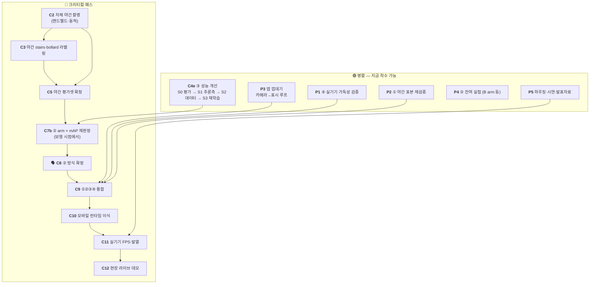

# 밤마실 — 전체 작업 TODO

> 최초 **2026-07-31** · 갱신 **2026-08-26** (`C10a` 양자화 완료 · 문서 compact 3차 43→30KB)
> 이 문서는 **무엇을 언제 할 수 있는가(순서·병렬성)** 만 다룬다. *왜 그렇게 하는가*는 원 문서에.
> 현재 상태 한 장은 [STATUS.md](STATUS.md) · 종결된 원문은 [archive/](archive/).

| 표기 | 뜻 | | 환경 | 뜻 |
|---|---|---|---|---|
| 🔴 | **크리티컬 패스** — 늦어지면 전체가 늦는다 | | 💻 | CPU만으로 가능 |
| 🟢 | **병렬 가능** — 지금 착수해도 된다 | | 🖥️ | 학습 PC 필요 (RTX 4060 Ti + 전체 데이터) |
| ⏸ | **대기** — 무엇을 기다리는지 명시 | | ☁️ | Colab (GPU 없는 PC 에서도) |
| 🗣️ | **팀 회의 필요** | | 📱 | 실기기 · 🎥 촬영 현장 |

---

## 0. 지금 상황

**마감까지 1주 남짓**이다. ①②③④ 네 단계는 전부 후보가 서 있고 데스크톱 end-to-end 도 돈다.
막혀 있는 것은 **두 개뿐**이고 둘 다 코드가 아니다 — 그리고 **8/5 이후 한 칸도 안 움직였다.**

1. 🔴 **`C2` 자체 야간 촬영** — `C3`→`C5`→`C7b`→`C8`→`C9` 가 직렬로 매달려 있다.
   선행 조건(안건 3·4)은 8/3 에, 마지막 전제(안건 7)는 **8/22 에** 풀렸다.
   **이제 문서상 `C2` 를 막는 것이 하나도 없다.**
2. 🔴 **`P3` 앱 껍데기 — 구현 0건.** `C9` 통합 시점에 없으면 통합할 곳이 없다.

★ ③ 는 그동안 외부에서 진행됐다 — `C4d` 6런이 8/7 에 도착했고(→ [STATUS ★인수분](STATUS.md)),
자체 3클래스 런은 8/23 에 끝났다. `bollard` 를 막던 "샘플에 172박스뿐"은 8/5 전량(300GB)
확보로 해소됐다.

> ⚠️ **직관과 반대인 순서 2건** — ① **② 방식 결정이 ③ 학습보다 뒤에 온다**(② 판정의 주 지표가
> ③ mAP 라 채점기가 먼저 있어야 한다) ② **자체 야간 촬영이 ② 방식 결정의 선행이다**
> (보유 데이터에 야간·강광원이 없어 평가 수단 자체가 없다).

---

## 1. 의존 관계



- 🔴 은 화살표 방향으로만 진행된다. **출발점은 `C2` 하나**다. (`C1`·`C4`·`C4b`·`C6`·`C7 1차` 완료 → 8장)
- 🟢 은 아무 때나 시작해도 되지만 **`C9` 통합 시점까지는 끝나 있어야 한다.**
- **`C4e`·`C10a` 는 크리티컬 패스가 아니다** — ③ 는 이미 쓸 수 있는 가중치와 ONNX 가 있고,
  둘 다 거기서 더 올리는 개선이라 병렬로 돈다.

---

## 2. 🔴 크리티컬 패스

| # | 작업 | 선행 | 환경 | 담당 | 근거 |
|---|------|------|------|------|------|
| **C2** | **자체 야간 촬영** — 핸드헬드·동적. ⚠️ 코스에 셋이 반드시: **볼라드 장면** · **멀리서 계단에 접근하는 구간** · **계단 없는 야간 노면**(점자블록·자전거도로·자갈 — 8/13 실측으로 추가) | **없음** | 🎥 | 팀원3 | [data.md 2-2](data.md) · [detection.md 8-4](detection.md) |
| **C3** | 자체 야간 `stairs`·`bollard` BBox 라벨링 + **`data/test_real_data/` 7장**(`_04` 는 유일한 야간 볼라드) | C2 | 💻 | 팀원3 | [labeling_stairs.md](labeling_stairs.md) |
| **C5** | **야간 평가셋 확정** — 자체 촬영분을 주 평가셋으로 승격 | C2·C3 | 💻 | 팀원3·팀장 | [STATUS 함정 1](STATUS.md) |
| **C7b** | ② arm × ③ mAP **재판정** — 1차(8/2)는 **대시캠**이라 보행 시점과 다르다 | C5 | 🖥️ | 팀장 | [detection.md 7장](detection.md) |
| **C8** | 🗣️ **회의 — ② 방식 확정** (FPS 예산 · 게이트 측정 환경 · 표시/탐지 분리 추인) | C7b | — | 전원 | [archive/lowlight_method_decision](archive/lowlight_method_decision_2026-07.md) |
| **C9** | **①②③④ 통합** — 데스크톱 사전 검증 완료(`pipeline_demo.py`) | C8 + P1·P2·P3 | 💻🖥️ | 팀장 | README 2장 |
| **C10** | ONNX → 모바일 런타임 이식(QNN/NNAPI/Core ML). ③ 는 **이미 ONNX 로 나가 있다** · 양자화도 끝났다(→ `C10a`) | C9 | 🖥️📱 | 팀장·팀원2 | [hardware_inference 1장](hardware_inference.md) |
| **C11** | 실기기 측정 — 지속 FPS · 10분 발열 · end-to-end 지연. **② 속도 게이트의 최종 판정자** | C10 + P5 | 📱 | 팀원2 | [hardware_inference 5장](hardware_inference.md) |
| **C11b** | **실기기 960 프레임 시간 측정** — 기획서 2.4 KPI 의 "측정 예정" 칸. ⚠️ 기존 640 값(p50 **32.7** · p95 **38.1**ms · 11분 · Galaxy A34)은 **더미 모델 = "무처리" 기준**이라 여유의 근거가 못 된다 — **640 처리 포함값을 먼저** 재야 비교가 성립한다 | C10 | 📱 | 팀원2 | [STATUS R5](STATUS.md) |
| **C12** | 현장 라이브 데모 + 모의 야간 코스 정량 비교 | C11 | 📱🎥 | 전원 | README 5장 |

> **`C2` 가 왜 최우선인가** — 촬영은 날씨·시간대·섭외 리드타임이 있고 실패하면 재촬영에 며칠이
> 든다. 게다가 뒤에 4단계가 직렬로 매달려 있다.

---

## 3. 🟢 병렬 트랙

### ~~C4c. ③ 3클래스 재학습~~ — ✅ **대체 완료** (외부 `C4d` 8/7 → 자체 `C4e` S3 8/23)

착수 전 4단계와 Colab 패키징 절차는 소임을 다했다(원문 → [data.md 3-1-4](data.md)).

★ **다만 게이트는 살아 있다** — 이후 모든 ③ 판정이 이 3축을 쓴다. **자를 바꾸면 8/23
판정들과 대조가 끊긴다.**

| 축 | 자 | 기준 |
|---|---|---|
| person 회귀 | rec 34 held-out (`eval_nightowls.py`) | recall **0.609** 유지 |
| stairs 회귀 | rec 34 · rec 38 (`eval_stairs_night.py`) | 야간 오탐 **0.2%** 유지 |
| bollard 신규 | 야간 평가셋 (`C5`) | 기준선 없음 — **폭 구간별 recall 을 같이 뽑을 것** |

> ⚠️ **볼라드는 640 입력에서 절반이 탐지 하한 아래다**(폭 중앙 **7.8px** · 8px 미만 **50.3%** ·
> `<4px` 는 960 에서도 recall **0.49** 상한). 구간별로 쪼개지 않으면 "데이터 부족"과
> "해상도 한계"가 구분되지 않는다.

⏸ **잔여** — 노면 마스킹(`Surface_1~5`) 미수령(`W5`). **원거리 계단 측정**이 여기 달려 있다
(→ [detection.md 8-3](detection.md)).

### 🆕 C4e. ③ 성능 개선 — S0~S3 ✅ 완료 · **남은 것은 S4 판정뿐**

⚠️ **배포 해상도 640 은 고정 전제**다(실기기 속도 미측정 · ②가 이미 ~20ms). 960 은 픽셀
2.25배라 근거 없이 올리면 FPS 게이트가 깨진다. 남은 레버는 **데이터 · 학습 레시피 · 추론측**뿐.

📦 **표·근거·읽어낸 것의 원문은 [detection.md 9·11장](detection.md) 이 정본**이다.
여기는 **결정된 값과 재실행 명령만** 둔다.

| 단계 | 결과 (전부 8/23) | GPU |
|---|---|---|
| **S0** | 인수분 640축 4런 held-out 판정 — **3런 통과 · `26n_640` 기각**(NMS-free 라 앱 계약도 바꾼다) · ★★ **주간 순위가 야간에서 뒤집혔다**(함정 1 의 세 번째 증거) | 0 |
| **S0b** | 보행 시점 실야간에서 **라벨 없이 오탐 측정** — **세 축의 1위가 전부 다르다**(recall `noneg` · 오탐 `11s` · 야간 볼라드 `11n`) → 단일 후보를 여기서 정하지 않는다 | 0 |
| **S1** | 추론측 두 실험 (↓ 확정값 표) | 0 |
| **S2** | AIHub `negative_night` **1,163장** 투입 → `stairs` 실야간 오탐 conf 0.10 에서 **22 → 9박스**. 막던 것은 데이터가 아니라 **배선 한 칸**이었고 `aihub_subset_to_yolo.py` 로 해소(같은 실행에서 세션 누수 결함 발견 → [함정 17](STATUS.md)) | 0 |
| **S3** | **첫 자체 3클래스 런 `c4e_s3_11n`** — `detect_v3` **16,291장** · 640 · 배경 10% · **100ep/patience 20**. **게이트 3종 전부 통과**(recall **0.635** · `stairs` 오탐 **0.0%** · 실야간 음성 5박스) · **야간 볼라드 붕괴 소멸**. c4d 는 50ep 이었으므로 **학습량 축이 여기서 처음 확인됐다** | 1회 ✅ |
| **S4** | 🔴 **남음** — `C5` 자체 야간 평가셋에서 후보 3개 최종 판정. 하네스는 8/25 준비 완료(↓) | 0 |

**S1 에서 확정된 운영값** (→ [detection.md 9-9](detection.md))

| 결정 | 값 |
|---|---|
| 운영 conf | **단일 0.25 확정** — 일괄 하향 **기각**(야간 음성에서 0.25→0.10 이 `stairs` 오탐 2~3.7배 · 발화 6/15→14/15) |
| 클래스별 conf | `bollard` 0.15 는 **`11s` 를 쓸 때만** — `11n` 은 이미 0.25 에서 다 잡고 `noneg` 는 역효과 |
| ③ 프레임 스킵 | **`--detect-every` 2 가 상한** (k=2→3 에서 IoU 0.93→0.88 · miss 0.21→0.30) |
| `W6` 보간 · `P1` 평활 | **둘 다 불필요** — 값이 없다 |
| 🆕 **ROI 크롭 (E3)** | 🔴 **기각**(8/26) — 단일 창은 전체 recall **−0.18~−0.24** · 2패스는 `<4px` +0.220 이나 **FP 2.26배**(정밀도 0.798→0.654) + 추론 2배. 🟡 **평가셋에 학습분이 최대 ~9% 섞여 있어 학습 PC 재확인 대기**(↓ §7) (→ [detection.md 9-9-3](detection.md)) |

🔴 **시간축은 conf 하향의 흡수 수단이 못 된다** — 오탐 평균 지속을 13.6 → **24.7** 프레임으로
**늘린다.** ★ 깜빡임의 주범은 스킵이 아니라 **탐지기 자체**(오라클도 1,000프레임에 105~127회)라
보간이 아니라 **데이터·학습**에서 풀 문제다.

**S2 잔여 2건** — 🟡 `W5` 노면 마스킹 다운로드(투입 전 `label_stats.py` 로 StairNet 과 종횡비·
면적 대조해 **학습 투입/평가 전용** 판정) · 🟡 `C3` 에서 `test_real_data/` 7장 라벨링.
★ ghost FP(기둥·가로등·표지판 지주) **57~63%** 는 좁은 정의상 **영영 오탐**이라
`pole`·`tree_trunk` 프레임을 **배경으로** 더 넣는 것이 정공법이다.
⚠️ 배경 비율은 **10% 유지** — 배경의 효과는 mAP 가 아니라 **FP 에** 난다.

**재실행**

```powershell
uv run python scripts/compare_detect.py --runs c4b_loli0,c4d_11n_640,c4e_s3_11n --skip-fp38
uv run python scripts/eval_real_night.py --runs c4b_loli0,c4d_11n_640,c4e_s3_11n
```
⚠️ `--skip-fp38` 는 rec38 재생성이 **~4GB 복사**라서다(→ [함정 14](STATUS.md)).
⚠️ 960 런 2개는 평가 대상이 아니다 — 배포 640 고정이고 imgsz 불일치 평가는 무의미하다.

#### 🆕 S4. 최종 판정 — ✅ **잴 자는 준비됐다** (8/25 신설)

후보 3개(`c4b_loli0` 현 배포 · `c4d_11n_640` 인수분 · `c4e_s3_11n` 자체)를 가르는 마지막
단계다. 기존 하네스 3종은 **전부 다른 것을 재서**(`compare_detect` NightOwls 전용 ·
`eval_real_night` **라벨 없음** · `eval_stairs_night` 단일 클래스) `C5` 를 못 쟀고,
그 빈칸을 **`scripts/eval_own_night.py`** 가 메운다.

**재는 것 — 5축** (원문은 스크립트 docstring)

| 축 | 무엇 | 비고 |
|---|---|---|
| A | 클래스별 **mAP50 · mAP50-95** + 종합 | 임계값 무관 · `model.val()` |
| B | **운영점** recall·precision·F1·FP·미탐 | 클래스별 **+ 종합(micro)** |
| C | **음성 프레임 오탐** 박스 수 · 발화 프레임 | 8/23 게이트와 **같은 자** |
| D | **GT 폭 구간별 recall** `<4/4~8/8~16/≥16px` | **+ 전체 열·종합 행** |
| E | **볼라드 박스별 confidence** | 장면 `maxconf` 로는 붕괴가 안 보인다 |

- `ignore` 박스는 **감점 제외**(찾아도 FP 아니고 못 찾아도 FN 아니다 →
  [labeling_stairs 4장](labeling_stairs.md)). val 라벨에서도 빼서 mAP 를 지킨다
- 클래스별 conf 는 `eval_real_night.py` 함수를 **그대로 재사용**한다 — 자를 새로 안 만들었다
- **2클래스 `c4b_loli0` 은 `bollard` 행이 `-`** 로 나온다(0 이면 "오탐 0" 오독)
- 🔴 **전처리는 `--letterbox` 가 정한다 — 기본 `square`**(배포 ONNX 와 같은 자).
  8/23 판정들은 자가 섞여 있었다(→ [함정 18](STATUS.md))

```powershell
uv run python scripts/eval_own_night.py --src data/own_night `
    --runs c4b_loli0,c4d_11n_640,c4e_s3_11n
```

🟢 **1차 실행 완료(8/30)** — `test_real_data`+`test_real_data2` 27장(Claude 육안 라벨)으로
위 명령을 처음 돌렸다. `c4e_s3_11n` 전 축 우세, 상세는 → [detection.md 9-10](detection.md).
🔴 **최종 판정은 아니다** — `label_stats.py` 확인 결과 높이 32px 미만 표본이 여전히 0 이라
`C2` 정식 촬영(원거리 계단 포함) → `C3` 라벨이 그대로 남는 일이다.

#### 하지 않는 것 (재개 조건을 같이 적는다)

| 항목 | 이유 | 재개 조건 |
|---|---|---|
| 960 · 1280 · 타일링 | 640 고정 전제와 충돌. `<4px`(GT 22%)는 960 에서도 recall 0.49 상한이라 해상도로 못 간다 | `C11b` 에서 **640 처리 포함값**을 재고 예산 여유가 확인될 때 |
| YOLO26n(NMS-free) | 앱 인터페이스 계약 변경 · 앱 구현 0건 | `P3` 골격 완료 후 |
| 클래스 추가 | 🗣️안건 7 종결 (8/22) | 마감 이후 |
| **주간→야간** 합성 증강(`W2`) | ✅ **A/B 로 쟀고 값이 없다** — 합성 21,657박스를 넣든 빼든 실야간 동점(`c4b_loli6000` 0.691/0.625 vs `c4b_loli0` 0.684/0.609)인데 **학습 비용은 2배**. 포화 광원 0.00% · 노이즈 방향 역전 · 라벨 오염 (→ [detection.md 6-7](detection.md)) | **없음 — 재개하지 않는다** |
| `--pole-as-bollard` | 8/22 좁은 정의 확정 | 제품 정의가 바뀔 때 |

### 🆕 C10a. ③ ONNX 양자화 — ✅ **8비트 채택 · 🔴 4비트·FP8 기각** (8/26 · FP8 8/28)

`C10` 의 준비 작업인데 **선행조건 0**(배포 ONNX 가 로컬에 있고 `.pt` 불요)이라 먼저 돌렸다.
신설 `scripts/quantize_onnx.py` · 산출은 **`outputs/quantization/<원본이름>-INT{8,4}/`**
— **디렉토리도 파일도 전부 같은 이름으로 시작**해 한 파일만 옮겨도 어느 판인지 안다.

```powershell
uv run python scripts/quantize_onnx.py                            # 8비트 (generic + qnn)
uv run python scripts/quantize_onnx.py --bits 4 --block-size 0    # 4비트 (기각 · 재현용)
```

📦 **수치의 정본은 패키지 README**(`<pkg>_README.md` — 파일 표 · FP32 정합 · 붕괴 검사).

| 판 | 크기 | 야간 볼라드 `_04` | 음성 15프레임 `stairs` 오탐 |
|---|---|---|---|
| FP32 (원본) | 10.61 MB | 2/2 (0.84 · 0.77) | 5박스 |
| ✅ **INT8 generic** | **3.15 MB** | **2/2** (0.81 · 0.78) | **4박스** |
| ✅ INT8 qnn | 3.04 MB | **2/2** | 5박스 |
| 🔴 INT4 generic | 1.86 MB | **0/2** — conf 0.05 까지 내려야 2개 | — |
| 🔴 INT4 qnn | 1.75 MB | **0/2** · conf 0.01 에서도 0개(`blind`) | 7장 전부 0검출 |

- **입출력 계약은 그대로** — `[1,3,640,640]` → `[1,7,8400]`. **앱이 고칠 것 없다**
- ⚠️ **CPU 판·GPU 판이 아니다** — QDQ ONNX 는 런타임 중립이고 두 판의 차이는 **EP 계열이
  요구하는 양자화 형식**이다. GPU 는 INT8 의 짝이 아니다(폰에 TensorRT 없음 →
  [hardware_inference 1장](hardware_inference.md)). GPU delegate 면 FP16 이다
- 캘리브는 **야간 실촬영 159프레임**(스틸 7 + 영상 5개 stride 4) · 전처리는 배포와 같은 자
- ★★★ **통째로 양자화하면 검출이 0 이 된다 — `Conv` 만** (→ [함정 20](STATUS.md))
- 🔴 **4비트가 왜 안 되는가** — 도구 문제가 아니다(opset 21 · Q/DQ 511개 전부 표준 도메인 ·
  4비트 initializer 176개로 **기계적으로는 성공**). ORT 의 per-block 스케일은 **rank-2 전용**이라
  Conv(rank-4)는 거부되고(`quant_utils.py:429`) **per-channel 이 상한**인데 거기서 무너졌다.
  `yolo11n` 2.59M 은 깎을 여유가 없다는 뜻이다
- 🔴 **FP8 은 왜 안 되는가**(`scripts/fp8_quant_experiment.py` · 8/28 · 배포 후보가 아니라
  기각 판단의 실증용 일회성 실험) — opset 12→19 변환은 성공. 세 경로 전부 막힌다:
  **A** generic·Conv만: 파일은 만들어지나(3.02MB) 실행 시 `float8e4m3fn` 을 받는
  `QLinearConv` 자체가 무효(`INVALID_GRAPH`) · **B** generic·전체그래프: 캘리브 단계에서
  `AttributeError`(분포 캘리브가 float8 에서 `avg`/`std` 를 못 찾음)로 생성 자체가 실패 ·
  **C** QNN(Hexagon HTP): `get_qnn_qdq_config`→`quantize()` 는 성공하지만(8/26 최초 실측
  때 "재검토 필요"로 남겼던 것을) 8/28 에 A와 똑같이 실행해 보니 **동일한 `INVALID_GRAPH`**.
  QNN 전용 그래프라 이 PC(CPU/CUDA 뿐, QNN EP 없음)로는 실행 가능 여부를 확인할 수 없고,
  실기기(Hexagon NPU) 없이는 "파일이 생겼다"와 "동작한다"가 다른 얘기다. 원문 →
  `outputs/quantization/<pkg>-FP8_experiment/result.md`

#### 🔴 아직 검증되지 않은 것

- **mAP·recall 정식 판정 불가** — held-out(rec34)·`detect_v3` val 이 이 PC 에 없다 →
  학습 PC 또는 `C5` 하네스
- **속도 미판정**(→ [함정 3](STATUS.md)) — 이 PC CPU EP 에서는 INT8 이 **오히려 느렸다**
  (FP32 62 · generic 68 · qnn 90ms). 데스크톱 x86 의 QDQ 오버헤드이지 폰 NPU 배율이 아니다
- **캘리브 표본이 한 장소·한 밤·세로 촬영**으로 치우쳐 있다
- **QNN 판이 실기기에서 CPU fallback 없이 올라가는지 미확인** — op 하나가 안 올라가면 이득 소멸

#### 하지 않는 것

| 항목 | 이유 | 재개 조건 |
|---|---|---|
| **4비트 채택** | 🔴 **만들어서 재 봤고 붕괴했다**(↑). ⚠️ 8/26 오전에 "대상 노드 0개라 **불가**"로 적었던 것은 **`matmul_nbits_quantizer`(LLM 전용) 경로만 본 오판**이다 — 일반 QDQ 양자화기는 `QInt4` 를 받고 Conv 88개가 대상이 된다. **생성은 되고 정확도가 무너진다** | **QAT**(학습 PC + `best.pt` 필요) 또는 용량이 더 있는 모델(`11s`)로 갈 때 |
| **FP8 채택** | 🔴 **세 경로 다 막힌다**(↑) — A·C 는 파일은 생겨도 이 PC 에 `float8e4m3fn` 을 받는 실행 공급자가 없어 `INVALID_GRAPH` · B 는 생성 자체가 캘리브 단계에서 실패. 애초에 `hardware_inference.md`가 정한 모바일 경로(NPU→INT8, GPU delegate→FP16)에 FP8 실행 경로가 없다 | **QNN(Hexagon NPU) 실기기 확보 시** A/C 재검증 가능 — 그 전까지는 재개 안 함 |
| `quantize_dynamic` | RNN·Transformer 용이다. CNN 은 **static PTQ** 가 정석 | 없음 |
| 내보내기 단계 FP16(`--half`) | INT8 캘리브의 입력을 **미리 손실**시키고 CPU EP 에서는 오히려 느리다 | GPU delegate 확정 시 |
| 앱팀 배포 전환 | 🔴 **아직 판정 전** — 위 미검증 4건. 현 계약은 FP32 판 그대로 | `C5` 판정 + `C11` 계측 |

### P3. 앱 (팀원2) — **완전 독립 · 🔴 실질적으로 크리티컬**

처리부를 항등함수로 두고 카메라→표시 루프를 먼저 완성해 두면 `C9` 통합이 "함수 갈아끼우기"로
끝난다. **모델을 기다릴 이유가 전혀 없다.**

| 작업 | 선행 |
|------|------|
| 앱 구조 설계 · 카메라 입력 → 표시 루프 (처리부 항등함수) | 없음 |
| 사전 녹화 입력 데모 모드 — **현장 실패 대비 보험** | 위 |
| UI — 온/오프, 강조 강도, 해상도 전환 | 위 |
| 스테레오 렌더(좌우 분할 + 배럴 왜곡) — 초기엔 단일 화면으로 검증 | 위 |

### P1·P2·P4·P5 — 잔여

| # | 작업 | 선행 | 환경 | 근거 |
|---|------|------|------|------|
| **P1** | ④ **저시력 가독성 실사용 검증** — 색은 8/24 확정이라 판정 대상이 좁아졌다: **라임↔노랑이 적록색약에서 갈리는가**(녹색맹 최소 ΔE **9.9**). 안 갈리면 되돌아갈 자리 `violet`·`magenta` 는 **둘 다 밝기 대비 3:1 미만**. 두께·야외 시인성은 여전히 가설 | P3 실기기 | 📱 | `emphasize.py` · [노트북](../notebooks/emphasis_palette_review.ipynb) |
| **P1** | 박스 시간축 평활(hold·IIR) — ⚠️ `C4e` S1 에서 **값 없음**으로 나왔다 | — | 🖥️ | [detection.md 9-9-2](detection.md) |
| **P2** | ① 야간 표본(ExDark·StairNet)으로 `D1A1+bf` 재검증 — **현재 글레어 표본 n=1** | — | 🖥️ | [lowlight 6-5-4](lowlight_classical.md) |
| **P2** | 🗣️ ①을 ②에 통합할 것인가 — 채택 시 통합이 기본 구도 | 위 재검증 | — | [lowlight 6-5-4](lowlight_classical.md) |
| **P4** | **B arm(Zero-DCE/SCI) 구현·실측** — 미착수 | — | 🖥️ | [lowlight 1장](lowlight_classical.md) |
| **P4** | `+bf` 기본값 승격 검토 — 신 지표에서 **반례 2건** | — | 💻 | [lowlight 6-4-3](lowlight_classical.md) |
| **P4** | LoLI-Street 라벨 육안 검수 (pseudo-label 신뢰도) | — | 🖥️ | [data.md 2-1](data.md) |
| **P5** | 골판지 VR 하우징 · 시연 영상 · **발표자료** | — | 🎥💻 | 아래 |

> **발표 소재는 이미 4건 확보돼 있다** — ① 계단 고전 CV 기각(재현율 **0.232** · 오경보 100%)
> ② 평가 데이터가 야간이 아님을 발견 ③ 목적 축 지표 3개가 육안과 어긋나 재설계
> ④ 표시/탐지 경로 분리(전처리가 탐지를 해친다는 실측). **"가설 → 정량 측정 → 기각 → 재설계"
> 서사**가 검증 없는 아키텍처 자랑보다 설득력이 높다.

---

## 4. ⏸ 대기

| # | 작업 | 무엇을 기다리는가 |
|---|------|------------------|
| **W2** | ~~주간→야간 합성 증강~~ → **야간 → 더 어두운 야간**으로 범위 축소 (8/25) | 🔴 주간→야간은 **기각**(→ 3장 *하지 않는 것*). 남은 것은 `C2` 실야간분을 `darken.py` 로 밝기 축 증강하는 것뿐 — **광원이 원본에 실재**해 합성의 치명 결함 2개가 없다. ⚠️ **학습 증강으로만** 쓰고 **평가셋에 넣지 말 것**(함정 2). 기다리는 것: `C2` 촬영분이 부족할 때만 |
| **W3** | C안 dense 복원망 33k 본학습 | **속도 게이트 통과 시에만.** 돌파 실마리가 없어 사실상 동결 |
| **W4** | NightOwls 로 ② arm 비교 재실행 | ✅ 선행 해제(8/1) · **착수 가능** |
| **W5** | AIHub **노면 마스킹**(`Surface_1~5`) 다운로드 | 없음 — 국내 PC 에서 지금. `stairs` 원거리 측정이 여기 달려 있다 |
| **W6** | 탐지 프레임 스킵 + 트래킹 보간 | ✅ 측정 완료 — **보간은 값 없음**, 스킵 상한 2 |
| **W7** | ② 속도 게이트 돌파 | 남은 카드 3개 — 내부 해상도 하향 · 셰이더 이식 · `C11` 재판정 |

---

## 5. 🗣️ 회의 안건

| # | 안건 | 시점 |
|---|------|------|
| **1** | **FPS 예산 배분 + 게이트 측정 환경 기준.** ★ 표시/탐지 분리로 계산이 달라졌다 — 병렬로 돌리면 예산이 는다. 20ms 는 실측이 아니라 **설계 배분값**이다 | C7b 직후 |
| **2** | **①을 ②에 통합할 것인가** — `D1A1+bf` 채택 시 통합이 기본 구도 | 야간 표본 재검증 후 |
| **3** | paired 촬영 **규모·공수 배분**(팀원3 경합). ✅ 존폐·개인정보는 8/3 종결 | C2 이후 |
| **5** | 채도 보정 적용 여부 (적용 시 arm 수 2배) | C7b 이전 |
| **6** | opencv-contrib 교체 여부 — 팀 4인 `uv.lock` 전원 갱신 | BIMEF 를 arm 에 올릴 때만 |
| **7** | ✅ **종결 (8/22) — 클래스 3종 최종 확정.** 나머지 26종 미채택(`pole` 648px vs `bollard` 75px 로 형태가 갈린다) · `2 bollard` **좁은 정의**(`--pole-as-bollard` 는 남기되 켜지 않는다) · 노면 20종은 세그 클래스라 보류. ★ 확장은 **마감 이후 갈래** | ✅ 종결 |

> ✅ **재촬영 위험은 8/22 로 해소됐다.** ⚠️ **코스에 확정된 요구는 셋** — 볼라드 장면 ·
> 멀리서 계단에 접근하는 구간 · 계단 없는 야간 노면.

---

## 6. 남은 일정 (8/26 기준)

🔴 **크리티컬 패스가 4주째 한 칸도 안 움직였다.** `C2` 미출발 · `P3` 0건 그대로다.
마감(9월 초)까지 **1주 남짓**이고 **`C9` 통합이 9월로 넘어가는 것은 기정사실**이다.

| 시기 | 🔴 크리티컬 | 🟢 병렬 |
|------|------------|---------|
| ~~8월 1~4주~~ | ~~안건 7 → `C2` 출발~~ **미이행**(안건 7 은 8/22 종결) | ✅ `C4d` 인수 · `C4e` S0~S3(8/23) · ④ 색 + ONNX 3클래스 공지(8/24) · Junction 재연결 |
| **8월 5주 (지금)** | 🔴 **`C2` 촬영 — 더 못 미룬다** → `C3` → `C5` → `C7b` → 🗣️`C8` | 🔴 **`P3` 앱 껍데기** · ✅ `C10a` 양자화(8/26) · `W5` 이월 · `P5` 하우징 |
| **9월 1주** | **`C9` 통합** → `C10` 이식 → **`C11` 실기기 측정** | **`C4e` S4 = `C5` 최종 판정**(후보 3개) · 발표자료 |
| **9월 초 마감** | **`C12` 현장 데모** | 사전 녹화 데모 모드(보험) 완비 |

### ⚠️ 일정 리스크

1. 🔴 **`C2` 는 이미 4주 늦었다.** 뒤에 4단계가 직렬이라 **`C9` 가 9월로 넘어간다.**
2. **앱이 구현 0건이다** — 이 문서에서 **가장 오래 방치된 항목**이고 지금 실제 병목이다.
3. **`C7b` 는 이미 넘겼다**(`C2` 미출발 → `C5` 없음). **보험을 발동할 국면** —
   현 후보(`c4e_s3_11n`)를 기준선으로 **`C9` 통합을 먼저 시작**한다.
4. **② 속도 게이트가 `C11` 에서 떨어지면** 9월 1주에 내부 해상도 하향으로 대응해야 한다 —
   되돌릴 시간이 없으므로 `C11` 을 앞당길 수 있으면 앞당긴다.

---

## 7. 지금 당장 착수 가능한 것 (선행조건 0)

| 작업 | 담당 | 환경 |
|------|------|------|
| 🟡 **배포 conf 계약 정정 — 절반 완료**(8/26). ✅ `export_onnx.py`·`pipeline_demo.py` 기본값 **0.35 → 0.25** · ✅ **INT8 패키지는 0.25 로 다시 구웠다**(같은 날 metadata 를 FP32 패키지 키 구조에 맞춰 재작성 — `classes`·`inference`·`preprocess`·`warning` 이 빠져 있었다). 🔴 **남은 것은 FP32 패키지 하나** — `metadata.json`·`README.md` 가 아직 0.35 이고 생성물이라 **`c4e_s3_11n/weights/best.pt` 이관 후** 다시 구워야 한다. 앱팀이 받는 FP32 zip 은 그때까지 0.35 를 말한다 | 팀장 | 💻 |
| 🔴 **`C2` 야간 촬영지 섭외·장비 준비** — 회의 직후 출발 | 팀원3 | 🎥 |
| 🔴 **`P3` 앱 껍데기** — 카메라→표시 루프 (처리부 항등함수) | 팀원2 | 📱 |
| 🆕 🟡 **`C4e` E3 재확인 — 오염 없는 평가셋에서** (8/26 결론의 유일한 구멍). 로컬 AIHub 서브셋은 `c4e_s3_11n` 학습분이 **최대 ~9%** 섞여 있고 **어느 장인지 로컬에서 못 가린다**(`detect_v3` 목록이 학습 PC 에 있다). **train 을 뺀 셋으로 한 번** 돌리면 닫힌다. ⚠️ 같이 **`c4d_11n_640`(외부 학습)로도** 돌릴 것 — 모델을 바꿔도 `<4px` 이득이 재현되면 오염 가설이 배제된다. ⚠️ `roi_crop_eval.py` 의 로더가 서브셋 레이아웃 전용이라 **분기 한 칸** 필요 (→ [detection.md 9-9-3](detection.md)) | 팀장 | 🖥️ |
| **`W5`** 노면 마스킹 `Surface_1~5` 다운로드 (`stairs` 원거리 측정용) | 팀원1 | 🖥️국내 |
| **`C4c` ①정찰** `aihub_pack_for_colab.py --src <해제루트> --dry-run` | 팀원1 | 🖥️국내 |
| **`P4`** B arm(Zero-DCE/SCI) 구현 · LoLI 라벨 육안 검수 | 팀원1 | 🖥️ |
| **`W4`** NightOwls 로 ② arm 비교 재실행 · **`P2`** 야간 표본 `D1A1+bf` 재검증 | 팀장 | 🖥️ |
| **`P5`** 하우징 제작 · 발표자료 초안 | 팀원3 | 🎥💻 |

> ✅ **최근 여기서 빠진 것** — Junction 재연결(8/23) · `C4e` S0~S3(8/23) · 앱팀 계약 공지(8/24) ·
> `C5` 하네스 신설(8/25) · `C10a` 양자화(8/26). 전부 ↓ 8장.

---

## 8. 완료 (요약 — 원문은 각 근거 문서)

| 항목 | 완료 | 근거 |
|------|------|------|
| ★ **`C10a` ③ ONNX 양자화** — **8비트 채택**(10.61→3.15MB · 볼라드 2/2 유지) · **4비트·FP8 기각** · 함정 20 발견 | 8/26 · FP8 8/28 | 3장 `C10a` · 패키지 README · FP8 `result.md` |
| ★ **`C5` 판정 하네스 `eval_own_night.py`** — 5축 · `ignore` 감점 제외. ★ **기존 하네스 함정 2건 동시 발견** | 8/25 | [STATUS 함정 18·19](STATUS.md) |
| ★ **외부 리뷰 회신** — 실증 4단 · 계단 오탐 3겹 · 작은 볼라드(`<4px` recall **0.319** · 미탐 58% `blind`) + distillation 조건부 판단 | 8/25 | [review_response](review_response_20260825.md) |
| **문서 최적화 2차** — `STATUS` 52.5→35KB · 인수분 원문 archive 이관 · **`W2` 기각 판정** | 8/25 | [archive/received_c4d](archive/received_c4d_2026-08-07.md) · [detection.md 6-7](detection.md) |
| ★ **④ 색 3종 확정 + ③ ONNX 3클래스 계약 공지** — `bollard` 라임 `#9CFF2E` · 출력 `[1,6,8400]`→`[1,7,8400]` | 8/24 | [share 7-0](share_yolo_c4b_20260803.md) |
| ★★★ **`C4e` S2+S3 — 첫 자체 3클래스 런** — 게이트 3종 통과 · `stairs` 실야간 오탐 **22→9박스** · 볼라드 붕괴 소멸 | 8/23 | [detection.md 11-3c](detection.md) |
| ★★ **`C4e` S1 — 클래스별 conf · 박스 시간축** — **단일 conf 0.25 확정** · `W6`·`P1` 값 없음 | 8/23 | [detection.md 9-9](detection.md) |
| ★★ **`C4e` S0·S0b — `c4d` held-out 판정** (3런 통과 · **주간 순위 뒤집힘**) + 라벨 없는 오탐 측정 | 8/23 | [detection.md 9장](detection.md) |
| ★ **문서 정합 정리** — 폐기된 직렬 표기 4곳 통일 · 3클래스 전환 함정 3개 기록 | 8/23 | [STATUS 함정 16](STATUS.md) |
| `data/` Junction 5종 재연결 (7개 스크립트 복구) | 8/23 | [data.md 5-2](data.md) |
| 🗣️ **안건 7 종결 — 클래스 3종 최종 확정**(좁은 정의) · `C2` 전제 소멸 | 8/22 | 5장 안건 7 |
| **데이터 위치 재편** — 전 데이터셋을 `D:\datasets\` 로(`data/` 는 Junction) · **C: 18.3GB 회수** | 8/22 | [STATUS 함정 14·15](STATUS.md) |
| ★ **c4d 육안 검수 노트북** — 라벨 검수 + 640 추론 + **실야간 첫 소견** | 8/13 | [notebook](../notebooks/aihub_subset_review.ipynb) |
| ★ **기획서 v20 수치 검증** — 수정 필요 5건 + 귀속 오류 1건 | 8/8 | [review_proposal_v20](review_proposal_v20_20260808.md) |
| ★ **외부 인수분 도착** — `C4d` 6런 · `is_night` **무효 판명** | 8/7 | [STATUS ★인수분](STATUS.md) |
| **AIHub bbox 전량 300GB 다운로드** + 정찰 · 취득 경로 확정(해외 차단 대응) · **노면 마스킹 `stairs` 발견** | 8/4~5 | [data.md 3-1](data.md) |
| **문서 최적화 1차** — `TODO` 전면 재작성 · 종결 논의 2건 archive 이관 | 8/5 | — |
| **클래스 3종 확정 + AIHub 배선** · ③ **ONNX 배포 패키지** · 🗣️ 안건 3·4(→ `C2` 선행 해소) | 8/3 | [share](share_yolo_c4b_20260803.md) · [labeling_stairs](labeling_stairs.md) |
| ★ `stairs` **야간/주간 분리 실측** — 야간 76장 mAP50 **0.993** → **저조도가 아니라 도메인 문제** | 8/3 | [detection.md 8장](detection.md) |
| `C4b` ③ 재학습 — held-out recall **0.195→0.609** · `stairs` 오탐 **7.7→0.2%** | 8/2 | [detection.md 6장](detection.md) |
| `C4` ③ baseline → **실야간 붕괴 발견**(person recall 0.226) · `C7` 1차 → ★ **표시/탐지 분리 확정** | 8/2 | [detection.md 3~4·7장](detection.md) |
| `W1` A3 시간축 — `+ts` 플리커 상쇄 ✅ / `+td` 는 `bf` 대체 실패 ❌ · 파이프라인 데모 | 8/2 | [lowlight 8장](lowlight_classical.md) |
| `C1` StairNet 선분→BBox(train 2,670/val 424) · `C6` 해상도 스윕 · NightOwls **13,602장** 해제 · ② **고전 CV 확정** | 8/1 | [detection.md 2-1](detection.md) · [lowlight 6-6](lowlight_classical.md) |
| ★ 목적 축 지표 3개 **절대 기준으로 재설계** · `P1` ④ 강조 렌더 · `P2` `D1A1+bf` | 7/31 | [lowlight 6-4·6-5](lowlight_classical.md) |
| ② 고전 arm 11개 구현 · 속도 프로브 · ★ 보유 데이터에 **야간·강광원 없음** 발견 | 7/29 | [data.md 0장](data.md) |
| 개발 환경(uv·CUDA) · 데이터 4종 확보 · 계단 고전 CV **기각**(재현율 0.232) | 7/26 | [archive/stair_classical_rejection](archive/stair_classical_rejection_2026-07-26.md) |

---

## 부록. 문서 지도

**정본은 [STATUS 5장](STATUS.md)** 이다 — 문서·노트북 목록과 크기가 거기 한 곳에만 있다.
여기서 가장 자주 따라가는 것만:

- 현재 상태 한 장 → [STATUS.md](STATUS.md)
- ③ 판정 원문(`C4e` 전체) → [detection.md 9·11장](detection.md)
- 양자화 실측 → `outputs/quantization/<pkg>/<pkg>_README.md`
- 앱팀 인수인계(3클래스 계약 · INT8) → [share 7-0](share_yolo_c4b_20260803.md)
- `stairs` 라벨 규칙(`C3` 작업자용) → [labeling_stairs.md](labeling_stairs.md)
- 종결된 실험·결정 원문 → [archive/](archive/)
