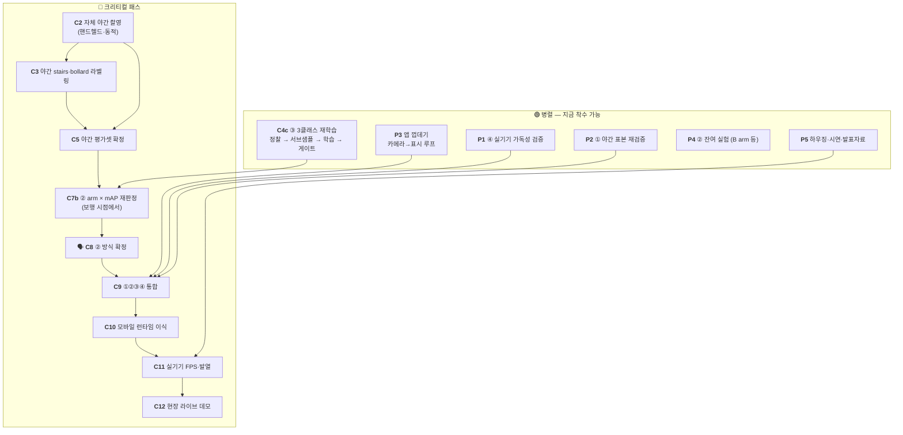

# 밤마실 — 전체 작업 TODO

> 최초 작성 **2026-07-31** · 갱신 **2026-08-05**
> 이 문서는 **무엇을 언제 할 수 있는가(순서·병렬성)** 만 다룬다. *왜 그렇게 하는가*는 원 문서에 있다.
> 현재 상태 한 장은 [STATUS.md](STATUS.md) · 완료 이력 원문은 [archive/](archive/).

| 표기 | 뜻 | | 환경 | 뜻 |
|---|---|---|---|---|
| 🔴 | **크리티컬 패스** — 늦어지면 전체가 늦는다 | | 💻 | CPU만으로 가능 |
| 🟢 | **병렬 가능** — 지금 착수해도 된다 | | 🖥️ | 학습 PC 필요 (RTX 4060 Ti + 전체 데이터) |
| ⏸ | **대기** — 무엇을 기다리는지 명시 | | ☁️ | Colab (GPU 없는 PC 에서도 가능) |
| 🗣️ | **팀 회의 필요** | | 📱 | 실기기 · 🎥 촬영 현장 |

---

## 0. 지금 상황

**남은 것은 8월 4주 + 9월 초다.** ①②③④ 네 단계는 전부 후보가 서 있고 데스크톱
end-to-end 도 돈다. 막혀 있는 것은 **두 개뿐**이고 둘 다 코드가 아니다.

1. 🔴 **`C2` 자체 야간 촬영** — `C3`→`C5`→`C7재판정`→`C8`→`C9` 가 직렬로 매달려 있다.
   선행 조건(안건 3·4)은 8/3 에 풀렸다. **막는 것이 없는데 안 나갔다.**
2. 🔴 **`P3` 앱 껍데기 — 구현 0건.** `C9` 통합 시점에 없으면 통합할 곳이 없다.

★ **8/5 에 하나가 풀렸다** — AIHub bbox 태스크 **전량(300GB) 다운로드 완료**. 8/4 까지
`bollard` 학습을 막던 "샘플에 172박스뿐"이 해소됐다. 다만 **장수만으로는 학습 계획을
못 세워서**(연속 프레임 · 저조도의 정체 불명) 정찰 단계가 하나 생겼다 → `C4c`.

> ⚠️ **직관과 반대인 순서 2건** — 놓치기 쉽다.
>
> 1. **② 방식 결정이 ③ 학습보다 *뒤*에 온다.** 파이프라인은 `②→③` 순이지만 ② 판정의
>    주 지표가 **③ 탐지 mAP** 라, 채점기(③)가 먼저 있어야 한다.
> 2. **자체 야간 촬영이 ② 방식 결정의 *선행*이다.** 보유 데이터에 야간·강광원이 없어
>    평가 수단 자체가 없다. 평가 수단이 없으면 방식을 고를 수 없다.

---

## 1. 의존 관계

- 🔴 은 화살표 방향으로만 진행된다. **출발점은 `C2` 하나**다 — 나머지 크리티컬 항목은
  전부 그 뒤에 붙는다. (`C1`·`C4`·`C4b`·`C6`·`C7 1차` 는 완료 → 8장)
- 🟢 은 아무 때나 시작해도 되지만 **`C9` 통합 시점까지는 끝나 있어야 한다.**
- **`C4c` 는 크리티컬 패스가 아니다.** ③ 는 이미 쓸 수 있는 가중치(`c4b_loli0`)가 있고
  ONNX 도 나가 있다. `C4c` 는 거기에 `bollard` 를 얹는 개선이라 병렬로 돈다.

---

## 2. 🔴 크리티컬 패스

| # | 작업 | 선행 | 환경 | 담당 | 근거 |
|---|------|------|------|------|------|
| **C2** | **자체 야간 촬영** — 핸드헬드·동적. ⚠️ 코스에 **볼라드 장면**과 **멀리서 계단에 접근하는 구간**이 반드시 들어가야 한다 | 없음 (🗣️안건 7 은 나가기 전 처리) | 🎥 | 팀원3 | [data.md 2-2](data.md) |
| **C3** | 자체 야간 `stairs`·`bollard` BBox 라벨링 | C2 | 💻 | 팀원3 | [labeling_stairs.md](labeling_stairs.md) |
| **C5** | **야간 평가셋 확정** — 자체 촬영분을 주 평가셋으로 승격 | C2·C3 | 💻 | 팀원3·팀장 | [STATUS 3장 함정 1](STATUS.md) |
| **C7b** | ② arm × ③ mAP **재판정** — 1차(8/2)는 NightOwls **대시캠**이라 보행 시점과 다르다 | C5 | 🖥️ | 팀장 | [detection.md 7장](detection.md) |
| **C8** | 🗣️ **회의 — ② 방식 확정** (FPS 예산 · 게이트 측정 환경 · 표시/탐지 분리 추인) | C7b | — | 전원 | [archive/lowlight_method_decision](archive/lowlight_method_decision_2026-07.md) |
| **C9** | **①②③④ 파이프라인 통합** — 데스크톱 사전 검증은 끝났다(`pipeline_demo.py`) | C8 + P1·P2·P3 | 💻🖥️ | 팀장 | README 2장 |
| **C10** | ONNX → 모바일 런타임 이식 (QNN/NNAPI/Core ML). ③ 는 **이미 ONNX 로 나가 있다** | C9 | 🖥️📱 | 팀장·팀원2 | [hardware_inference.md 1장](hardware_inference.md) |
| **C11** | 실기기 측정 — 지속 FPS · 10분 발열 · end-to-end 지연. **② 속도 게이트의 최종 판정자** | C10 + P5 | 📱 | 팀원2 | [hardware_inference.md 5장](hardware_inference.md) |
| **C12** | 현장 라이브 데모 + 모의 야간 코스 정량 비교 | C11 | 📱🎥 | 전원 | README 5장 |

> **`C2` 가 왜 최우선인가** — 촬영은 날씨·시간대·섭외 리드타임이 있고 실패하면 재촬영에
> 며칠이 든다. 게다가 뒤에 4단계가 직렬로 매달려 있다. 다른 무엇보다 먼저 나가야 한다.

---

## 3. 🟢 병렬 트랙

### C4c. ③ 3클래스 재학습 — `person` · `stairs` · **`bollard`** (팀원1 · 8/5 착수 가능)

AIHub bbox 전량이 들어왔다. **그러나 장수를 그대로 학습에 넣으면 안 된다** — 아래 4개가
학습 *전에* 끝나야 한다. 각 항목의 근거는 [data.md 3-1-4](data.md).

| 순서 | 작업 | 환경 | 왜 |
|---|------|---|---|
| ① | **정찰** `aihub_pack_for_colab.py --dry-run` — 블록 수 · 저조도 판별 | 🖥️국내 | 장수 ≠ 장면 수 · "저조도"가 야간인지 그늘인지 |
| ② | 저조도가 야간이면 **그 블록 일부를 held-out 으로 분리** | 💻 | 다 넣으면 야간 볼라드를 잴 자가 사라진다 |
| ③ | **서브샘플** — NightOwls 와 같은 자릿수로 (`--max-images`) | 💻 | 전량이면 주간이 90% 를 넘어 `C4` 붕괴 조건 재현 |
| ④ | val 을 **블록(가능하면 zip) 단위**로 분리 | 💻 | 무작위면 인접 프레임 쌍둥이로 수치가 부풀어 오른다 |
| ⑤ | 패키징(`--zip`, 2~3GB) → Drive → [colab_aihub_train.ipynb](../notebooks/colab_aihub_train.ipynb) | ☁️ | 학습 PC 를 점유하지 않는다 |
| ⑥ | ★ **회귀 게이트** — 이것이 합격 기준이다 (아래) | 🖥️ | 성패는 bollard mAP 가 아니다 |

**게이트** — 클래스 추가가 기존 성능을 깎으면 실패다.

| 축 | 자 | 기준 |
|---|---|---|
| person 회귀 | rec 34 held-out (`eval_nightowls.py`) | recall **0.609** 유지 |
| stairs 회귀 | rec 34 · rec 38 (`eval_stairs_night.py`) | 야간 오탐 **0.2%** 유지 |
| bollard 신규 | AIHub val (블록 분리) | 기준선 없음 — **박스 크기 구간별 recall 을 같이 뽑을 것** |

> ⚠️ **볼라드는 640 입력에서 절반이 탐지 하한 아래다**(폭 중앙 7.8px · 8px 미만 50.3%).
> 낮은 recall 은 예상된 것이고, 크기 구간별로 쪼개지 않으면 "데이터 부족"과 "해상도
> 한계"가 구분되지 않는다.

⏸ **잔여** — 노면 마스킹(`Surface_1~5`)은 아직 안 받았다. 이번 학습의 `stairs` 는
StairNet 뿐이고, **원거리 계단 측정**(→ [detection.md 8-3](detection.md))은 그 다운로드에 달려 있다.

### P3. 앱 (팀원2) — **완전 독립 · 🔴 실질적으로 크리티컬**

처리부를 항등함수로 두고 카메라→표시 루프를 먼저 완성해 두면 `C9` 통합이 "함수
갈아끼우기"로 끝난다. **모델을 기다릴 이유가 전혀 없다.**

| 작업 | 선행 |
|------|------|
| 앱 구조 설계 · 카메라 입력 → 표시 루프 (처리부 항등함수) | 없음 |
| 사전 녹화 입력 데모 모드 — **현장 실패 대비 보험** | 위 |
| UI — 온/오프, 강조 강도, 해상도 전환 | 위 |
| 스테레오 렌더(좌우 분할 + 배럴 왜곡) — 초기엔 단일 화면으로 검증 | 위 |

### P1·P2·P4·P5 — 잔여

| # | 작업 | 선행 | 환경 | 근거 |
|---|------|------|------|------|
| **P1** | ④ **저시력 가독성 실사용 검증** — 색·두께·야외 시인성. 코드 기본값은 가설이다 | P3 실기기 | 📱 | `scripts/emphasize.py` |
| **P1** | 박스 시간축 평활(hold·IIR) — ③ 프레임 스킵 시 깜빡임 방지 | — | 🖥️ | [hardware_inference 5장](hardware_inference.md) |
| **P2** | ① 야간 표본(ExDark·StairNet)으로 `D1A1+bf` 재검증 — **현재 글레어 표본 n=1** | — | 🖥️ | [lowlight 6-5-4](lowlight_classical.md) |
| **P2** | 🗣️ ①을 ②에 통합할 것인가 — 채택 시 통합이 기본 구도 | 위 재검증 | — | [lowlight 6-5-4](lowlight_classical.md) |
| **P4** | **B arm(Zero-DCE/SCI) 구현·실측** — 미착수 | — | 🖥️ | [lowlight 1장](lowlight_classical.md) |
| **P4** | `+bf` 기본값 승격 검토 — 신 지표에서 **반례 2건** | — | 💻 | [lowlight 6-4-3](lowlight_classical.md) |
| **P4** | LoLI-Street 라벨 육안 검수 (pseudo-label 신뢰도) | — | 🖥️ | [data.md 2-1](data.md) |
| **P5** | 골판지 VR 하우징 · 시연 영상 · **발표자료** | — | 🎥💻 | 아래 |

> **발표 소재는 이미 4건 확보돼 있다** — ① 계단 고전 CV 기각(재현율 0.232·오경보 100%),
> ② 평가 데이터가 야간이 아님을 발견, ③ 목적 축 지표 3개가 육안과 어긋나 재설계,
> ④ 표시/탐지 경로 분리(전처리가 탐지를 해친다는 실측). **"가설 → 정량 측정 → 기각 →
> 재설계" 서사**가 검증 없는 아키텍처 자랑보다 설득력이 높다.

---

## 4. ⏸ 대기

| # | 작업 | 무엇을 기다리는가 |
|---|------|------------------|
| **W2** | 주간 → 야간 저조도 **합성 증강** | 착수는 가능하나 **AIHub 를 야간에 쓸 때만** 의미. `C4c` 정찰이 "저조도 = 그늘"로 나오면 값이 오른다 |
| **W3** | C안 dense 복원망 33k 본학습 | **속도 게이트 통과 시에만.** 현재 게이트 돌파 실마리가 없어 사실상 동결 |
| **W4** | NightOwls 로 ② arm 비교 재실행 | ✅ 선행 해제(8/1). **착수 가능** — ExDark 는 실내가 많아 보행 도메인과 다르다 |
| **W5** | AIHub **노면 마스킹**(`Surface_1~5`) 다운로드 | 없음 — 국내 PC 에서 지금 받을 수 있다. `stairs` 원거리 측정이 여기 달려 있다 |
| **W6** | 탐지 프레임 스킵 + 트래킹 보간 | ③ 모델 (✅ 있음) → **착수 가능** |
| **W7** | ② 속도 게이트 돌파 | 남은 카드 3개 — 내부 해상도 하향 · 셰이더 이식 · `C11` 실기기 재판정 |

---

## 5. 🗣️ 회의 안건

| # | 안건 | 시점 |
|---|------|------|
| **1** | **FPS 예산 배분 + 게이트 측정 환경 기준.** ★ 표시/탐지 분리로 계산이 달라졌다 — ②의 지연이 ③에 더해지지 않으므로 두 경로를 병렬로 돌리면 예산이 는다. 20ms 는 실측이 아니라 **설계 배분값**이다 | C7b 직후 |
| **2** | **①을 ②에 통합할 것인가** — `D1A1+bf` 채택 시 통합이 기본 구도 | 야간 표본 재검증 후 |
| **3** | paired 촬영 **규모·공수 배분** (팀원3 경합). ✅ 존폐·개인정보는 8/3 종결 | C2 이후 |
| **5** | 채도 보정 적용 여부 (적용 시 arm 수 2배) | C7b 이전 |
| **6** | opencv-contrib 교체 여부 — 팀 4인 `uv.lock` 전원 갱신 | BIMEF 를 arm 에 올릴 때만 |
| **7** | 🔴 **일반 장애물 — 클래스를 더 늘릴 것인가.** ① 나머지 26종 추가(권고 **미채택** — `pole` 648px vs `bollard` 75px 로 형태가 갈려 버려도 안전) ② **`2 bollard` 의 범위** — 2장의 "전봇대"는 `pole` 로 별개다. 넓히려면 `--pole-as-bollard` ③ 노면 20종 갈래 — 전부 세그 클래스라 지금 결정 불요 | **`C2` 전에** |

> ⚠️ **안건 7 을 `C2` 전에 처리하지 않으면 재촬영 위험이 남는다.** 장애물이 추가되면
> 촬영 코스에 장애물 구간이 필요하다.
> ⚠️ **결정과 무관하게 코스에 이미 확정된 요구가 둘** — **볼라드 장면**(야간 볼라드는
> `C2` 로만 판정된다)과 **멀리서 계단에 접근하는 구간**(원거리 계단의 야간 답은 `C2` 뿐).

---

## 6. 남은 일정 (8/5 기준)

| 시기 | 🔴 크리티컬 | 🟢 병렬 |
|------|------------|---------|
| **8월 1주 (지금)** | 🗣️**안건 7** → **`C2` 촬영 출발** | **`P3` 앱 껍데기 착수** · `C4c` ①~⑤ |
| **8월 2주** | `C3` 라벨링 → `C5` 평가셋 | `P3` 계속 · `C4c` ⑥ 게이트 · `W5` 노면 받기 |
| **8월 3주** | **`C7b` 재판정** | `P4` B arm · `P5` 하우징·시연 촬영 |
| **8월 4주** | 🗣️**`C8`** → **`C9` 통합 착수** | 발표자료 초안 |
| **9월 1주** | `C10` 이식 → **`C11` 실기기 측정** | 발표자료·데모 영상 완성 |
| **9월 초 마감** | **`C12` 현장 데모** | 사전 녹화 데모 모드(보험) 완비 |

### ⚠️ 일정 리스크

1. **`C2` 가 8월 1주를 넘기면 전부 늦는다.** 4단계가 직렬로 매달려 있다.
2. **앱이 구현 0건이다.** `C9` 시점에 껍데기가 없으면 통합할 곳이 없다 — 방치하면
   8월 4주에 병목이 된다. 지금 이 문서에서 **가장 방치돼 있는 항목**이다.
3. **`C7b` 가 8월 3주를 넘기면** `C8` 이 밀리고 통합 시간이 사라진다.
   보험: `C8` 이 지연돼도 **현 잠정 1위를 기준선으로 `C9` 통합을 먼저 시작**한다.
4. **② 속도 게이트가 실기기(`C11`)에서 떨어지면** 9월 1주에 내부 해상도 하향으로
   대응해야 한다 — 되돌릴 시간이 없으므로 `C11` 을 앞당길 수 있으면 앞당긴다.

---

## 7. 지금 당장 착수 가능한 것 (선행조건 0)

| 작업 | 담당 | 환경 |
|------|------|------|
| 🗣️ **회의 안건 7** (일반 장애물) — `C2` 의 마지막 전제 | 전원 | — |
| 🔴 **`C2` 야간 촬영지 섭외·장비 준비** — 회의 직후 출발 | 팀원3 | 🎥 |
| 🔴 **`P3` 앱 껍데기** — 카메라→표시 루프 (처리부 항등함수) | 팀원2 | 📱 |
| **`C4c` ①정찰** `aihub_pack_for_colab.py --src <해제루트> --dry-run` | 팀원1 | 🖥️국내 |
| **`W5`** 노면 마스킹 `Surface_1~5` 다운로드 (`stairs` 원거리 측정용) | 팀원1 | 🖥️국내 |
| **`P4`** B arm(Zero-DCE/SCI) 구현 · LoLI 라벨 육안 검수 | 팀원1 | 🖥️ |
| **`W4`** NightOwls 로 ② arm 비교 재실행 | 팀장 | 🖥️ |
| **`P2`** 야간 표본으로 `D1A1+bf` 재검증 (글레어 표본 n=1 해소) | 팀장 | 🖥️ |
| **`P5`** 하우징 제작 · 발표자료 초안 | 팀원3 | 🎥💻 |

---

## 8. 완료 (요약 — 원문은 각 근거 문서)

| 항목 | 완료 | 근거 |
|------|------|------|
| 개발 환경(uv·CUDA) · 데이터 4종 확보 + 무결성 검증 | 7/26 | README |
| 계단 고전 CV **정량 검증 후 기각** → YOLO 통합 전환 | 7/26 | [archive/stair_classical_rejection](archive/stair_classical_rejection_2026-07-26.md) |
| ② 고전 arm 11개 구현 · 속도 프로브 · 비교 하네스 | 7/29 | [lowlight 1~2장](lowlight_classical.md) |
| ★ 보유 데이터에 **야간·강광원이 없음**을 발견 | 7/29 | [data.md 0장](data.md) |
| ★ 목적 축 지표 3개 **절대 기준으로 재설계** | 7/31 | [lowlight 6-4](lowlight_classical.md) |
| `P1` ④ 선택적 강조 렌더 · `P2` 조합 arm `D1A1+bf` | 7/31 | `scripts/emphasize.py` · [lowlight 6-5](lowlight_classical.md) |
| `C1` StairNet 선분 → BBox (train 2,670 / val 424) | 8/1 | [detection.md 2-1](detection.md) |
| `C6` ② 해상도 × arm 스윕 — 720p 통과는 `A1`·`A2` 뿐 | 8/1 | [lowlight 6-6](lowlight_classical.md) |
| NightOwls 확보·해제 (13,602장 / 13.78 GiB) | 8/1 | [data.md 5-2](data.md) |
| ② **고전 CV 확정** — A/B/C 중 A | 8/1 | [archive/lowlight_method_decision](archive/lowlight_method_decision_2026-07.md) |
| `C4` ③ baseline → **실야간 붕괴 발견**(person recall 0.226) | 8/2 | [detection.md 3~4장](detection.md) |
| `C4b` ③ 재학습 — held-out recall **0.195→0.609** · `stairs` 오탐 **7.7→0.2%** | 8/2 | [detection.md 6장](detection.md) |
| `C7` ② arm × mAP 1차 → ★ **표시/탐지 경로 분리 확정** | 8/2 | [detection.md 7장](detection.md) |
| `W1` A3 시간축 — `+ts` 플리커 상쇄 ✅ / `+td` 는 `bf` 대체 실패 ❌ | 8/2 | [lowlight 8장](lowlight_classical.md) |
| 파이프라인 데모 (②→③→④ end-to-end) | 8/2 | `scripts/pipeline_demo.py` |
| 🗣️ 안건 3·4 처리 — `C2` 선행 조건 해소 · `stairs` 라벨 정의 확정 | 8/3 | [labeling_stairs.md](labeling_stairs.md) |
| **클래스 3종 확정 + AIHub 배선** · ③ **ONNX 배포 패키지** | 8/3 | [data.md 3-1-1](data.md) · [share](share_yolo_c4b_20260803.md) |
| ★ AIHub **노면 마스킹 `stairs`** 발견 — "계단 없음" 정정 | 8/4 | [data.md 3-1-2](data.md) |
| AIHub 취득 경로 확정 — **국내 패키징 + Colab 학습** (해외 차단 대응) | 8/4 | [data.md 3-1-3](data.md) |
| **AIHub bbox 전량 300GB 다운로드** · ★ **정찰**(블록 수·저조도 판별) | 8/5 | [data.md 3-1-4](data.md) |

---

## 부록. 문서 지도

| 찾는 것 | 문서 |
|---------|------|
| ★ **현재 상태 한 장** (여기부터 읽는다) | [STATUS.md](STATUS.md) |
| 기획·배경·환경 셋업 | [../README.md](../README.md) |
| ★ `stairs` 라벨을 어떻게 치는가 (`C3` 작업자용) | [labeling_stairs.md](labeling_stairs.md) |
| 팀 공유 — ③ 결과 + 앱팀 인수인계 | [share_yolo_c4b_20260803.md](share_yolo_c4b_20260803.md) |
| 데이터 상세 · AIHub · 계단 방식 근거 | [data.md](data.md) |
| ② 고전 기법 지형도 · arm 실측 · 지표 재설계 | [lowlight_classical.md](lowlight_classical.md) |
| ③ 탐지 — 데이터 구성 · 검증 · 판정 | [detection.md](detection.md) |
| 모바일 런타임 · 양자화 · FPS 병목 | [hardware_inference.md](hardware_inference.md) |
| 스크립트가 뭘 하는지 | [../scripts/README.md](../scripts/README.md) |
| 목적 축을 **무엇으로 어떻게 재는가** | [../scripts/metrics.py](../scripts/metrics.py) |
| 종결된 실험·결정 원문 | [archive/](archive/) |
