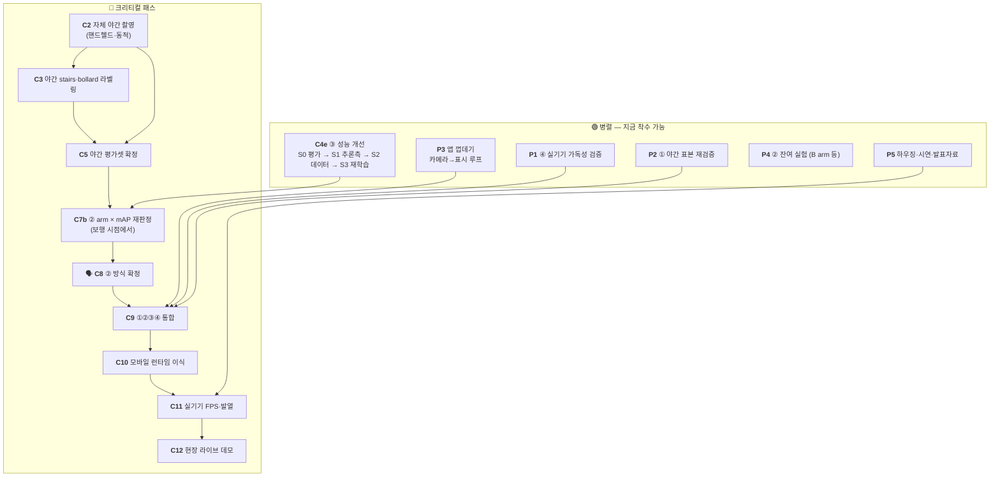

# 밤마실 — 전체 작업 TODO

> 최초 작성 **2026-07-31** · 갱신 **2026-08-23** (`C4e` **S0 판정 완료** · 다음은 S1)
> 이 문서는 **무엇을 언제 할 수 있는가(순서·병렬성)** 만 다룬다. *왜 그렇게 하는가*는 원 문서에 있다.
> 현재 상태 한 장은 [STATUS.md](STATUS.md) · 완료 이력 원문은 [archive/](archive/).

| 표기 | 뜻 | | 환경 | 뜻 |
|---|---|---|---|---|
| 🔴 | **크리티컬 패스** — 늦어지면 전체가 늦는다 | | 💻 | CPU만으로 가능 |
| 🟢 | **병렬 가능** — 지금 착수해도 된다 | | 🖥️ | 학습 PC 필요 (RTX 4060 Ti + 전체 데이터) |
| ⏸ | **대기** — 무엇을 기다리는지 명시 | | ☁️ | Colab (GPU 없는 PC 에서도 가능) |
| 🗣️ | **팀 회의 필요** | | 📱 | 실기기 · 🎥 촬영 현장 |

---

## 0. 지금 상황

**남은 것은 2주 남짓이다** (8/22 기준). ①②③④ 네 단계는 전부 후보가 서 있고 데스크톱
end-to-end 도 돈다. 막혀 있는 것은 **두 개뿐**이고 둘 다 코드가 아니다 — 그리고
**8/5 이후 둘 다 한 칸도 안 움직였다.**

1. 🔴 **`C2` 자체 야간 촬영** — `C3`→`C5`→`C7재판정`→`C8`→`C9` 가 직렬로 매달려 있다.
   선행 조건(안건 3·4)은 8/3 에, **마지막 전제였던 안건 7 은 8/22 에** 풀렸다
   (클래스 3종 최종 확정 → 코스에 장애물 구간이 추가될 일이 없다).
   **이제 문서상 `C2` 를 막는 것이 하나도 없다.**
2. 🔴 **`P3` 앱 껍데기 — 구현 0건.** `C9` 통합 시점에 없으면 통합할 곳이 없다.

★ **③ 는 그동안 외부에서 진행됐다** — `C4c` 를 이어받은 **`C4d` 6런 비교**가 8/7 에
`received/` 로 들어왔고(→ [STATUS ★인수분](STATUS.md)), 8/13 에 **실야간 소재로 눈으로
확인**까지 했다. 그러나 **held-out 야간 평가를 못 돌려 채택은 못 했다** — 결국 `C2` 다.
`bollard` 를 막던 "샘플에 172박스뿐"은 8/5 전량(300GB) 확보로 해소됐다.

> ⚠️ **직관과 반대인 순서 2건** — 놓치기 쉽다.
>
> 1. **② 방식 결정이 ③ 학습보다 *뒤*에 온다.** 파이프라인은 `②→③` 순이지만 ② 판정의
>    주 지표가 **③ 탐지 mAP** 라, 채점기(③)가 먼저 있어야 한다.
> 2. **자체 야간 촬영이 ② 방식 결정의 *선행*이다.** 보유 데이터에 야간·강광원이 없어
>    평가 수단 자체가 없다. 평가 수단이 없으면 방식을 고를 수 없다.

---

## 1. 의존 관계



- 🔴 은 화살표 방향으로만 진행된다. **출발점은 `C2` 하나**다 — 나머지 크리티컬 항목은
  전부 그 뒤에 붙는다. (`C1`·`C4`·`C4b`·`C6`·`C7 1차` 는 완료 → 8장)
- 🟢 은 아무 때나 시작해도 되지만 **`C9` 통합 시점까지는 끝나 있어야 한다.**
- **`C4e` 는 크리티컬 패스가 아니다.** ③ 는 이미 쓸 수 있는 가중치(`c4b_loli0`)가 있고
  ONNX 도 나가 있다. `C4e` 는 거기서 성능을 더 올리는 개선이라 병렬로 돈다.
  (`C4c` 는 외부에서 `C4d` 로 실행됐고, 그 6런의 **채택 판정이 `C4e` S0** 이다.)

---

## 2. 🔴 크리티컬 패스

| # | 작업 | 선행 | 환경 | 담당 | 근거 |
|---|------|------|------|------|------|
| **C2** | **자체 야간 촬영** — 핸드헬드·동적. ⚠️ 코스에 셋이 반드시 들어가야 한다 — **볼라드 장면** · **멀리서 계단에 접근하는 구간** · 🆕 **계단이 없는 야간 노면**(점자블록·자전거도로·자갈). 셋째는 8/13 실측 때문에 추가됐다: 실야간 노면에서 `stairs` 오탐이 되살아나는데 StairNet 에 음성 표본이 없어 **이것 없이는 못 고친다** | **없음 — 8/22 안건 7 종결로 전제 소멸** | 🎥 | 팀원3 | [data.md 2-2](data.md) · [detection.md 8-4](detection.md) |
| **C3** | 자체 야간 `stairs`·`bollard` BBox 라벨링. 🆕 **`data/test_real_data/` 7장도 같이 친다** — `_04` 는 프로젝트 유일의 야간 볼라드 사진이고, 나머지는 오탐 판정에 쓸 음성 표본이다 | C2 | 💻 | 팀원3 | [labeling_stairs.md](labeling_stairs.md) |
| **C5** | **야간 평가셋 확정** — 자체 촬영분을 주 평가셋으로 승격 | C2·C3 | 💻 | 팀원3·팀장 | [STATUS 3장 함정 1](STATUS.md) |
| **C7b** | ② arm × ③ mAP **재판정** — 1차(8/2)는 NightOwls **대시캠**이라 보행 시점과 다르다 | C5 | 🖥️ | 팀장 | [detection.md 7장](detection.md) |
| **C8** | 🗣️ **회의 — ② 방식 확정** (FPS 예산 · 게이트 측정 환경 · 표시/탐지 분리 추인) | C7b | — | 전원 | [archive/lowlight_method_decision](archive/lowlight_method_decision_2026-07.md) |
| **C9** | **①②③④ 파이프라인 통합** — 데스크톱 사전 검증은 끝났다(`pipeline_demo.py`) | C8 + P1·P2·P3 | 💻🖥️ | 팀장 | README 2장 |
| **C10** | ONNX → 모바일 런타임 이식 (QNN/NNAPI/Core ML). ③ 는 **이미 ONNX 로 나가 있다** | C9 | 🖥️📱 | 팀장·팀원2 | [hardware_inference.md 1장](hardware_inference.md) |
| **C11** | 실기기 측정 — 지속 FPS · 10분 발열 · end-to-end 지연. **② 속도 게이트의 최종 판정자** | C10 + P5 | 📱 | 팀원2 | [hardware_inference.md 5장](hardware_inference.md) |
| **C11b** | **실기기 960 프레임 시간 측정** — 기획서 2.4 KPI 의 "측정 예정" 칸을 채운다. `C11`(지속 FPS·발열)과 **별개 항목**: 재는 대상이 960 해상도 1건이고 납품처가 기획서다. ⚠️ 기존 640 값(p50 32.7 · p95 38.1 · 표시 5.75 · 11분, Galaxy A34)은 **더미 모델 골격 = "무처리" 기준**이다 — 실모델·②·④를 얹은 값이 아니므로 **"15FPS(66ms) 대비 여유 확보"의 근거가 되지 못한다.** 960 을 재기 전에 **640 처리 포함값을 먼저** 재야 비교가 성립한다. 계측 원본이 이 저장소에 없으니 같이 올릴 것 | C10 (앱 골격은 있음) | 📱 | 팀원2 | [STATUS ★인수분 R5](STATUS.md) |
| **C12** | 현장 라이브 데모 + 모의 야간 코스 정량 비교 | C11 | 📱🎥 | 전원 | README 5장 |

> **`C2` 가 왜 최우선인가** — 촬영은 날씨·시간대·섭외 리드타임이 있고 실패하면 재촬영에
> 며칠이 든다. 게다가 뒤에 4단계가 직렬로 매달려 있다. 다른 무엇보다 먼저 나가야 한다.

---

## 3. 🟢 병렬 트랙

### C4c. ③ 3클래스 재학습 — `person` · `stairs` · **`bollard`** (팀원1 · 8/5 착수 가능)

AIHub bbox 전량이 들어왔다. **그러나 장수를 그대로 학습에 넣으면 안 된다** — 아래 4개가
학습 *전에* 끝나야 한다. 각 항목의 근거는 [data.md 3-1-4](data.md).

| 순서 | 작업 | 환경 | 왜 |
|---|------|---|---|
| ① | **정찰** `aihub_pack_for_colab.py --dry-run` — 블록 수 · 저조도 판별 | 🖥️국내 | 장수 ≠ 장면 수 · "저조도"가 야간인지 그늘인지 |
| ② | 저조도가 야간이면 **그 블록 일부를 held-out 으로 분리** | 💻 | 다 넣으면 야간 볼라드를 잴 자가 사라진다 |
| ③ | **서브샘플** — NightOwls 와 같은 자릿수로 (`--max-images`) | 💻 | 전량이면 주간이 90% 를 넘어 `C4` 붕괴 조건 재현 |
| ④ | val 을 **블록(가능하면 zip) 단위**로 분리 | 💻 | 무작위면 인접 프레임 쌍둥이로 수치가 부풀어 오른다 |
| ⑤ | 패키징(`--zip`, 2~3GB) → Drive → [colab_aihub_train.ipynb](../notebooks/colab_aihub_train.ipynb) | ☁️ | 학습 PC 를 점유하지 않는다 |
| ⑥ | ★ **회귀 게이트** — 이것이 합격 기준이다 (아래) | 🖥️ | 성패는 bollard mAP 가 아니다 |

**게이트** — 클래스 추가가 기존 성능을 깎으면 실패다.

| 축 | 자 | 기준 |
|---|---|---|
| person 회귀 | rec 34 held-out (`eval_nightowls.py`) | recall **0.609** 유지 |
| stairs 회귀 | rec 34 · rec 38 (`eval_stairs_night.py`) | 야간 오탐 **0.2%** 유지 |
| bollard 신규 | AIHub val (블록 분리) | 기준선 없음 — **박스 크기 구간별 recall 을 같이 뽑을 것** |

> ⚠️ **볼라드는 640 입력에서 절반이 탐지 하한 아래다**(폭 중앙 7.8px · 8px 미만 50.3%).
> 낮은 recall 은 예상된 것이고, 크기 구간별로 쪼개지 않으면 "데이터 부족"과 "해상도
> 한계"가 구분되지 않는다.

⏸ **잔여** — 노면 마스킹(`Surface_1~5`)은 아직 안 받았다. 이번 학습의 `stairs` 는
StairNet 뿐이고, **원거리 계단 측정**(→ [detection.md 8-3](detection.md))은 그 다운로드에 달려 있다.

### 🆕 C4e. ③ 성능 개선 — **비용 오름차순 4단계** (팀장 · 8/22 수립)

클래스가 3종으로 고정(🗣️안건 7 종결)됐으므로 이제 **성능만 올리면 된다.**
⚠️ **배포 해상도 640 은 고정 전제**다 — 실기기 속도가 아직 미측정이고 ②가 이미 ~20ms 를
쓴다. 960 은 픽셀 2.25배라 근거 없이 올리면 FPS 게이트가 깨진다. **남은 레버는
데이터 · 학습 레시피 · 추론측 셋뿐**이고 `S0`~`S3` 이 그 순서로 훑는다.

| 단계 | 무엇 | GPU 학습 | 선행 |
|---|---|---|---|
| **S0** | ✅ **완료 (8/23)** — 640 축 4런 판정. **3런 통과 · `26n_640` 기각 · 주간 순위 뒤집힘** (→ [detection.md 9장](detection.md)) | 0 | — |
| **S1** | 추론측 — 운영 conf `0.25→0.10` + 시간축 흡수 | 0 | S0 |
| **S2** | 데이터 — **음성 표본 보강** (`stairs` 실야간 오탐의 유일한 해법) | 0 | `W5` · Junction · `C3` |
| **S3** | `C4e` 재학습 1회 | 1회 | S0·S2 |
| **S4** | `C5` 자체 야간 평가셋에서 **최종 판정** | 0 | `C2`→`C3`→`C5` |

#### S0. 무학습 — 가장 큰 미실현 이득은 학습이 아니라 **평가**다

배포 중인 것은 여전히 **2클래스 `c4b_loli0`** 이고, 3클래스 `c4d` 6런은 **held-out 야간
평가를 한 번도 안 거쳤다**(→ [STATUS ★인수분 R4](STATUS.md)). 가중치
(`received/bammasil_weights/c4d_*/best.pt`)와 평가 코드가 **이미 로컬에 다 있다.**
클래스 배치가 `CLASS_NAMES` 와 같아(`0 person`) 기존 스크립트가 그대로 먹는다.

1. `received/` 의 `best.pt` 를 `outputs/detect/<런>/weights/best.pt` 레이아웃으로 **복사**
   (`compare_detect.py` 가 이 경로를 고정한다 — 코드를 고치지 않는다. 런당 ~5MB)
2. **640 축 4런만** — `c4d_11n_640` · `c4d_11s_640` · `c4d_26n_640` · `c4d_11n_640_noneg`.
   960 런 2개는 **제외**(640 고정 전제 · imgsz 불일치 평가는 무의미)
3. 1차는 `--skip-fp38` — `rec38` 은 8/22 에 지웠고 재생성이 **~4GB 복사**다
   (→ [STATUS 3장 함정 14](STATUS.md)). rec34 를 통과한 후보에만 rec38 을 쓴다

```powershell
uv run python scripts/compare_detect.py `
    --runs c4b_loli0,c4d_11n_640,c4d_11s_640,c4d_26n_640,c4d_11n_640_noneg --skip-fp38
uv run python scripts/eval_stairs_night.py --weights outputs/detect/c4d_11s_640/weights/best.pt
```

**게이트는 `C4c` 것을 그대로 쓴다** (person recall 0.609 · `stairs` 야간 오탐 0.2%/0.0%).
주간 기준으로는 `c4d_11s_640`(mAP50 0.812)이 640 최고지만, **주간 순위가 야간에서
뒤집히는 것이 이 프로젝트의 반복 패턴**(→ 3장 함정 1)이라 순위는 이 실행이 정한다.
⚠️ `c4d_26n_640` 은 **NMS-free — 앱 인터페이스 계약이 바뀐다.** 앱이 구현 0건인 지금
채택하면 `P3` 을 흔들므로 **측정은 하되 채택 후보에서 뺀다.**

**✅ 결과 (8/23)** — 원문·표 전체는 → [detection.md 9장](detection.md).

| 런 | mAP50 | recall | stairs 오탐 | 게이트 |
|---|---|---|---|---|
| `c4b_loli0` (현 배포) | 0.684 | 0.609 | 0.2% | 기준 |
| **`c4d_11n_640_noneg`** | **0.748** | **0.687** | 0.2% | ✅ **잠정 1위** |
| `c4d_11n_640` | 0.736 | 0.644 | 0.0% | ✅ 통과 |
| `c4d_11s_640` | 0.684 | 0.639 | 0.0% | ✅ 통과 |
| `c4d_26n_640` | 0.668 | 0.594 | 0.0% | ❌ **기각** |

★★ **주간 순위가 야간에서 거의 정확히 뒤집혔다** — 주간 1위 `11s`(0.812)가 야간에서
현 배포와 동점이고 주간 꼴찌 `11n` 이 야간 2위다. **함정 1 의 세 번째 증거.**

⚠️ **`noneg` 1위를 채택으로 읽지 말 것** — 볼라드·계단 오탐을 직접 세 보니 4런 전부
**0~2박스**라 **rec34 는 recall 은 가르지만 FP 는 못 가른다.** 인수분의 `noneg` FP
경고(주간 6,988 볼라드 박스)는 **미해소**다.

→ **채택 후보 2개**(`c4d_11n_640` · `c4d_11n_640_noneg`)로 좁혔고 **최종 선택은 `C5`**
(보행 시점 자체 촬영 야간)로 넘긴다. 지금 배포를 갱신해야 한다면 **`c4d_11n_640`** 이
안전한 쪽이다(배경 10% 유지 · 인수분 권고와 일치).
⚠️ **채택 시 3클래스라 ONNX 출력이 2→3 으로 바뀐다** — `export_onnx.py` 재실행 +
앱팀 계약 공지 필요 (→ [share 7장](share_yolo_c4b_20260803.md)).

> **rec38 은 돌리지 않았다** — rec34 에서 `stairs` 오탐이 이미 바닥(0.0~0.2%)이고 rec38
> 재생성은 PNG 복사 ~4GB 인데 **같은 대시캠 도메인**이라 정보가 겹친다. 같은 4GB 면
> `C3` 보행 시점 라벨링이 낫다.

#### S1. 추론측 — 학습 없이 얻는 이득

- **운영 conf `0.25 → 0.10`** (인수분 R1 의 무릎: bollard **+7.4~8.5%p 에 FP 2.6~3.2배**)
- FP 증가는 **시간축으로 흡수**한다 — `W6`(프레임 스킵 + 트래킹 보간) · `P1`(박스 hold·IIR).
  `scripts/temporal_eval.py` 가 이미 프레임 시퀀스를 돌린다
- 게이트: **프레임당 오탐 개수**(④가 화면을 덮지 않을 것) · rec34 person recall 무회귀

#### S2. 데이터 — 음성 표본 보강 🔴

1. **`W5` 노면 마스킹 `Surface_1~5` 다운로드** (국내 PC 에서만 — 3장 함정 8)
2. **투입 전 선행** — `label_stats.py` 로 노면 `stairs` ↔ StairNet 종횡비·면적 대조 →
   **학습 투입 / 평가 전용** 판정 (→ [detection.md 8-3](detection.md)).
   ⚠️ **`data/Stair dataset` Junction 이 먼저 걸려 있어야 한다** (→ [data.md 5-2](data.md))
3. **계단 없는 보도·점자블록·맨홀·자전거도로를 배경 이미지로 투입.** `noneg` 런이 이미
   보여 줬다 — **배경의 효과는 mAP 가 아니라 FP 에 나타난다**(볼라드 FP +11% · person +16%).
   배경 비율 **10% 유지**
4. **`C3` 에서 `data/test_real_data/` 7장 라벨링** — 최초의 야간 음성 표본 + 유일한
   야간 볼라드 GT(`_04`). 8/13 소견이 정성 → 정량으로 바뀌는 지점이다
5. ★ **좁은 정의 확정의 귀결** — 인수분 볼라드 FP 의 `ghost` **57~63%** 는 정체가
   **기둥·가로등·표지판 지주**인데, 범위를 안 넓혔으므로 **영영 오탐이다.** AIHub 의
   `pole`·`tree_trunk` 프레임을 **배경으로** 더 넣어 "장대에는 반응하지 마라"를
   강화하는 것이 이 FP 를 줄이는 정공법이다

#### S3. 재학습 `C4e` — 1회

- **데이터**: c4d 11K 축소셋 + 노면 음성 표본 + (확보되면) `C3` 자체 야간분
- **레시피**: 640 · 배경 10% · **epochs 100 / patience 20**(`train_detect.py` 기본).
  c4d 는 **50ep / patience 10** 이라 **학습량 부족 가능성이 남아 있다** — 같은 데이터로
  이 축만 바꾼 런이 없어 여기서 처음 확인된다
- **모델**: S0 에서 이긴 축 (`11n` vs `11s`)
- ⚠️ **seed 1개로 순위를 정하지 말 것** — c4d 6런의 차이가 mAP **+0.02 대**라 seed 분산과
  구분되지 않는다. 최종 후보 2개는 **seed 3개**로 재확인한다
- **게이트**: `C4c` 3축 + 🆕 **실야간 노면 `stairs` FP**(`C3` 라벨 후에만 가능)

#### 하지 않는 것 (재개 조건을 같이 적는다)

| 항목 | 이유 | 재개 조건 |
|---|---|---|
| 960 · 1280 · 타일링 | 640 고정 전제와 충돌. `<4px`(GT 22%)는 960 에서도 recall 0.49 상한이라 해상도로 못 간다 | `C11b` 에서 **640 처리 포함값**을 재고 예산에 여유가 확인될 때 |
| YOLO26n(NMS-free) 채택 | 앱 인터페이스 계약 변경 · 앱 구현 0건 | `P3` 골격 완료 후 |
| 클래스 추가 | 🗣️안건 7 종결 (8/22) | 마감 이후 |
| 합성 야간 증강(`W2`) | LoLI 교훈 — 합성은 실야간을 대체 못 한다 | `C2` 확보 후 보조 수단으로만 |
| `--pole-as-bollard` | 8/22 좁은 정의 확정 | 제품 정의가 바뀔 때 |

### P3. 앱 (팀원2) — **완전 독립 · 🔴 실질적으로 크리티컬**

처리부를 항등함수로 두고 카메라→표시 루프를 먼저 완성해 두면 `C9` 통합이 "함수
갈아끼우기"로 끝난다. **모델을 기다릴 이유가 전혀 없다.**

| 작업 | 선행 |
|------|------|
| 앱 구조 설계 · 카메라 입력 → 표시 루프 (처리부 항등함수) | 없음 |
| 사전 녹화 입력 데모 모드 — **현장 실패 대비 보험** | 위 |
| UI — 온/오프, 강조 강도, 해상도 전환 | 위 |
| 스테레오 렌더(좌우 분할 + 배럴 왜곡) — 초기엔 단일 화면으로 검증 | 위 |

### P1·P2·P4·P5 — 잔여

| # | 작업 | 선행 | 환경 | 근거 |
|---|------|------|------|------|
| **P1** | ④ **저시력 가독성 실사용 검증** — 색·두께·야외 시인성. 코드 기본값은 가설이다 | P3 실기기 | 📱 | `scripts/emphasize.py` |
| **P1** | 박스 시간축 평활(hold·IIR) — ③ 프레임 스킵 시 깜빡임 방지 | — | 🖥️ | [hardware_inference 5장](hardware_inference.md) |
| **P2** | ① 야간 표본(ExDark·StairNet)으로 `D1A1+bf` 재검증 — **현재 글레어 표본 n=1** | — | 🖥️ | [lowlight 6-5-4](lowlight_classical.md) |
| **P2** | 🗣️ ①을 ②에 통합할 것인가 — 채택 시 통합이 기본 구도 | 위 재검증 | — | [lowlight 6-5-4](lowlight_classical.md) |
| **P4** | **B arm(Zero-DCE/SCI) 구현·실측** — 미착수 | — | 🖥️ | [lowlight 1장](lowlight_classical.md) |
| **P4** | `+bf` 기본값 승격 검토 — 신 지표에서 **반례 2건** | — | 💻 | [lowlight 6-4-3](lowlight_classical.md) |
| **P4** | LoLI-Street 라벨 육안 검수 (pseudo-label 신뢰도) | — | 🖥️ | [data.md 2-1](data.md) |
| **P5** | 골판지 VR 하우징 · 시연 영상 · **발표자료** | — | 🎥💻 | 아래 |

> **발표 소재는 이미 4건 확보돼 있다** — ① 계단 고전 CV 기각(재현율 0.232·오경보 100%),
> ② 평가 데이터가 야간이 아님을 발견, ③ 목적 축 지표 3개가 육안과 어긋나 재설계,
> ④ 표시/탐지 경로 분리(전처리가 탐지를 해친다는 실측). **"가설 → 정량 측정 → 기각 →
> 재설계" 서사**가 검증 없는 아키텍처 자랑보다 설득력이 높다.

---

## 4. ⏸ 대기

| # | 작업 | 무엇을 기다리는가 |
|---|------|------------------|
| **W2** | 주간 → 야간 저조도 **합성 증강** | 착수는 가능하나 **AIHub 를 야간에 쓸 때만** 의미. `C4c` 정찰이 "저조도 = 그늘"로 나오면 값이 오른다 |
| **W3** | C안 dense 복원망 33k 본학습 | **속도 게이트 통과 시에만.** 현재 게이트 돌파 실마리가 없어 사실상 동결 |
| **W4** | NightOwls 로 ② arm 비교 재실행 | ✅ 선행 해제(8/1). **착수 가능** — ExDark 는 실내가 많아 보행 도메인과 다르다 |
| **W5** | AIHub **노면 마스킹**(`Surface_1~5`) 다운로드 | 없음 — 국내 PC 에서 지금 받을 수 있다. `stairs` 원거리 측정이 여기 달려 있다 |
| **W6** | 탐지 프레임 스킵 + 트래킹 보간 | ③ 모델 (✅ 있음) → **착수 가능** |
| **W7** | ② 속도 게이트 돌파 | 남은 카드 3개 — 내부 해상도 하향 · 셰이더 이식 · `C11` 실기기 재판정 |

---

## 5. 🗣️ 회의 안건

| # | 안건 | 시점 |
|---|------|------|
| **1** | **FPS 예산 배분 + 게이트 측정 환경 기준.** ★ 표시/탐지 분리로 계산이 달라졌다 — ②의 지연이 ③에 더해지지 않으므로 두 경로를 병렬로 돌리면 예산이 는다. 20ms 는 실측이 아니라 **설계 배분값**이다 | C7b 직후 |
| **2** | **①을 ②에 통합할 것인가** — `D1A1+bf` 채택 시 통합이 기본 구도 | 야간 표본 재검증 후 |
| **3** | paired 촬영 **규모·공수 배분** (팀원3 경합). ✅ 존폐·개인정보는 8/3 종결 | C2 이후 |
| **5** | 채도 보정 적용 여부 (적용 시 arm 수 2배) | C7b 이전 |
| **6** | opencv-contrib 교체 여부 — 팀 4인 `uv.lock` 전원 갱신 | BIMEF 를 arm 에 올릴 때만 |
| **7** | ✅ **종결 (8/22) — 클래스는 `0 person` · `1 stairs` · `2 bollard` 3종으로 최종 확정.** ① 나머지 26종 **미채택 확정**(`pole` 648px vs `bollard` 75px 로 형태가 갈려 버려도 안전) ② `2 bollard` 는 **좁은 정의 확정** — `pole`·`tree_trunk` 를 흡수하지 않는다. `aihub_to_yolo.py --pole-as-bollard` 는 **확장 대비로 남기되 켜지 않는다** ③ 노면 20종은 **향후 확장 후보로 보류**(전부 세그 클래스라 bbox 파이프라인과 태스크가 안 맞는다). ★ **추후 클래스 확장 가능성은 열려 있다 — 다만 마감(9월 초) 이후 갈래다** | ✅ 8/22 종결 |

> ✅ **재촬영 위험은 8/22 로 해소됐다.** 클래스가 3종으로 고정돼 촬영 코스에 장애물
> 구간이 추가로 필요해질 일이 없다 — **`C2` 를 막는 전제가 하나도 남지 않았다.**
> ⚠️ **코스에 이미 확정된 요구는 셋** — **볼라드 장면**(야간 볼라드는 `C2` 로만 판정된다) ·
> **멀리서 계단에 접근하는 구간**(원거리 계단의 야간 답은 `C2` 뿐) · 🆕 **계단이 없는
> 야간 노면**(점자블록·자전거도로·자갈 — 실야간 `stairs` 오탐의 음성 표본, 8/13 실측).

---

## 6. 남은 일정 (8/22 기준)

🔴 **크리티컬 패스가 3주째 한 칸도 안 움직였다.** `C2` 미출발 · `P3` 0건 그대로다.
8/22 에 마지막 전제(안건 7)가 풀렸으므로 **이번 주에 `C2` 가 안 나가면 통합이 9월로 넘어간다.**

| 시기 | 🔴 크리티컬 | 🟢 병렬 |
|------|------------|---------|
| ~~8월 1~3주~~ | ~~안건 7 → `C2` 출발~~ **미이행** | `C4c` → 외부 `C4d` 로 대체 ✅ · 8/13 실야간 육안 확인 ✅ |
| **8월 4주 (지금)** | ✅ 안건 7 종결(8/22) → 🔴 **`C2` 촬영 출발 — 더 못 미룬다** → `C3` 라벨링 | 🔴 **`P3` 앱 껍데기** · **`C4e` S0**(학습 0) · Junction 재연결 · `W5` 노면 받기 |
| **8월 5주** | `C5` 평가셋 → **`C7b` 재판정** → 🗣️**`C8`** | `C4e` S2 음성 표본 · `P5` 하우징·시연 촬영 |
| **9월 1주** | **`C9` 통합** → `C10` 이식 → **`C11` 실기기 측정** | `C4e` S3 재학습(택1) · 발표자료 |
| **9월 초 마감** | **`C12` 현장 데모** | 사전 녹화 데모 모드(보험) 완비 |

### ⚠️ 일정 리스크

1. 🔴 **`C2` 는 이미 3주 늦었다** (8월 1주 목표 → 8/22 현재 미이행). 뒤에 4단계가 직렬로
   매달려 있어, **`C9` 통합이 9월로 넘어가는 것이 이미 기정사실에 가깝다.**
   8/22 로 마지막 전제가 풀렸으므로 **남은 것은 실행뿐이다.**
2. **앱이 구현 0건이다.** `C9` 시점에 껍데기가 없으면 통합할 곳이 없다 — 방치하면
   8월 4주에 병목이 된다. 지금 이 문서에서 **가장 방치돼 있는 항목**이다.
3. **`C7b` 가 8월 3주를 넘기면** `C8` 이 밀리고 통합 시간이 사라진다.
   보험: `C8` 이 지연돼도 **현 잠정 1위를 기준선으로 `C9` 통합을 먼저 시작**한다.
4. **② 속도 게이트가 실기기(`C11`)에서 떨어지면** 9월 1주에 내부 해상도 하향으로
   대응해야 한다 — 되돌릴 시간이 없으므로 `C11` 을 앞당길 수 있으면 앞당긴다.

---

## 7. 지금 당장 착수 가능한 것 (선행조건 0)

| 작업 | 담당 | 환경 |
|------|------|------|
| ~~🔧 `data/` Junction 재연결~~ ✅ **8/23 완료** | — | — |
| ~~🔴 `C4e` S0 held-out 판정~~ ✅ **8/23 완료** → 다음은 **`C4e` S1**(운영 conf 0.10 + 시간축) | 팀장 | 🖥️ |
| 🔴 **`C2` 야간 촬영지 섭외·장비 준비** — 회의 직후 출발 | 팀원3 | 🎥 |
| 🔴 **`P3` 앱 껍데기** — 카메라→표시 루프 (처리부 항등함수) | 팀원2 | 📱 |
| **`C4c` ①정찰** `aihub_pack_for_colab.py --src <해제루트> --dry-run` | 팀원1 | 🖥️국내 |
| **`W5`** 노면 마스킹 `Surface_1~5` 다운로드 (`stairs` 원거리 측정용) | 팀원1 | 🖥️국내 |
| **`P4`** B arm(Zero-DCE/SCI) 구현 · LoLI 라벨 육안 검수 | 팀원1 | 🖥️ |
| **`W4`** NightOwls 로 ② arm 비교 재실행 | 팀장 | 🖥️ |
| **`P2`** 야간 표본으로 `D1A1+bf` 재검증 (글레어 표본 n=1 해소) | 팀장 | 🖥️ |
| **`P5`** 하우징 제작 · 발표자료 초안 | 팀원3 | 🎥💻 |

---

## 8. 완료 (요약 — 원문은 각 근거 문서)

| 항목 | 완료 | 근거 |
|------|------|------|
| 개발 환경(uv·CUDA) · 데이터 4종 확보 + 무결성 검증 | 7/26 | README |
| 계단 고전 CV **정량 검증 후 기각** → YOLO 통합 전환 | 7/26 | [archive/stair_classical_rejection](archive/stair_classical_rejection_2026-07-26.md) |
| ② 고전 arm 11개 구현 · 속도 프로브 · 비교 하네스 | 7/29 | [lowlight 1~2장](lowlight_classical.md) |
| ★ 보유 데이터에 **야간·강광원이 없음**을 발견 | 7/29 | [data.md 0장](data.md) |
| ★ 목적 축 지표 3개 **절대 기준으로 재설계** | 7/31 | [lowlight 6-4](lowlight_classical.md) |
| `P1` ④ 선택적 강조 렌더 · `P2` 조합 arm `D1A1+bf` | 7/31 | `scripts/emphasize.py` · [lowlight 6-5](lowlight_classical.md) |
| `C1` StairNet 선분 → BBox (train 2,670 / val 424) | 8/1 | [detection.md 2-1](detection.md) |
| `C6` ② 해상도 × arm 스윕 — 720p 통과는 `A1`·`A2` 뿐 | 8/1 | [lowlight 6-6](lowlight_classical.md) |
| NightOwls 확보·해제 (13,602장 / 13.78 GiB) | 8/1 | [data.md 5-2](data.md) |
| ② **고전 CV 확정** — A/B/C 중 A | 8/1 | [archive/lowlight_method_decision](archive/lowlight_method_decision_2026-07.md) |
| `C4` ③ baseline → **실야간 붕괴 발견**(person recall 0.226) | 8/2 | [detection.md 3~4장](detection.md) |
| `C4b` ③ 재학습 — held-out recall **0.195→0.609** · `stairs` 오탐 **7.7→0.2%** | 8/2 | [detection.md 6장](detection.md) |
| `C7` ② arm × mAP 1차 → ★ **표시/탐지 경로 분리 확정** | 8/2 | [detection.md 7장](detection.md) |
| `W1` A3 시간축 — `+ts` 플리커 상쇄 ✅ / `+td` 는 `bf` 대체 실패 ❌ | 8/2 | [lowlight 8장](lowlight_classical.md) |
| 파이프라인 데모 (②→③→④ end-to-end) | 8/2 | `scripts/pipeline_demo.py` |
| 🗣️ 안건 3·4 처리 — `C2` 선행 조건 해소 · `stairs` 라벨 정의 확정 | 8/3 | [labeling_stairs.md](labeling_stairs.md) |
| **클래스 3종 확정 + AIHub 배선** · ③ **ONNX 배포 패키지** | 8/3 | [data.md 3-1-1](data.md) · [share](share_yolo_c4b_20260803.md) |
| ★ AIHub **노면 마스킹 `stairs`** 발견 — "계단 없음" 정정 | 8/4 | [data.md 3-1-2](data.md) |
| AIHub 취득 경로 확정 — **국내 패키징 + Colab 학습** (해외 차단 대응) | 8/4 | [data.md 3-1-3](data.md) |
| **AIHub bbox 전량 300GB 다운로드** · ★ **정찰**(블록 수·저조도 판별) | 8/5 | [data.md 3-1-4](data.md) |
| ★ `stairs` **야간/주간 분리 실측** — 야간 76장 mAP50 0.993, **저조도 아닌 도메인이 문제** | 8/3 | [detection.md 8장](detection.md) |
| **문서 최적화** — `TODO` 전면 재작성 · 종결 논의 2건 `archive/` 이관 · `STATUS` 한 장 복귀 | 8/5 | — |
| ★ **외부 인수분 `received/` 도착** — `C4d` 3클래스 6런 비교 · `is_night` 무효 판명 | 8/7 | [STATUS ★인수분](STATUS.md) |
| ★ **기획서 v20 수치 검증** — 수정 필요 5건 + 귀속 오류 1건 | 8/8 | [review_proposal_v20](review_proposal_v20_20260808.md) |
| ★★ **`C4e` S0 — `c4d` held-out 야간 판정** (3런 통과 · **주간 순위 뒤집힘**) | 8/23 | [detection.md 9장](detection.md) |
| `data/` Junction 5종 재연결 (7개 스크립트 복구) | 8/23 | [data.md 5-2](data.md) |
| 🗣️ **안건 7 종결 — 클래스 3종 최종 확정**(`2 bollard` 좁은 정의) · `C2` 전제 소멸 | 8/22 | 5장 안건 7 · [detection.md 8-2](detection.md) |
| **데이터 위치 재편** — 전 데이터셋 실체를 `D:\datasets\` 로 이관 (`data/` 는 Junction) | 8/22 | [data.md 5-2](data.md) · [STATUS 3장 함정 15](STATUS.md) |
| **`outputs/datasets/` 정리 — C: 18.3GB 회수** | 8/22 | [STATUS 3장 함정 14](STATUS.md) |
| ★ **c4d 육안 검수 노트북** — 라벨 검수 + 640 추론 + **실야간 첫 소견** | 8/13 | [notebook](../notebooks/aihub_subset_review.ipynb) · [detection.md 8-4](detection.md) |

---

## 부록. 문서 지도

| 찾는 것 | 문서 |
|---------|------|
| ★ **현재 상태 한 장** (여기부터 읽는다) | [STATUS.md](STATUS.md) |
| 기획·배경·환경 셋업 | [../README.md](../README.md) |
| ★ `stairs` 라벨을 어떻게 치는가 (`C3` 작업자용) | [labeling_stairs.md](labeling_stairs.md) |
| 팀 공유 — ③ 결과 + 앱팀 인수인계 | [share_yolo_c4b_20260803.md](share_yolo_c4b_20260803.md) |
| 데이터 상세 · AIHub · 계단 방식 근거 | [data.md](data.md) |
| ② 고전 기법 지형도 · arm 실측 · 지표 재설계 | [lowlight_classical.md](lowlight_classical.md) |
| ③ 탐지 — 데이터 구성 · 검증 · 판정 | [detection.md](detection.md) |
| 모바일 런타임 · 양자화 · FPS 병목 | [hardware_inference.md](hardware_inference.md) |
| 스크립트가 뭘 하는지 | [../scripts/README.md](../scripts/README.md) |
| 목적 축을 **무엇으로 어떻게 재는가** | [../scripts/metrics.py](../scripts/metrics.py) |
| 종결된 실험·결정 원문 | [archive/](archive/) |
