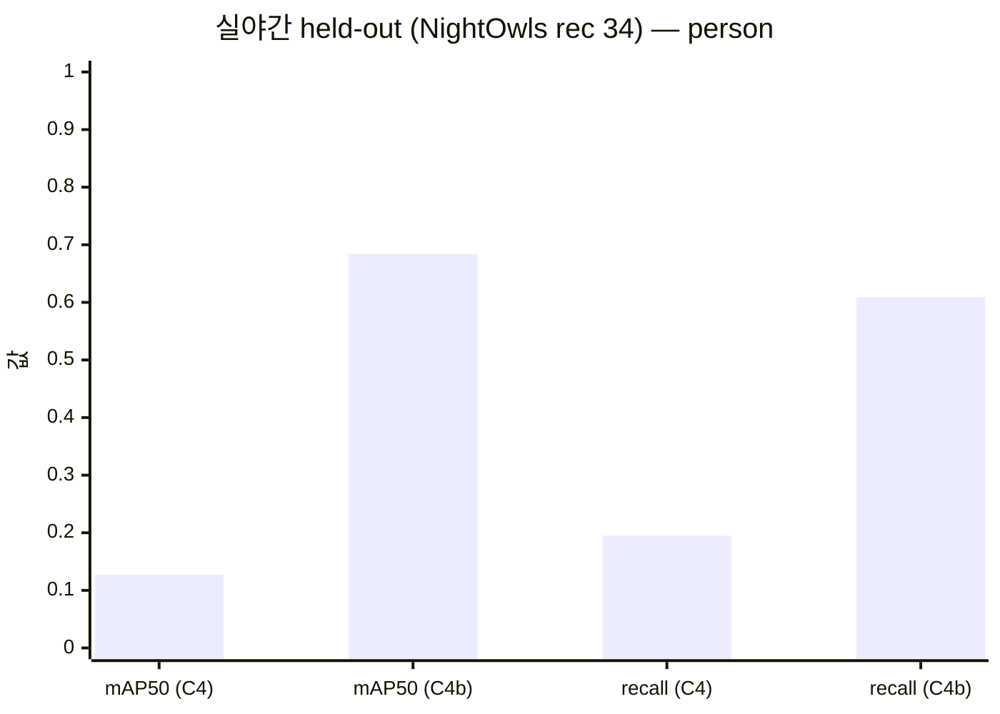
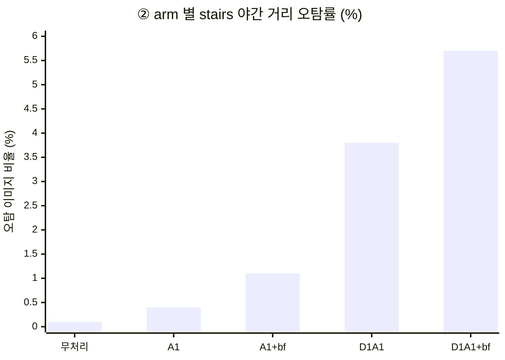

# [공유] ③ YOLO 위험요소 탐지 — 훈련 결과와 회의 안건 (2026-08-03)

> ✅ **2026-09-03 최종 확정** — 배포 모델은 **`c4f_distill_11n_640` INT8**(증류 학생 모델)로
> 최종 채택됐다. **인터페이스 계약은 3클래스 판(7-0)에서 바뀌지 않는다** — 파일만 교체하면
> 된다. 앱팀은 **7-0c** 를 먼저 볼 것.
>
> 🔴 **2026-08-24 갱신** — **3클래스 ONNX 패키지가 나왔고 인터페이스 계약이 바뀐다**
> (출력 `[1,6,8400]` → `[1,7,8400]`). 아래 7-0 은 계약 변경의 원문으로 남겨 둔다.

> **팀 공유용 요약본**이다. 근거·상세는 [detection.md](detection.md), 그림 실물은
> [stairs_night_review.ipynb](../notebooks/stairs_night_review.ipynb) ·
> [detect_c4_review.ipynb](../notebooks/detect_c4_review.ipynb) 에 있다.
> 표의 mermaid 차트는 GitHub 웹에서 렌더된다.
>
> 📦 **앱·모바일 담당자는 [7장](#7-앱팀에게--onnx-배포-패키지) 부터 보면 된다** —
> 모델 파일과 연동 스펙이 거기 있다.

---

## 1. 무엇에 대한 훈련인가

**밤마실** 파이프라인의 **③ 위험요소 탐지** 단계다. 야맹증 저시력자의 야간 보행에서
위험한 **보행자(`person`)와 계단(`stairs`)** 을 스마트폰 카메라 프레임에서 실시간으로
찾아, ④ 선택적 강조가 화면에 표시할 박스를 공급한다.

```
프레임 ─┬─→ [탐지 경로] 원본 그대로 ────────→ ③ YOLO ──┐
        │                                              ↓
        └─→ [표시 경로] ② 저조도 개선 ──────→ ④ 경계선 강조 → 화면
```

- **모델**: YOLO11n (모바일 실시간 예산에 맞춘 최소 모델) · 2클래스 단일 모델
- **훈련 이력**: `C4` baseline (LoLI-Street 합성 야간 + StairNet 계단)
  → **`C4b` 재학습** (실제 야간 데이터 **NightOwls** 투입) ← 이번 공유의 본론
- **판정 기준**: 학습에 쓰지 않은 실야간 held-out(NightOwls rec 34, 1,001장 · 사람 손 라벨)
- **채택 가중치**: `c4b_loli0` (NightOwls만 학습. 합성본 포함 런과 성능 동점인데
  학습 비용 절반 · pseudo-label 의존 없음)

---

## 2. 결과 ① — 실야간 성능이 5배가 됐다 (`C4b`)

| 지표 (실야간 held-out) | C4 baseline | **C4b 채택 런** | 의미 |
|---|---:|---:|---|
| person mAP50 | 0.127 | **0.684** | 5.4배 |
| person recall | 0.195 | **0.609** | **놓치는 보행자 80.5% → 39.1%** |
| `stairs` 야간 거리 오탐 | 7.7% | **0.2%** | 횡단보도·차선을 계단으로 오인하던 결함 소멸 |



### ⚠️ 개발 val 만 봤으면 이 개선은 안 보였다

| 평가셋 | C4 | C4b |
|---|---:|---:|
| 개발 val (합성 데이터 혼합) | 0.892 | 0.892 |
| **실야간 held-out** | **0.127** | **0.684** |

개발 val 은 한 자리도 안 움직였다. **판정은 반드시 실야간 held-out 에서 한다** —
이후 모든 수치도 이 기준이다.

---

## 3. 결과 ② — 계단: 저조도는 문제가 아니고 **도메인**이 문제다

야간/주간을 갈라서 재 봤다 (`eval_stairs_night.py`):

| 구간 | 장수 | mAP50 | recall |
|---|---:|---:|---:|
| **야간** | 76 | **0.993** | 0.987 |
| 주간 | 348 | 0.988 | 0.977 |

**야간이 오히려 근소하게 높다.** 어둡다는 것 자체는 계단 탐지의 장애물이 아니다.

그런데 이 0.99 를 "완료"로 읽으면 안 된다. 계단 라벨의 유일한 소스인 StairNet 은
**계단이 화면 대부분을 차지하는 사진**이다. GT 박스가 프레임에서 차지하는 면적이
중앙값 **38%** 인 반면, 실제 야간 거리의 보행자 박스는 **0.27%** — **142배** 차이다.
즉 **"보행 중 멀리 있는 계단"은 학습·평가 데이터에 아예 존재하지 않는다.**

| 서비스에 필요한 능력 | 측정 결과 |
|---|---|
| 계단 사진에서 계단 찾기 (야간 포함) | ✅ 된다 (mAP50 0.993) |
| 계단 없는 야간 거리에서 헛보지 않기 | ✅ 된다 (오탐 0.2% — 2/1,001장) |
| **보행 중 멀리 있는 계단** 찾기 | ❌ **측정 불가 — 데이터가 없다** |
| 부분 가림·측면 각도의 계단 | ❌ 측정 불가 |

→ **야간 공백을 메울 수단은 `C2` 자체 야간 촬영뿐이다** (회의 안건 3·4가 선행 조건).

> ★ **8/4 추가** — AIHub **Surface Masking** 태스크의 `caution_zone > stairs` 는
> **1인칭 보행 시점**이라 "보행 중 멀리 있는 계단"을 **주간 한정으로는** 잴 수 있다.
> `C2` 를 대체하지는 못하지만, **촬영 전에** 이 항목의 답을 미리 볼 수 있는 유일한
> 수단이다 (→ [data.md 3-1-2](data.md)).

---

## 4. 결과 ③ — ② 저조도 개선을 탐지 앞단에 붙이면 **나빠진다** (`C7`)

② 를 탐지 입력에 적용해 봤다. 모든 arm 이 mAP 를 떨어뜨리고, 무엇보다 **`C4b` 가
잡아 둔 계단 오탐이 되살아난다**:



오인 대상이 횡단보도·차선·포장 텍스처라 **저시력 보행자가 반드시 지나는 곳**이다.

→ 그래서 **표시/탐지 경로 분리**가 결론이다: 탐지는 원본을 먹고, ② 는 화면 표시
전용으로 쓴다 (1장 그림). 분리하면 두 경로를 병렬로 돌릴 수 있어 ② 의 지연이
③ 에 더해지지 않는 이득도 있다. 8/2 `pipeline_demo.py` 로 end-to-end 동작을
데스크톱에서 확인했다.

---

## 5. 🗣️ 회의 안건 — 이번 결과가 결정을 요구하는 것

번호는 [TODO.md 5장](TODO.md) 안건 체계를 따른다. **3·4번이 급하다** —
크리티컬 패스(`C2` 촬영)의 선행 조건이라 이것이 늦으면 전체가 늦는다.

| # | 안건 | 왜 지금 | 제안 |
|---|------|---------|------|
| **3** | 촬영 프로토콜·초상권/개인정보 방침 | `C2` 자체 야간 촬영의 선행 조건. 3장의 도메인 공백은 촬영 없이는 못 메운다 | 첫 회의에서 확정 |
| **4** | `stairs` BBox 라벨 정의 (계단 전체/단위 · 부분 가림 · 최소 크기) | **사후 변경 시 전량 재라벨링.** 촬영 전에 못 박아야 한다 | 현행 "계단 전체 1박스" 추인 여부 포함 |
| **1** | 표시/탐지 경로 분리 추인 + FPS 예산 배분 | 4장 실측으로 분리 근거 확보. 병렬 구조면 ② 속도 게이트 계산이 달라진다 | 분리 채택 권고 (데이터 지지) |
| **7** | **일반 장애물 — 클래스를 더 늘릴 것인가** | 클래스는 **`0 person` · `1 stairs` · `2 bollard` 3종으로 확정**(8/3, 배선 완료)이라 안건이 좁아졌다: 남은 것은 **① 나머지 26종을 더 올릴 것인가 ② `2 bollard` 의 범위 ③ 노면 20종 갈래**다. [AIHub 인도보행](https://aihub.or.kr/aihubdata/data/view.do?dataSetSn=189) 샘플 실측(8/3): 장애물 29종 확보 가능하나 ~~① **계단 클래스 없음**~~ ② **야간 없음** — 야간 장애물 성능은 `C2` 촬영분에 장애물 장면이 있어야만 판정 가능. ★ **①은 8/4 정정** — 샘플에 든 bbox·polygon 이 **둘 다 장애물 태스크**여서 못 본 것이고, **Surface Masking(노면 20종) 태스크에 `caution_zone > stairs` 가 있다** (→ [data.md 3-1-2](data.md)) | **1️⃣ 26종 추가는 권고하지 않는다** — 버려도 안전함이 실측으로 확인됐다(`pole` 648px vs `bollard` 75px, 상단 접촉 87.3% vs 0.0% → "장대에는 반응하지 마라"는 올바른 지도). 클래스를 늘리면 `C4c` 재학습 비용이 붙는데 제품이 경고할 대상은 아니다. ~~29종 원 스키마 채택~~ 은 **미채택**(경위 → [data.md 3-1-1](data.md)). **2️⃣ `2 bollard` 는 좁은 정의**(bollard만)로 구현했다 — 2장의 "전봇대"가 곧 `pole` 이라 넓히려면 `aihub_to_yolo.py --pole-as-bollard` 한 번. **제품 정의 문제라 회의에서 정한다.** **3️⃣ 노면 20종은 별도 갈래로 열려 있다** — `damaged`(파손) · `grating` · `manhole` 은 발이 걸리는 실제 위험이고 `braille_guide_blocks` 는 저시력자 대상에서 의미가 크나, **전부 영역(세그) 클래스라 bbox 파이프라인과 태스크가 안 맞는다.** 지금 결정할 필요는 없다. **⚠️ 무엇을 늘리든 비용의 본체는 학습이 아니라 촬영 코스에 해당 장면을 넣는 것**(안건 3 연동)이다 |

---

## 6. 남은 한계 — 수치를 과신하지 말 것

1. **NightOwls 는 차량 대시캠**이다. 카메라 높이·속도가 보행과 달라, recall 0.609 가
   보행 시점에서 재현된다는 보장은 없다. 최종 판정은 자체 촬영분(`C5`) 몫이다.
2. 계단 오탐 0.2% 는 "헛보지 않는다"로 읽히지만, held-out 에 진짜 계단이 없어
   **"거리 장면에선 아예 발화하지 않는다"** 가능성을 배제하지 못한다 — 역시 `C2` 로만
   가려진다.
3. 위 수치는 전부 **채택 런(`c4b_loli0`) 기준**이다. 동점 런 `c4b_loli6000`
   (0.691/0.625/오탐 0.0%)과 섞어 쓰지 말 것.

---

## 7. 앱팀에게 — ONNX 배포 패키지

> 🔴 **2026-08-24 갱신 — 3클래스 패키지가 나왔다. 인터페이스 계약이 바뀐다.**
> 아래 7-0 을 먼저 읽을 것. 8/3 자 2클래스 스펙은 그 아래에 **비교용**으로 남긴다.

### 🔴 7-0. 계약 변경 — 2클래스 → 3클래스 (2026-08-24)

**받을 것**: `outputs/export/bammasil_det_c4e_s3_11n_640.zip` (9.20 MB)

| 항목 | 기존 `c4b_loli0` (8/3) | **신규 `c4e_s3_11n`** |
|---|---|---|
| 클래스 | 2 — `0 person` `1 stairs` | **3 — `0 person` `1 stairs` `2 bollard`** |
| 출력 shape | `[1, 6, 8400]` | **`[1, 7, 8400]`** |
| 채널 구성 | `cx,cy,w,h` + 점수 **2** | `cx,cy,w,h` + 점수 **3** |
| 입력 | `[1,3,640,640]` float32 · letterbox · RGB · /255 | **동일 (변경 없음)** |
| NMS | 그래프 밖 | **동일 (변경 없음)** |
| 정밀도 | FP32 | **동일 (변경 없음)** |

**앱이 고쳐야 하는 곳은 한 군데다** — 후처리에서 **점수 채널 수를 2 에서 3 으로** 늘리고
`argmax` 범위를 넓히면 된다. 채널 4 이후를 하드코딩으로 2개만 읽고 있다면 그 부분이다.
전처리·NMS·좌표 역변환은 **그대로**다.

🆕 **`2 bollard` 가 새로 생긴다** — 볼라드(차량 진입 억제 말뚝)다.
✅ **④ 강조 렌더의 색도 확정됐다 (2026-08-24).** 앱에서 박스를 그릴 때 이 값을 쓴다.

| 클래스 | 색 | HEX | BGR (OpenCV) |
|---|---|---|---|
| `0 person` | 시안 | `#00E6FF` | `(255, 230, 0)` |
| `1 stairs` | 노랑 | `#FFD700` | `(0, 215, 255)` |
| **`2 bollard`** | **라임** | **`#9CFF2E`** | **`(46, 255, 156)`** |

렌더 규칙은 기존과 같다 — **경계선만** 이중 스트로크(검정 밑선 + 위 색 본선), 내부 비채움,
**점멸 금지**(대상 사용자가 광과민이다). 참조 구현은 `scripts/emphasize.py`.
⚠️ **미지정 클래스는 흰색**(`FALLBACK_COLOR`)이다 — 흰 박스가 보이면 클래스 매핑이 어긋난 것이다.

⚠️ **아직 되돌 수 있다** — 라임은 야간 배경 대비를 산 선택이라 **적록색약에서 계단 노랑과
가까워진다**(녹색맹 ΔE 9.9). `P1` 실기기 가독성 검증에서 뒤집히면 색만 바뀌고
**인터페이스·후처리는 그대로**이니, 색은 **상수 한 곳에 모아** 두기 바란다.
근거·후보 비교 → [`notebooks/emphasis_palette_review.ipynb`](../notebooks/emphasis_palette_review.ipynb).

**성능 (held-out NightOwls rec 34 · person)**

| 지표 | `c4b_loli0` | **`c4e_s3_11n`** |
|---|---|---|
| mAP50 | 0.684 | **0.710** |
| recall | 0.609 | **0.635** |
| `stairs` 야간 오탐률 | 0.2% | **0.0%** |
| `bollard` | ❌ 없음 | ✅ 개발 val mAP50 0.806 |

보행 시점 실야간 음성 표본에서 `stairs` 오탐도 **6 → 5박스**(conf 0.25)로 줄었다.
**검증됨**: PT↔ONNX 좌표 오차 **0.0001px** · 신뢰도 오차 **0** (표본 8장 / 박스 27개).

✅ **`C5` 최종 판정 완료 → 7-0c.** 배포 가중치는 이 `c4e_s3_11n`이 아니라
**`c4f_distill_11n_640` INT8**로 바뀌었다(계약은 동일 — 파일만 교체).

재생성:
```powershell
uv run python scripts/export_onnx.py --weights outputs/detect/c4e_s3_11n/weights/best.pt `
    --val-images "D:\datasets\_derived\detect_v3\images\val"
```

---

### 🆕 7-0b. INT8 판이 생겼다 — **계약은 그대로** (2026-08-26)

`outputs/quantization/bammasil_det_c4e_s3_11n_640-INT8/` 에 8비트 양자화판이 있다.

| | FP32 (현 배포) | **INT8** |
|---|---|---|
| 크기 | 10.61 MB | **3.15 MB** |
| 입력 | `[1,3,640,640]` | **동일** |
| 출력 | `[1,7,8400]` | **동일** |
| 전처리·후처리·NMS·좌표 역변환 | letterbox·RGB·/255 | **동일 — 앱이 고칠 것 없다** |

**파일만 바꿔 끼우면 된다.** 야간 볼라드 2/2 · 계단 검출은 FP32 와 같고 음성 오탐은
오히려 5→4박스로 줄었다(자체 야간 소재 기준).

- 판이 **둘**이다 — `..._generic.onnx`(NNAPI·Core ML·CPU EP) · `..._qnn_qdq.onnx`(스냅드래곤
  QNN). **CPU 판·GPU 판이 아니라** EP 계열이 요구하는 양자화 형식 차이다
- 🔴 **4비트는 기각됐다** — 만들면 파일은 나오지만 야간 볼라드가 2/2 → 0/2 로 무너진다
- 자세한 표·근거는 패키지 안 `..._README.md`
- 🟡 **NPU EP 전체 적재·실기기 mAP 정식 판정은 여전히 `C11`/`C10` 대기** — 아래 7-0c 도 동일

---

### ✅ 7-0c. 최종 채택 — `c4f_distill_11n_640` INT8 (2026-09-03)

`C5`(자체 촬영 야간 평가셋) 판정과 `model_selection.md` 7-8장의 재검증을 거쳐 **배포
가중치가 `c4e_s3_11n` 에서 지식 증류 학생 모델 `c4f_distill_11n_640` 의 INT8 판으로
바뀌었다.** 앱이 이미 7-0/7-0b 로 3클래스·INT8 계약을 맞춰 뒀다면 **고칠 것은 없다** —
파일만 교체하면 된다.

**받을 것**: `outputs/quantization/bammasil_det_c4f_distill_11n_640_640-INT8.zip`
(모델 본체 `..._generic.onnx` 3.15 MB)

| 항목 | `c4e_s3_11n` INT8(이전) | **`c4f_distill_11n_640` INT8(최종)** |
|---|---|---|
| 학습 방식 | 자체 3클래스 단독 학습 | **지식 증류**(교사 `c4f_11s_640_teacher` YOLO11s → 학생 YOLO11n) |
| 입력·출력·전처리·NMS | `[1,3,640,640]` → `[1,7,8400]` · letterbox·RGB·/255 · NMS 앱 구현 | **동일 — 변경 없음** |
| 용량 | 3.15 MB | 3.15 MB(동일 아키텍처 크기) |
| 운영 conf | 0.25 | **0.25(동일)** |
| own_night(41장) mAP50 | 0.560 | 0.539(계보 내 3후보 중 최저지만 채택 근거는 mAP 단독이 아님, 아래 참고) |

**왜 `c4e_s3_11n` 대신 이걸 채택했나** — own_night 41장 단일 mAP50만 보면 `c4e_s3_11n`
INT8(0.560)이 근소 우세하지만, 증류판은 (1) held-out NightOwls `rec34`에서 5종 중
**1등**(mAP50 0.717, → 순위가 own_night과 갈리는 현상은 원인 미규명 상태로 남아 있음)
(2) 교사 대비 정확도 손실이 적어 **용량 대비 성능**이 가장 낫다고 팀이 판단했다.
남은 불확실성(own_night vs rec34 순위 역전, `C11` 실기기 속도)은 그대로 유효하다 —
상세 근거는 [model_selection.md 5·7·8장](model_selection.md).

```powershell
uv run python scripts/export_onnx.py --weights outputs/detect/c4f_distill_11n_640/weights/best.pt `
    --val-images "D:\datasets\_derived\detect_v3\images\val"
uv run python scripts/quantize_onnx.py --onnx outputs/export/bammasil_det_c4f_distill_11n_640_640/bammasil_det_c4f_distill_11n_640_640.onnx --bits 8
```

---

### 7-1. (8/3 원문) 2클래스 패키지 스펙

**받을 것**: `outputs/export/bammasil_det_c4b_loli0_640.zip` (9.2 MB)

| 들어 있는 것 | 용도 |
|---|---|
| `bammasil_det_c4b_loli0_640.onnx` (10.6 MB) | 모델 본체 |
| `README.md` | **연동 문서** — 전처리·후처리 절차, 임계값, 런타임별 배포 경로 |
| `metadata.json` | 같은 내용의 기계 판독용 (입출력 shape·클래스·체크섬) |

**핵심 스펙**

| 항목 | 값 |
|---|---|
| 입력 | `images` `[1,3,640,640]` float32 · **letterbox 정사각 · RGB · /255** (평균·표준편차 정규화 없음) |
| 출력 | `output0` `[1,6,8400]` = `[cx,cy,w,h, person점수, stairs점수]` × 앵커 |
| 정밀도 | FP32 (INT8 양자화는 **타깃 런타임에서** 할 것) |
| NMS | **그래프에 없음** — 앱에서 구현 (conf 0.35 / IoU 0.7) |

**왜 NMS 를 빼고 shape 을 고정했나**: `NonMaxSuppression` 연산자와 동적 축은
QNN/NNAPI/Core ML 에서 그래프를 CPU 로 떨어뜨리거나 변환을 거부시킨다. "순수 conv 는
NPU, NMS 는 앱 코드"가 모바일 정석이다. 데스크톱에서 바로 굴려보고 싶으면
`--nms` 를 켜서 다시 구우면 된다.

**검증됨**: PyTorch 원본과 ONNX 가 같은 입력에서 **좌표 오차 0.0001px · 신뢰도 오차 0**
으로 일치한다 (val 24장 / 박스 21개). 변환 손실 없음.

### ⚠️ 연동 시 반드시 지킬 것

1. **탐지 입력은 ② 저조도 개선을 거치지 않은 원본 프레임이다.** 4장 결과 그대로다 —
   ②를 앞단에 붙이면 계단 오탐이 0.1%→5.7% 로 되살아난다. 화면에 보이는 영상(②)과
   모델에 넣는 영상(원본)이 **다르다**는 뜻이니, 구조를 그렇게 짜야 한다.
2. **출력 좌표는 640×640 letterbox 좌표계다.** 원본 프레임에 그대로 그리면 박스가
   어긋난다 — 패딩 offset 을 빼고 scale 로 나누는 역변환이 필요하다.

재생성: `uv run python scripts/export_onnx.py` (해상도 변경은 `--imgsz 320` 등)
