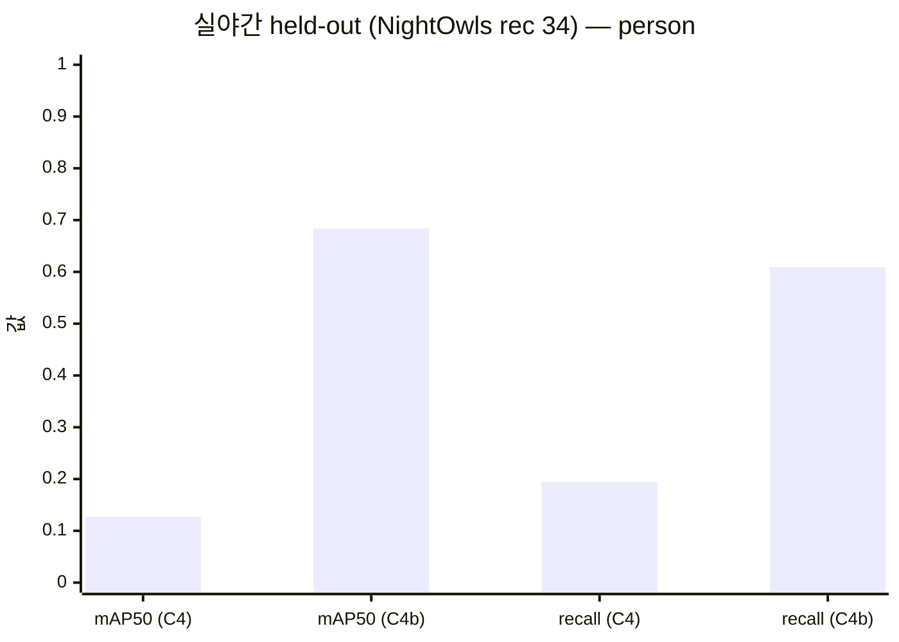
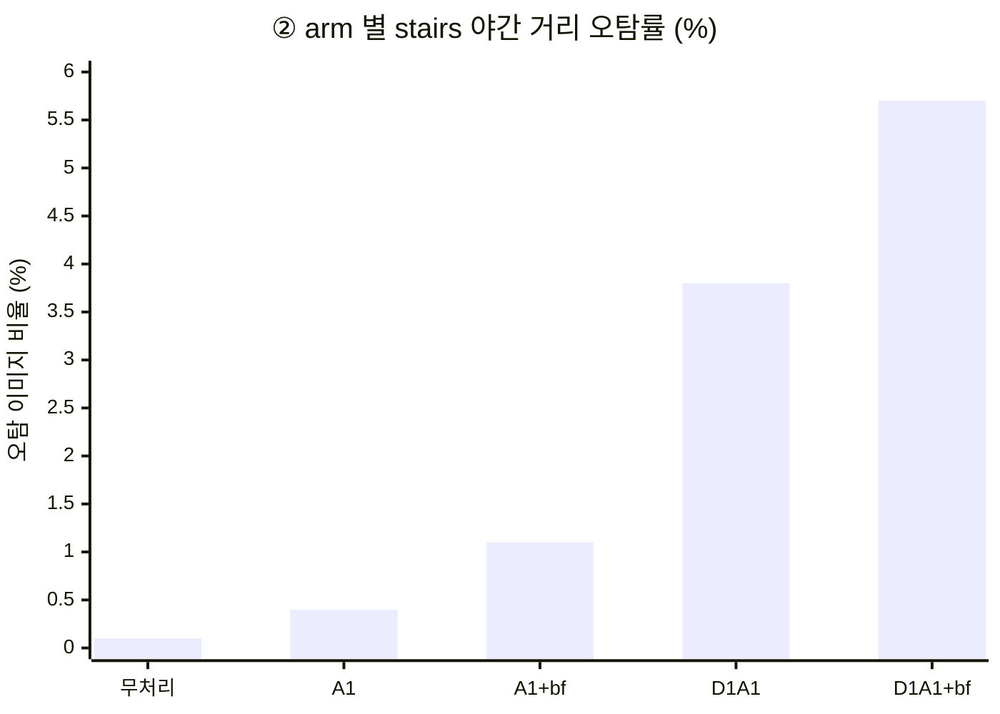

# [공유] ③ YOLO 위험요소 탐지 — 훈련 결과와 회의 안건 (2026-08-03)

> **팀 공유용 요약본**이다. 근거·상세는 [detection.md](detection.md), 그림 실물은
> [stairs_night_review.ipynb](../notebooks/stairs_night_review.ipynb) ·
> [detect_c4_review.ipynb](../notebooks/detect_c4_review.ipynb) 에 있다.
> 표의 mermaid 차트는 GitHub 웹에서 렌더된다.

---

## 1. 무엇에 대한 훈련인가

**밤마실** 파이프라인의 **③ 위험요소 탐지** 단계다. 야맹증 저시력자의 야간 보행에서
위험한 **보행자(`person`)와 계단(`stairs`)** 을 스마트폰 카메라 프레임에서 실시간으로
찾아, ④ 선택적 강조가 화면에 표시할 박스를 공급한다.

```
프레임 ─┬─→ [탐지 경로] 원본 그대로 ────────→ ③ YOLO ──┐
        │                                              ↓
        └─→ [표시 경로] ② 저조도 개선 ──────→ ④ 경계선 강조 → 화면
```

- **모델**: YOLO11n (모바일 실시간 예산에 맞춘 최소 모델) · 2클래스 단일 모델
- **훈련 이력**: `C4` baseline (LoLI-Street 합성 야간 + StairNet 계단)
  → **`C4b` 재학습** (실제 야간 데이터 **NightOwls** 투입) ← 이번 공유의 본론
- **판정 기준**: 학습에 쓰지 않은 실야간 held-out(NightOwls rec 34, 1,001장 · 사람 손 라벨)
- **채택 가중치**: `c4b_loli0` (NightOwls만 학습. 합성본 포함 런과 성능 동점인데
  학습 비용 절반 · pseudo-label 의존 없음)

---

## 2. 결과 ① — 실야간 성능이 5배가 됐다 (`C4b`)

| 지표 (실야간 held-out) | C4 baseline | **C4b 채택 런** | 의미 |
|---|---:|---:|---|
| person mAP50 | 0.127 | **0.684** | 5.4배 |
| person recall | 0.195 | **0.609** | **놓치는 보행자 80.5% → 39.1%** |
| `stairs` 야간 거리 오탐 | 7.7% | **0.2%** | 횡단보도·차선을 계단으로 오인하던 결함 소멸 |



### ⚠️ 개발 val 만 봤으면 이 개선은 안 보였다

| 평가셋 | C4 | C4b |
|---|---:|---:|
| 개발 val (합성 데이터 혼합) | 0.892 | 0.892 |
| **실야간 held-out** | **0.127** | **0.684** |

개발 val 은 한 자리도 안 움직였다. **판정은 반드시 실야간 held-out 에서 한다** —
이후 모든 수치도 이 기준이다.

---

## 3. 결과 ② — 계단: 저조도는 문제가 아니고 **도메인**이 문제다

야간/주간을 갈라서 재 봤다 (`eval_stairs_night.py`):

| 구간 | 장수 | mAP50 | recall |
|---|---:|---:|---:|
| **야간** | 76 | **0.993** | 0.987 |
| 주간 | 348 | 0.988 | 0.977 |

**야간이 오히려 근소하게 높다.** 어둡다는 것 자체는 계단 탐지의 장애물이 아니다.

그런데 이 0.99 를 "완료"로 읽으면 안 된다. 계단 라벨의 유일한 소스인 StairNet 은
**계단이 화면 대부분을 차지하는 사진**이다. GT 박스가 프레임에서 차지하는 면적이
중앙값 **38%** 인 반면, 실제 야간 거리의 보행자 박스는 **0.27%** — **142배** 차이다.
즉 **"보행 중 멀리 있는 계단"은 학습·평가 데이터에 아예 존재하지 않는다.**

| 서비스에 필요한 능력 | 측정 결과 |
|---|---|
| 계단 사진에서 계단 찾기 (야간 포함) | ✅ 된다 (mAP50 0.993) |
| 계단 없는 야간 거리에서 헛보지 않기 | ✅ 된다 (오탐 0.2% — 2/1,001장) |
| **보행 중 멀리 있는 계단** 찾기 | ❌ **측정 불가 — 데이터가 없다** |
| 부분 가림·측면 각도의 계단 | ❌ 측정 불가 |

→ **이 공백을 메울 수단은 `C2` 자체 야간 촬영뿐이다** (회의 안건 3·4가 선행 조건).

---

## 4. 결과 ③ — ② 저조도 개선을 탐지 앞단에 붙이면 **나빠진다** (`C7`)

② 를 탐지 입력에 적용해 봤다. 모든 arm 이 mAP 를 떨어뜨리고, 무엇보다 **`C4b` 가
잡아 둔 계단 오탐이 되살아난다**:



오인 대상이 횡단보도·차선·포장 텍스처라 **저시력 보행자가 반드시 지나는 곳**이다.

→ 그래서 **표시/탐지 경로 분리**가 결론이다: 탐지는 원본을 먹고, ② 는 화면 표시
전용으로 쓴다 (1장 그림). 분리하면 두 경로를 병렬로 돌릴 수 있어 ② 의 지연이
③ 에 더해지지 않는 이득도 있다. 8/2 `pipeline_demo.py` 로 end-to-end 동작을
데스크톱에서 확인했다.

---

## 5. 🗣️ 회의 안건 — 이번 결과가 결정을 요구하는 것

번호는 [TODO.md 5장](TODO.md) 안건 체계를 따른다. **3·4번이 급하다** —
크리티컬 패스(`C2` 촬영)의 선행 조건이라 이것이 늦으면 전체가 늦는다.

| # | 안건 | 왜 지금 | 제안 |
|---|------|---------|------|
| **3** | 촬영 프로토콜·초상권/개인정보 방침 | `C2` 자체 야간 촬영의 선행 조건. 3장의 도메인 공백은 촬영 없이는 못 메운다 | 첫 회의에서 확정 |
| **4** | `stairs` BBox 라벨 정의 (계단 전체/단위 · 부분 가림 · 최소 크기) | **사후 변경 시 전량 재라벨링.** 촬영 전에 못 박아야 한다 | 현행 "계단 전체 1박스" 추인 여부 포함 |
| **1** | 표시/탐지 경로 분리 추인 + FPS 예산 배분 | 4장 실측으로 분리 근거 확보. 병렬 구조면 ② 속도 게이트 계산이 달라진다 | 분리 채택 권고 (데이터 지지) |
| 신규 | **일반 장애물(볼라드·전봇대 등) 클래스 추가 여부** | 현재 클래스는 `person`·`stairs` 둘뿐. 추가하면 안건 4 라벨 정의와 `C3` 라벨링 범위가 늘어난다 | **추가하지 않기 권고** — 9월 초 마감 일정상 계단·보행자 집중 |

---

## 6. 남은 한계 — 수치를 과신하지 말 것

1. **NightOwls 는 차량 대시캠**이다. 카메라 높이·속도가 보행과 달라, recall 0.609 가
   보행 시점에서 재현된다는 보장은 없다. 최종 판정은 자체 촬영분(`C5`) 몫이다.
2. 계단 오탐 0.2% 는 "헛보지 않는다"로 읽히지만, held-out 에 진짜 계단이 없어
   **"거리 장면에선 아예 발화하지 않는다"** 가능성을 배제하지 못한다 — 역시 `C2` 로만
   가려진다.
3. 위 수치는 전부 **채택 런(`c4b_loli0`) 기준**이다. 동점 런 `c4b_loli6000`
   (0.691/0.625/오탐 0.0%)과 섞어 쓰지 말 것.
